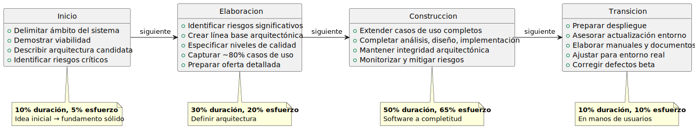

# Metodología

Se selecciona el **Proceso Unificado de Desarrollo (RUP)** como metodología para este proyecto.

> RUP es un proceso de desarrollo de software basado en componentes, dirigido por casos de uso, centrado en la arquitectura, e iterativo e incremental (Jacobson et al., 1999).

---

### Principios fundamentales

|||
|-|-|
|**Basado en componentes**|El sistema se construye mediante componentes interconectados y bien definidos vía sus interfaces, favoreciendo reutilización, modularidad y escalabilidad|
|**Dirigido por casos de uso**|Los CdU son el artefacto principal para establecer y comunicar el comportamiento deseado del sistema. Primera entrada para análisis, diseño, implementación y pruebas|
|**Centrado en la arquitectura**|La arquitectura es el artefacto principal para la conceptualización, construcción, gestión y evolución del sistema|
|**Iterativo e incremental**|El proceso se organiza en iteraciones que producen entregas ejecutables, integrando continuamente la arquitectura para producir incrementos sucesivos|

---

### Fases

**Tabla 3.** Fases de RUP, descripción y mapeo al TFG.

|Fase|Descripción|Objetivos principales|Mapeo al TFG|
|-|-|-|-|
|**Inicio**|La idea inicial se funda y delimita|Delimitar ámbito, demostrar viabilidad, identificar riesgos críticos, esbozar arquitectura candidata|Capítulo 1|
|**Elaboración**|Se define la arquitectura|Línea base arquitectónica, capturar ~80% requisitos funcionales, mitigar riesgos significativos|Capítulos 2 y 3|
|**Construcción**|El software se lleva a su completitud|Extender CdU, completar análisis/diseño/implementación/pruebas, mantener integridad arquitectónica|Capítulos finales|
|**Transición**|El software se pone en manos de los usuarios|Preparar despliegue, documentación, ajustar al entorno real|Futuras líneas (Caps. finales)|

**Figura 1.** Distribución de esfuerzo y duración en las fases de RUP.

||Inicio|Elaboración|Construcción|Transición|
|-|:-:|:-:|:-:|:-:|
|**Duración (%)**|10|30|50|10|
|**Esfuerzo (%)**|5|20|65|10|

*Nota: En el contexto de este TFG, la fase de Transición se aborda de forma limitada, quedando como parte de las futuras líneas de actuación.*

*Fuente: materiales de Ingeniería del Software I (IdSw1)*

---

### Disciplinas técnicas

**Tabla 4.** Disciplinas técnicas de RUP y su aplicación en el TFG.

|Disciplina|Actividades principales|Capítulo|
|-|-|-|
|**Modelado del dominio**|Identificar clases conceptuales, atributos y asociaciones del dominio|Cap. 2|
|**Requisitos**|Encontrar actores y CdU, priorizar, detallar, prototipar y estructurar los CdU|Cap. 2|
|**Análisis**|Analizar la arquitectura, los CdU, las clases y los paquetes|Cap. 3|
|**Diseño**|Diseñar la arquitectura, los CdU, las clases y los paquetes|Cap. 3|
|**Implementación**|Implementar la arquitectura, las clases, los subsistemas y las pruebas unitarias|Caps. finales|
|**Pruebas**|Planificar, diseñar, implementar y ejecutar pruebas de integración y de sistema|Caps. finales|

Las disciplinas no se ejecutan de forma estrictamente secuencial: en la fase de Elaboración, por ejemplo, la disciplina de Requisitos tiene su mayor intensidad pero las disciplinas de Análisis y Diseño ya comienzan a ejecutarse. Esta superposición es coherente con la naturaleza iterativa e incremental de RUP.

---

### Entregables por fase y criterios de transición

|Transición|Entregables|Criterio|
|-|-|-|
|**Inicio → Elaboración**|Contextualización, estado del arte, objetivos, metodología (Cap. 1)|Escenario, objetivos y metodología definidos y aprobados|
|**Elaboración → Construcción**|MdD, actores y CdU, prototipos, diagrama de contexto (Cap. 2). Clases de análisis y diseño, arquitectura, diagramas de despliegue y paquetes, modelos de datos (Cap. 3)|Requisitos capturados, validados con el cliente; análisis y diseño suficientes para guiar implementación|
|**Construcción → Transición**|MVP funcional, código fuente documentado, resultados de pruebas (Caps. finales)|MVP satisface requisitos priorizados y validado con el cliente|

---

### Justificación de la metodología

|Argumento|Relación con el proyecto|
|-|-|
|**Requisitos complejos**|El sistema integra seguimiento de precios en tiempo real, un leaderboard con etiquetado/clustering de direcciones y alertas con webhook — requiere captura rigurosa de requisitos dirigida por CdU|
|**Importancia de la arquitectura**|Consumo de datos en tiempo real desde la L1 de Hyperliquid con múltiples herramientas concurrentes — decisiones arquitectónicas críticas desde las primeras fases|
|**Desarrollo iterativo**|Construcción incremental con retroalimentación temprana del cliente (Infinite Fieldx)|
|**Trazabilidad**|Cadena desde requisitos hasta implementación, pasando por análisis y diseño — coherente con los criterios de evaluación del TFG|
|**Alineación académica**|RUP es la metodología de referencia en las asignaturas de Ingeniería del Software del Grado|

