# Detalle de casos de uso

## Convenciones de especificación

Siguiendo la metodología, cada caso de uso se especifica con una cabecera de metadatos, un flujo principal y un diagrama de actividad o secuencia según proceda. El flujo respeta el siguiente vocabulario controlado:

|El actor únicamente|El sistema únicamente|
|-|-|
|introduce / solicita introducir|permite introducir / permite solicitar|
|solicita|presenta, muestra, visualiza|
|selecciona|valida, registra|

En esta actividad **no se especifican** decisiones sobre el diseño de la interfaz de usuario (disposición de pantallas, elementos de navegación, botones, controles), sobre implementación (persistencia, comunicación) ni sobre las intenciones del actor.

---

## Leaderboard

### CU-01 — Consultar leaderboard

|Atributo|Valor|
|-|-|
|**ID**|CU-01|
|**Nombre**|Consultar leaderboard|
|**Actores**|Usuario (primario), Hyperliquid L1 (proveedor)|
|**Objetivo**|Presentar al Usuario la clasificación de direcciones por volumen de compra y venta para un mercado, token y temporalidad dados, con las direcciones conocidas resueltas a sus nombres de entidad.|
|**Tipo**|Primario, esencial|
|**Nivel**|Objetivo de usuario|
|**Precondición**|Sistema disponible.|
|**Postcondición exitosa**|Clasificación presentada y actualizándose continuamente mientras el Usuario permanezca en el contexto.|
|**Postcondición de fallo**|Mensaje informativo de indisponibilidad del flujo de datos; el Usuario puede reintentar o abandonar.|

|Paso|El actor hace|El sistema responde|
|-|-|-|
|1|El Usuario solicita consultar el leaderboard.||
|2||Permite seleccionar mercado, token y temporalidad.|
|3|El Usuario selecciona mercado, token y temporalidad.||
|4||Solicita a Hyperliquid L1 el flujo continuo de operaciones para el token seleccionado.|
|5|Hyperliquid L1 entrega el flujo continuo de operaciones.||
|6||Agrega volúmenes de compra y de venta por dirección en la temporalidad solicitada.|
|7||Resuelve los nombres de las entidades conocidas para las direcciones.|
|8||Presenta la clasificación ordenada por volumen.|
|9||Actualiza la clasificación a medida que recibe nuevas operaciones.|

**Flujos alternativos**

- *3a. El Usuario cambia la selección*: el sistema reinicia la agregación con los nuevos parámetros.
- *5a. Hyperliquid L1 interrumpe el flujo*: el sistema informa de la indisponibilidad y conserva la última clasificación calculada.

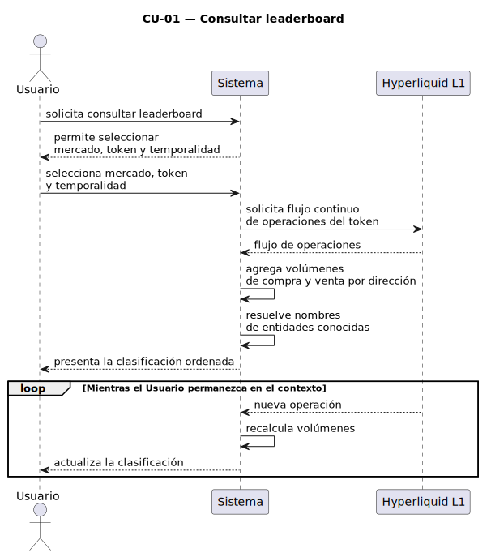

---

## Entidades

### CU-02 — Crear entidad

|Atributo|Valor|
|-|-|
|**ID**|CU-02|
|**Nombre**|Crear entidad|
|**Actor**|Usuario|
|**Objetivo**|Registrar una nueva entidad con un nombre que permitirá resolver direcciones en el leaderboard.|
|**Tipo**|Primario, esencial|
|**Nivel**|Objetivo de usuario|
|**Precondición**|Sistema disponible.|
|**Postcondición exitosa**|Entidad registrada con nombre único.|
|**Postcondición de fallo**|Entidad no registrada; se informa el motivo.|

|Paso|El actor hace|El sistema responde|
|-|-|-|
|1|El Usuario solicita crear una entidad.||
|2||Permite introducir el nombre de la entidad.|
|3|El Usuario introduce el nombre.||
|4||Valida que el nombre no esté en uso.|
|5||Registra la entidad.|
|6||Presenta confirmación del registro.|

**Flujos alternativos**

- *4a. Nombre duplicado*: el sistema informa del conflicto y permite introducir un nombre distinto.
- *4b. Nombre vacío*: el sistema informa del dato requerido.

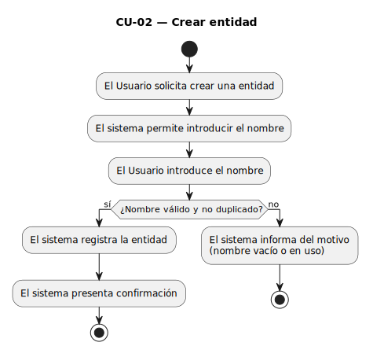

### CU-03 — Abrir entidades

|Atributo|Valor|
|-|-|
|**ID**|CU-03|
|**Nombre**|Abrir entidades|
|**Actor**|Usuario|
|**Objetivo**|Presentar al Usuario la relación de entidades registradas, con capacidad de filtrado, como punto de entrada a operaciones sobre una entidad concreta.|
|**Tipo**|Primario, esencial|
|**Nivel**|Objetivo de usuario|
|**Precondición**|Sistema disponible.|
|**Postcondición exitosa**|Relación de entidades presentada; el Usuario puede solicitar operaciones sobre una entidad.|

|Paso|El actor hace|El sistema responde|
|-|-|-|
|1|El Usuario solicita abrir entidades.||
|2||Presenta la relación de entidades registradas.|
|3|El Usuario solicita filtrar la relación *(opcional)*.||
|4||Presenta la relación filtrada.|
|5|El Usuario solicita una operación sobre una entidad.||

**Flujos alternativos**

- *2a. No hay entidades registradas*: el sistema presenta una relación vacía e invita al Usuario a crear la primera entidad.
- *4a. Ningún elemento coincide con el filtro*: el sistema presenta la relación vacía manteniendo el criterio aplicado y permitiendo modificarlo.

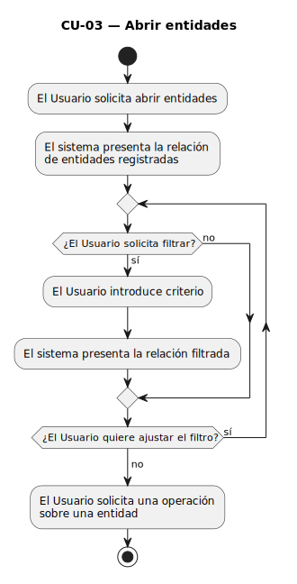

### CU-04 — Editar entidad

|Atributo|Valor|
|-|-|
|**ID**|CU-04|
|**Nombre**|Editar entidad|
|**Actor**|Usuario|
|**Objetivo**|Modificar el nombre de una entidad existente.|
|**Tipo**|Primario, esencial|
|**Nivel**|Objetivo de usuario|
|**Precondición**|Existe al menos una entidad registrada.|
|**Postcondición exitosa**|Entidad con el nombre actualizado.|
|**Postcondición de fallo**|Entidad sin cambios; se informa el motivo.|

|Paso|El actor hace|El sistema responde|
|-|-|-|
|1|El Usuario solicita editar una entidad.||
|2||Presenta el nombre actual y permite introducir uno nuevo.|
|3|El Usuario introduce el nuevo nombre.||
|4||Valida que el nombre no esté en uso por otra entidad.|
|5||Registra el nuevo nombre.|
|6||Presenta confirmación.|

**Flujos alternativos**

- *2a. La entidad ya no existe (eliminada concurrentemente)*: el sistema informa y cancela la operación, devolviendo al Usuario al contexto de entidades.
- *4a. Nuevo nombre vacío*: el sistema informa del dato requerido y permite introducirlo de nuevo.
- *4b. Nombre en uso por otra entidad*: el sistema informa del conflicto y permite introducir un nombre distinto.

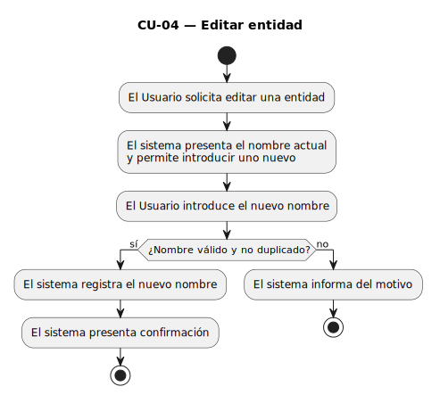

### CU-05 — Eliminar entidad

|Atributo|Valor|
|-|-|
|**ID**|CU-05|
|**Nombre**|Eliminar entidad|
|**Actor**|Usuario|
|**Objetivo**|Dar de baja una entidad y romper el vínculo con sus direcciones.|
|**Tipo**|Primario, esencial|
|**Nivel**|Objetivo de usuario|
|**Precondición**|Existe la entidad objetivo.|
|**Postcondición exitosa**|La entidad deja de estar registrada; las direcciones que agrupaba dejan de estar resueltas en el leaderboard.|
|**Postcondición de fallo**|Entidad sin cambios.|

|Paso|El actor hace|El sistema responde|
|-|-|-|
|1|El Usuario solicita eliminar una entidad.||
|2||Solicita confirmación de la eliminación.|
|3|El Usuario confirma.||
|4||Da de baja la entidad y sus vínculos con direcciones.|
|5||Presenta confirmación.|

**Flujos alternativos**

- *3a. El Usuario no confirma*: el sistema cancela la operación sin cambios.

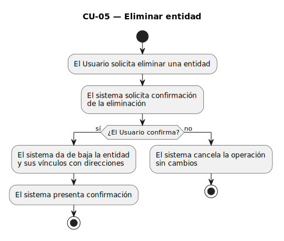

---

## Direcciones

### CU-06 — Añadir dirección

|Atributo|Valor|
|-|-|
|**ID**|CU-06|
|**Nombre**|Añadir dirección|
|**Actor**|Usuario|
|**Objetivo**|Asociar una dirección pública de Hyperliquid a una entidad existente.|
|**Tipo**|Primario, esencial|
|**Nivel**|Objetivo de usuario|
|**Precondición**|Existe la entidad objetivo.|
|**Postcondición exitosa**|Dirección asociada a la entidad.|
|**Postcondición de fallo**|Dirección no asociada; se informa el motivo.|

|Paso|El actor hace|El sistema responde|
|-|-|-|
|1|El Usuario solicita añadir una dirección a la entidad.||
|2||Permite introducir la dirección.|
|3|El Usuario introduce la dirección.||
|4||Valida el formato de la dirección y que no esté asociada a ninguna entidad.|
|5||Registra la asociación.|
|6||Presenta confirmación.|

**Flujos alternativos**

- *4a. Formato inválido*: el sistema informa del error de formato.
- *4b. Dirección ya asociada a otra entidad*: el sistema informa del conflicto.

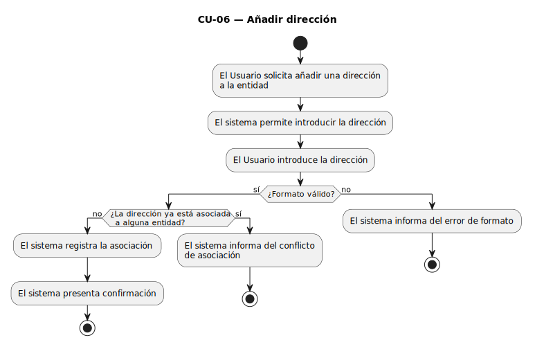

### CU-07 — Abrir direcciones

|Atributo|Valor|
|-|-|
|**ID**|CU-07|
|**Nombre**|Abrir direcciones|
|**Actor**|Usuario|
|**Objetivo**|Presentar al Usuario las direcciones asociadas a una entidad, con capacidad de filtrado.|
|**Tipo**|Primario, esencial|
|**Nivel**|Objetivo de usuario|
|**Precondición**|Existe la entidad objetivo.|
|**Postcondición exitosa**|Relación de direcciones presentada; el Usuario puede solicitar operaciones sobre ellas.|

|Paso|El actor hace|El sistema responde|
|-|-|-|
|1|El Usuario solicita abrir las direcciones de una entidad.||
|2||Presenta las direcciones asociadas.|
|3|El Usuario solicita filtrar la relación *(opcional)*.||
|4||Presenta la relación filtrada.|
|5|El Usuario solicita una operación sobre una dirección.||

**Flujos alternativos**

- *2a. La entidad no tiene direcciones asociadas*: el sistema presenta una relación vacía e invita al Usuario a añadir la primera dirección.
- *2b. La entidad ya no existe (eliminada concurrentemente)*: el sistema informa y devuelve al Usuario al contexto de entidades.
- *4a. Ningún elemento coincide con el filtro*: el sistema presenta la relación vacía manteniendo el criterio aplicado.

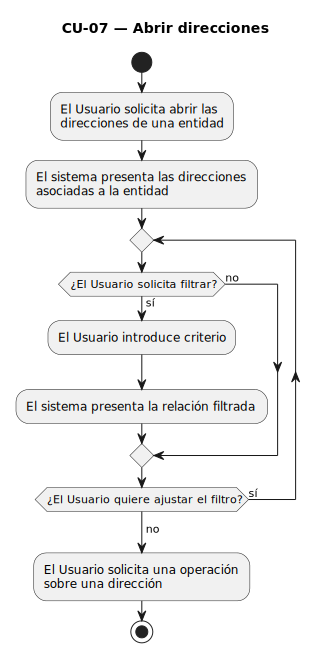

### CU-08 — Eliminar dirección

|Atributo|Valor|
|-|-|
|**ID**|CU-08|
|**Nombre**|Eliminar dirección|
|**Actor**|Usuario|
|**Objetivo**|Desvincular una dirección de la entidad a la que pertenece.|
|**Tipo**|Primario, esencial|
|**Nivel**|Objetivo de usuario|
|**Precondición**|La dirección está asociada a una entidad.|
|**Postcondición exitosa**|La dirección queda desvinculada de la entidad.|

|Paso|El actor hace|El sistema responde|
|-|-|-|
|1|El Usuario solicita eliminar una dirección.||
|2||Solicita confirmación.|
|3|El Usuario confirma.||
|4||Rompe el vínculo entre dirección y entidad.|
|5||Presenta confirmación.|

**Flujos alternativos**

- *2a. La dirección ya no está asociada (desvinculada concurrentemente)*: el sistema informa y cancela la operación.
- *3a. El Usuario no confirma*: el sistema cancela la operación y preserva el vínculo.

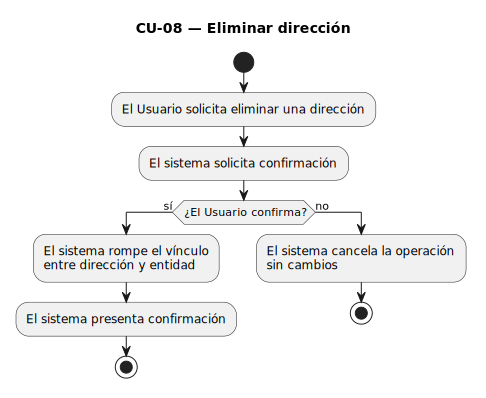

---

## Alertas

### CU-09 — Crear alerta de precio

|Atributo|Valor|
|-|-|
|**ID**|CU-09|
|**Nombre**|Crear alerta de precio|
|**Actor**|Usuario|
|**Objetivo**|Registrar una alerta que vigilará el precio de un token contra un umbral y notificará a un webhook cuando la condición se cumpla.|
|**Tipo**|Primario, esencial|
|**Nivel**|Objetivo de usuario|
|**Precondición**|Sistema disponible.|
|**Postcondición exitosa**|Alerta registrada y operativa.|
|**Postcondición de fallo**|Alerta no registrada; se informa el motivo.|

|Paso|El actor hace|El sistema responde|
|-|-|-|
|1|El Usuario solicita crear una alerta.||
|2||Permite seleccionar mercado y token.|
|3|El Usuario selecciona mercado y token.||
|4||Permite introducir el umbral de precio y la dirección del webhook.|
|5|El Usuario introduce umbral y webhook.||
|6||Valida el formato del umbral y la alcanzabilidad del webhook.|
|7||Registra la alerta en estado operativo.|
|8||Presenta confirmación.|

**Flujos alternativos**

- *6a. Umbral inválido*: el sistema informa y permite corregir.
- *6b. Webhook no alcanzable*: el sistema informa y permite introducir otra dirección o confirmar el registro pese al aviso.

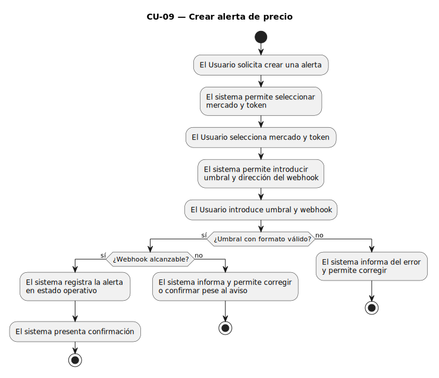

### CU-10 — Abrir alertas de precio

|Atributo|Valor|
|-|-|
|**ID**|CU-10|
|**Nombre**|Abrir alertas de precio|
|**Actor**|Usuario|
|**Objetivo**|Presentar al Usuario la relación de alertas registradas, con capacidad de filtrado.|
|**Tipo**|Primario, esencial|
|**Nivel**|Objetivo de usuario|
|**Precondición**|Sistema disponible.|
|**Postcondición exitosa**|Relación de alertas presentada; el Usuario puede solicitar operaciones sobre una alerta.|

|Paso|El actor hace|El sistema responde|
|-|-|-|
|1|El Usuario solicita abrir alertas.||
|2||Presenta la relación de alertas registradas con su estado actual.|
|3|El Usuario solicita filtrar la relación *(opcional)*.||
|4||Presenta la relación filtrada.|
|5|El Usuario solicita una operación sobre una alerta.||

**Flujos alternativos**

- *2a. No hay alertas registradas*: el sistema presenta una relación vacía e invita al Usuario a crear la primera alerta.
- *4a. Ningún elemento coincide con el filtro*: el sistema presenta la relación vacía manteniendo el criterio aplicado.

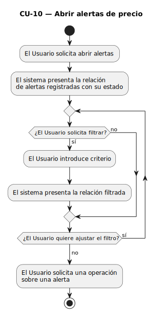

### CU-11 — Editar alerta de precio

|Atributo|Valor|
|-|-|
|**ID**|CU-11|
|**Nombre**|Editar alerta de precio|
|**Actor**|Usuario|
|**Objetivo**|Modificar los parámetros de una alerta existente (token, umbral, webhook).|
|**Tipo**|Primario, esencial|
|**Nivel**|Objetivo de usuario|
|**Precondición**|Existe la alerta objetivo.|
|**Postcondición exitosa**|Alerta con parámetros actualizados.|

|Paso|El actor hace|El sistema responde|
|-|-|-|
|1|El Usuario solicita editar una alerta.||
|2||Presenta los parámetros actuales y permite modificarlos.|
|3|El Usuario introduce los nuevos parámetros.||
|4||Valida los nuevos parámetros.|
|5||Registra los cambios.|
|6||Presenta confirmación.|

**Flujos alternativos**

- *2a. La alerta ya no existe (eliminada concurrentemente)*: el sistema informa y cancela la operación.
- *4a. Umbral inválido*: el sistema informa del dato erróneo y permite corregirlo.
- *4b. Webhook no alcanzable*: el sistema informa del fallo y permite introducir otra dirección de webhook o persistir el cambio asumiendo el riesgo.

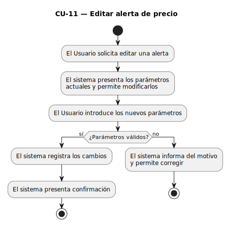

### CU-12 — Eliminar alerta de precio

|Atributo|Valor|
|-|-|
|**ID**|CU-12|
|**Nombre**|Eliminar alerta de precio|
|**Actor**|Usuario|
|**Objetivo**|Dar de baja una alerta, cesando su vigilancia.|
|**Tipo**|Primario, esencial|
|**Nivel**|Objetivo de usuario|
|**Precondición**|Existe la alerta objetivo.|
|**Postcondición exitosa**|La alerta queda dada de baja y no volverá a dispararse.|

|Paso|El actor hace|El sistema responde|
|-|-|-|
|1|El Usuario solicita eliminar una alerta.||
|2||Solicita confirmación.|
|3|El Usuario confirma.||
|4||Da de baja la alerta.|
|5||Presenta confirmación.|

**Flujos alternativos**

- *2a. La alerta ya no existe (eliminada concurrentemente o disparada definitivamente)*: el sistema informa y cancela la operación.
- *3a. El Usuario no confirma*: el sistema cancela la operación y preserva la alerta.

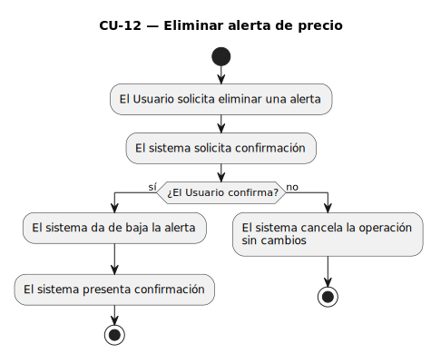

---

## Evaluación automática

### CU-13 — Evaluar alertas activas

|Atributo|Valor|
|-|-|
|**ID**|CU-13|
|**Nombre**|Evaluar alertas activas|
|**Actor primario**|Hyperliquid L1|
|**Objetivo**|Comprobar, ante cada actualización de precio recibida desde la L1, si alguna alerta operativa para el token afectado cumple su condición y, en tal caso, dispararla.|
|**Tipo**|Primario, esencial|
|**Nivel**|Objetivo del sistema|
|**Precondición**|Existe al menos una alerta operativa para el token objeto de la actualización.|
|**Postcondición exitosa**|Las alertas cuya condición se cumple quedan marcadas como disparadas y desencadenan la notificación.|
|**Postcondición de fallo**|Las alertas no evaluadas correctamente se reintentan en la siguiente actualización de precio.|

|Paso|El actor hace|El sistema responde|
|-|-|-|
|1|Hyperliquid L1 entrega una actualización de precio para un token.||
|2||Recupera las alertas operativas para ese token.|
|3||Para cada alerta, compara el nuevo precio con el umbral definido.|
|4||Marca como *disparadas* las alertas cuya condición se cumple.|
|5||Solicita CU-14 por cada alerta disparada *(`<<include>>`)*.|

**Flujos alternativos**

- *2a. No hay alertas operativas para el token*: el sistema descarta la actualización sin realizar evaluación.
- *3a. Error al recuperar o evaluar las alertas*: el sistema registra el incidente y pospone la evaluación a la siguiente actualización de precio, preservando el estado previo de las alertas.
- *4a. Ninguna alerta cumple su condición*: el sistema finaliza el caso de uso sin desencadenar notificaciones.

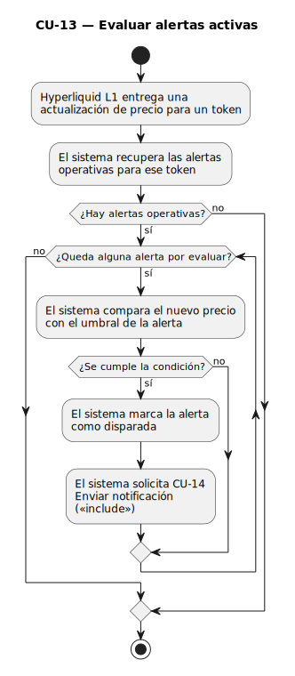

### CU-14 — Enviar notificación

|Atributo|Valor|
|-|-|
|**ID**|CU-14|
|**Nombre**|Enviar notificación|
|**Actor**|Servicio Webhook (receptor)|
|**Objetivo**|Transmitir al webhook receptor la notificación correspondiente a una alerta disparada y rearmar la alerta tras la confirmación.|
|**Tipo**|Secundario (incluido por CU-13)|
|**Nivel**|Objetivo del sistema|
|**Precondición**|Existe una alerta en estado *disparada* pendiente de notificar.|
|**Postcondición exitosa**|El Servicio Webhook recibe la notificación y la alerta queda rearmada en estado operativo.|
|**Postcondición de fallo**|La alerta queda marcada como *notificación fallida* a la espera de reintento.|

|Paso|El actor hace|El sistema responde|
|-|-|-|
|1||Compone la notificación con los datos de la alerta (token, precio actual, umbral).|
|2||Transmite la notificación al Servicio Webhook.|
|3|El Servicio Webhook confirma la recepción.||
|4||Registra la notificación como entregada.|
|5||Rearma la alerta al estado operativo.|

**Flujos alternativos**

- *3a. El Servicio Webhook no responde o devuelve error*: el sistema marca la notificación como fallida, programa un reintento y mantiene la alerta en estado *disparada*.

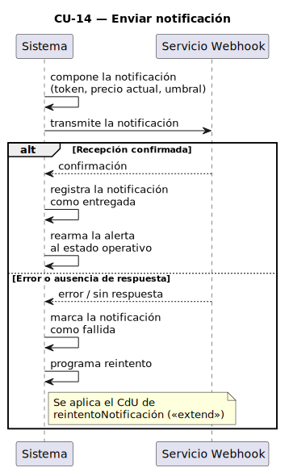

