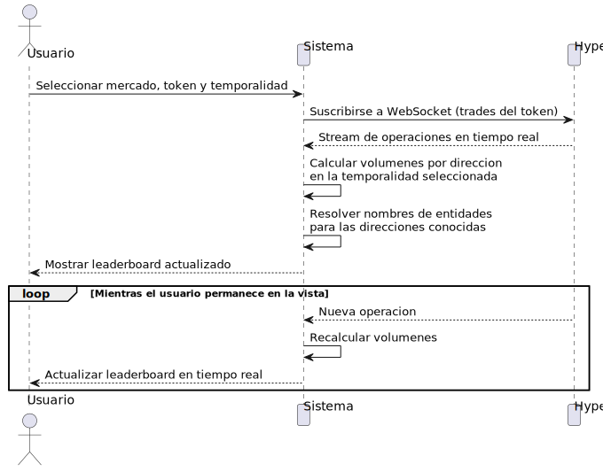
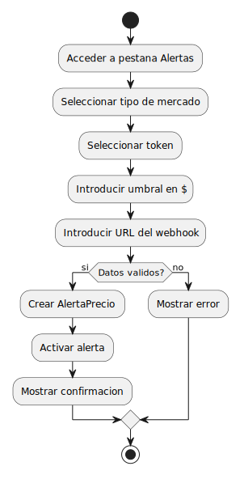
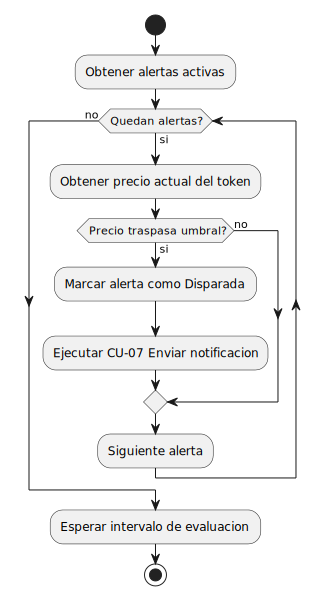
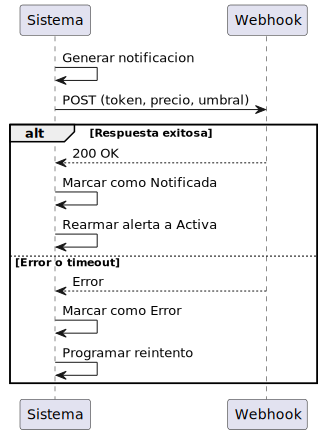

# Detalle de casos de uso

Se detallan los cuatro casos de uso de mayor prioridad con sus precondiciones, postcondiciones, flujos principal, alternativo y excepcional, y diagramas asociados.

---

## CU-01 — Consultar leaderboard

**Actores:** Usuario, Hyperliquid L1

**Precondiciones:**
- El sistema está conectado a Hyperliquid L1 vía WebSocket.
- Existen tokens listados en al menos uno de los tres mercados.

**Postcondiciones:**
- El usuario visualiza el ranking de compradores y vendedores del token seleccionado, actualizado en tiempo real.

### Flujo principal

|Paso|El actor hace|El sistema responde|
|-|-|-|
|1|El usuario accede a la pestaña Leaderboard.||
|2||Muestra los tres cuadros (Spot, Perps nativos, Perps HIP-3) con los selectores de token y temporalidad.|
|3|El usuario selecciona un token y una temporalidad en uno de los cuadros.||
|4||Se suscribe al WebSocket de Hyperliquid para recibir operaciones del token seleccionado.|
|5||Calcula los volúmenes acumulados de compra y venta por dirección dentro de la temporalidad.|
|6||Resuelve los nombres de entidades para las direcciones registradas.|
|7||Muestra el leaderboard ordenado por volumen.|
|8|El usuario permanece en la vista.||
|9||Actualiza el leaderboard en tiempo real conforme llegan nuevas operaciones.|

### Flujo alternativo

- **3a.** No hay tokens disponibles en el mercado seleccionado: el sistema muestra un mensaje indicando que no hay tokens.
- **6a.** Ninguna dirección del ranking pertenece a una entidad registrada: se muestran todas las direcciones en formato crudo.

### Flujo excepcional

- **4a.** Fallo en la conexión WebSocket: el sistema muestra un mensaje de error y reintenta la conexión automáticamente.

*Figura 5 — Diagrama de secuencia de CU-01 Consultar leaderboard*

---

## CU-04 — Configurar alerta

**Actores:** Usuario

**Precondiciones:**
- El usuario ha accedido a la pestaña Alertas.

**Postcondiciones:**
- Se ha creado una nueva AlertaPrecio en estado Activa, asociada al token, umbral y webhook indicados.

### Flujo principal

|Paso|El actor hace|El sistema responde|
|-|-|-|
|1|El usuario accede a la pestaña Alertas.||
|2||Muestra la lista de alertas existentes y el formulario de creación.|
|3|El usuario selecciona un tipo de mercado (Spot, PerpNativo o PerpHIP3).||
|4|El usuario selecciona un token del mercado elegido.||
|5|El usuario introduce un umbral en dólares.||
|6|El usuario introduce la URL del webhook.||
|7|El usuario pulsa "Crear alerta".||
|8||Valida que los datos son correctos.|
|9||Crea la AlertaPrecio y la activa.|
|10||Muestra un mensaje de confirmación y añade la alerta a la lista.|

### Flujo alternativo

- **8a.** El umbral no es un número válido: el sistema muestra un mensaje de error y solicita corregirlo.
- **8b.** La URL del webhook no es válida: el sistema muestra un mensaje de error.

### Flujo excepcional

- **9a.** Error interno al persistir la alerta: el sistema muestra un mensaje de error y la alerta no se crea.

*Figura 6 — Diagrama de actividad de CU-04 Configurar alerta*

---

## CU-06 — Evaluar alertas

**Actores:** Hyperliquid L1 (sistema externo)

**Precondiciones:**
- Existe al menos una alerta en estado Activa.
- El sistema está recibiendo precios de Hyperliquid L1.

**Postcondiciones:**
- Las alertas cuyo umbral ha sido traspasado pasan a estado Disparada y se ejecuta CU-07.

### Flujo principal

|Paso|El actor hace|El sistema responde|
|-|-|-|
|1|Hyperliquid L1 envía el precio actualizado de un token.||
|2||Obtiene la lista de alertas activas para ese token.|
|3||Compara el precio actual con el umbral de cada alerta.|
|4||Para cada alerta cuyo umbral se ha traspasado, la marca como Disparada.|
|5||Ejecuta CU-07 (Enviar notificación) para cada alerta disparada.|

### Flujo alternativo

- **2a.** No hay alertas activas para el token: el sistema no realiza ninguna acción.
- **3a.** El precio no ha traspasado ningún umbral: el sistema no realiza ninguna acción.

### Flujo excepcional

- **1a.** Se interrumpe la conexión con Hyperliquid L1: el sistema reintenta la conexión y registra el incidente.

*Figura 7 — Diagrama de actividad de CU-06 Evaluar alertas*

---

## CU-07 — Enviar notificación

**Actores:** Servicio Webhook (sistema externo)

**Precondiciones:**
- Existe una alerta en estado Disparada con un webhook configurado.

**Postcondiciones:**
- Se ha enviado la notificación al webhook. La alerta pasa a Notificada (si éxito) o a Error (si fallo).

### Flujo principal

|Paso|El actor hace|El sistema responde|
|-|-|-|
|1||Genera la notificación con los datos de la alerta (token, precio actual, umbral).|
|2||Envía una petición POST al webhook configurado.|
|3|El Servicio Webhook responde con 200 OK.||
|4||Marca la alerta como Notificada.|
|5||Rearma la alerta a estado Activa para seguir evaluando.|

### Flujo alternativo

- **5a.** El usuario ha configurado la alerta como "de un solo uso": la alerta pasa a Desactivada en lugar de rearmarse.

### Flujo excepcional

- **3a.** El Servicio Webhook responde con un error o no responde (timeout): el sistema marca la alerta como Error y programa un reintento automático.

*Figura 8 — Diagrama de secuencia de CU-07 Enviar notificación*

