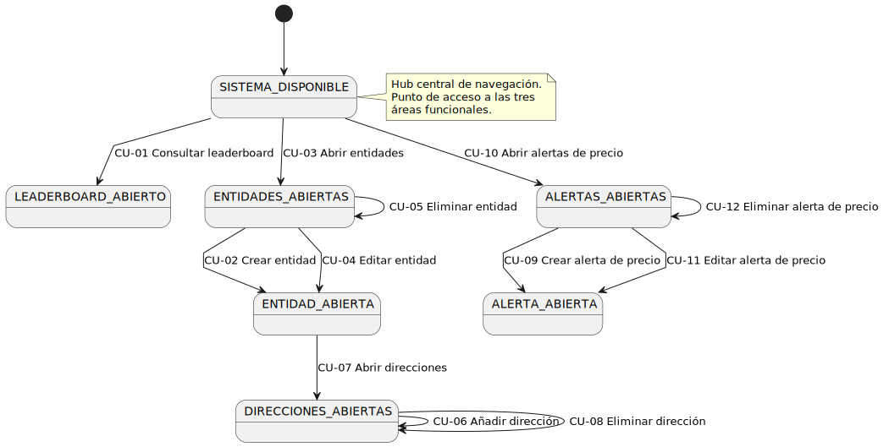

# Diagrama de contexto

El diagrama de contexto representa el sistema como una caja negra y muestra las interacciones con los actores externos.

*Figura 13 — Diagrama de contexto del sistema*

## Interacciones

- **Usuario → Sistema**: consulta el leaderboard de compradores y vendedores, gestiona entidades (agrupaciones de direcciones) y configura alertas de precio con webhook.
- **Hyperliquid L1 → Sistema**: proporciona precios en tiempo real y operaciones (trades) a través de la API REST y WebSocket de Hyperliquid.
- **Sistema → Servicio Webhook**: envía notificaciones HTTP cuando una alerta de precio se dispara, al endpoint configurado por el usuario.
