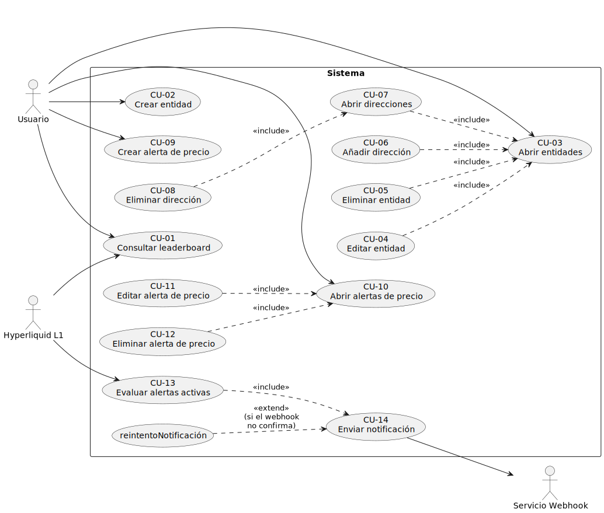

# Estructuración del modelo de casos de uso

## Criterios aplicados

Siguiendo la metodología, la estructuración persigue reducir redundancia, agrupar por cohesión funcional y hacer explícitas las dependencias entre CdU mediante las relaciones estándar de UML.

|Criterio|Aplicación en este proyecto|
|-|-|
|**Cohesión funcional**|Los CdU se agrupan por la entidad del dominio sobre la que actúan (*Entidades*, *Direcciones*, *Alertas*, *Leaderboard*, *Evaluación automática*).|
|**Minimización de dependencias**|Cada agrupación es autocontenida salvo las relaciones explícitas `<<include>>` y `<<extend>>`. No se cruzan responsabilidades entre áreas sin dejar constancia.|
|**Reutilización**|Operaciones compartidas se encapsulan como CdU propios invocados mediante `<<include>>` (por ejemplo, la navegación a listado previa a cualquier operación de edición o eliminación, y la emisión de la notificación tras la evaluación).|
|**Extensibilidad**|Variantes y comportamientos opcionales se expresan mediante `<<extend>>`, dejando el flujo base inalterado.|

## Áreas funcionales

|Área|CdU que contiene|Responsabilidad|
|-|-|-|
|**Leaderboard**|CU-01|Provee al Usuario la clasificación de direcciones por actividad, a partir del flujo de datos de la L1.|
|**Entidades**|CU-02, CU-03, CU-04, CU-05|Gestiona el catálogo de entidades que resuelven nombres de direcciones en el leaderboard.|
|**Direcciones**|CU-06, CU-07, CU-08|Gestiona la pertenencia de direcciones públicas a las entidades.|
|**Alertas**|CU-09, CU-10, CU-11, CU-12|Gestiona la configuración de las alertas de precio.|
|**Evaluación automática**|CU-13, CU-14|Vigila el precio y emite notificaciones al webhook receptor.|

## Relaciones entre casos de uso

### Inclusiones `<<include>>`

|CdU base|`<<include>>`|Justificación|
|-|-|-|
|CU-04 Editar entidad|CU-03 Abrir entidades|La edición presupone haber localizado previamente la entidad objetivo en la relación listada y filtrable.|
|CU-05 Eliminar entidad|CU-03 Abrir entidades|Mismo razonamiento: la selección precede a la eliminación.|
|CU-06 Añadir dirección|CU-03 Abrir entidades|La dirección se añade en el contexto de una entidad concreta, localizada en la relación.|
|CU-07 Abrir direcciones|CU-03 Abrir entidades|El listado de direcciones se contextualiza sobre una entidad.|
|CU-08 Eliminar dirección|CU-07 Abrir direcciones|La eliminación se realiza sobre la relación de direcciones de una entidad.|
|CU-11 Editar alerta de precio|CU-10 Abrir alertas de precio|La edición presupone selección previa en la relación de alertas.|
|CU-12 Eliminar alerta de precio|CU-10 Abrir alertas de precio|Mismo razonamiento.|
|CU-13 Evaluar alertas activas|CU-14 Enviar notificación|Cada alerta cuya condición se cumple desencadena, de forma obligatoria e incondicional, una notificación.|

### Extensiones `<<extend>>`

|CdU base|`<<extend>>`|Punto de extensión / condición|
|-|-|-|
|CU-14 Enviar notificación|*reintentoNotificación*|Si el Servicio Webhook no confirma la recepción, se programa un reintento diferido de la transmisión.|

> *Nota:* No se han identificado generalizaciones entre CdU. Los cuatro CdU CRUD de cada área comparten una estructura similar en su flujo principal, pero esa similitud es de plantilla narrativa, no de comportamiento especificado; elevarla a una superclase abstracta oscurecería el modelo sin aportar valor. Se prefiere mantenerlos como CdU concretos hermanos.

## Diagrama estructurado

## Validación de la estructura

|Criterio|Comprobación|
|-|-|
|**Completitud**|Cada entidad del modelo del dominio con ciclo de vida (Entidad, Dirección, AlertaPrecio) está cubierta por el patrón CRUD completo; las entidades derivadas (Precio, Operación, Notificación) no lo requieren porque no son gestionadas por el Usuario sino consecuencia del flujo con la L1 y con el webhook.|
|**Consistencia**|La nomenclatura sigue la misma plantilla (*Verbo + sustantivo* en los nombres, `CU-XX` en los códigos) en todas las áreas. No hay solapamiento de responsabilidades entre CdU.|
|**Viabilidad**|El diagrama refleja únicamente relaciones verificables a partir del flujo de cada CdU, sin adelantar decisiones de análisis ni de diseño.|

