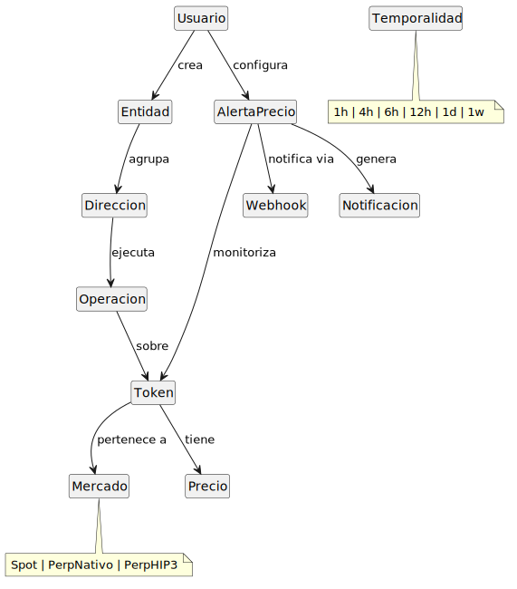
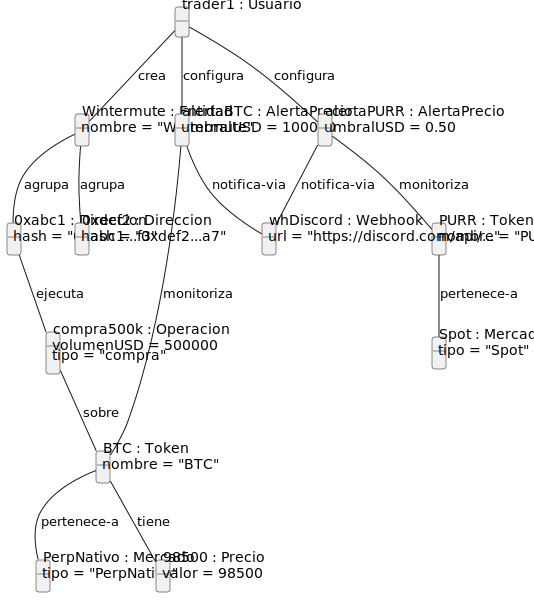
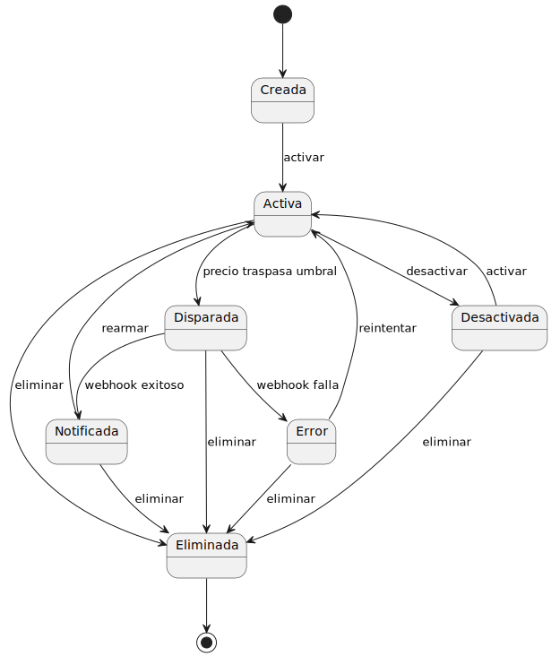

# Modelo del dominio

## Diagrama de clases conceptual

El modelo del dominio representa las clases conceptuales del problema y las relaciones entre ellas, sin entrar en detalles de implementación. Se ha mantenido lo más limpio posible, sin atributos, para centrarse en la estructura y las asociaciones.

*Figura 1 — Diagrama de clases conceptual del dominio*

Las once clases conceptuales identificadas son:

- **Usuario** — operador del sistema (de Infinite Fieldx).
- **Token** — activo listado en Hyperliquid (spot o perpetuo).
- **Mercado** — categoría del token: Spot (HIP-1/HIP-2), PerpNativo o PerpHIP3.
- **Precio** — valor en dólares de un token en un instante dado.
- **Dirección** — dirección pública de Hyperliquid.
- **Entidad** — agrupación de direcciones bajo un nombre asignado por el usuario.
- **Operación** — compra o venta ejecutada en Hyperliquid, con un volumen en dólares.
- **Temporalidad** — período seleccionado para consultar el leaderboard (1h, 4h, 6h, 12h, 1d, 1w).
- **AlertaPrecio** — alerta configurada por el usuario: token + umbral en dólares.
- **Webhook** — endpoint URL de destino para las notificaciones.
- **Notificación** — mensaje enviado cuando una alerta se dispara.

Los tres valores de **Mercado** determinan en cuál de los tres cuadros del leaderboard aparece cada token.

---

## Diagrama de objetos

El diagrama de objetos muestra una instancia concreta del modelo: un usuario *trader1* con una entidad *Wintermute* que agrupa dos direcciones, una alerta sobre BTC (PerpNativo) a 100 000 $ y otra sobre PURR (Spot) a 0,50 $, y una operación de compra de 500 000 $ de BTC ejecutada por una de las direcciones.

*Figura 2 — Diagrama de objetos*

---

## Diagrama de estados — AlertaPrecio

La entidad con el ciclo de vida más relevante es **AlertaPrecio**. Sus estados y transiciones son:

*Figura 3 — Diagrama de estados de AlertaPrecio*

Una alerta se crea en estado **Creada** y pasa a **Activa** automáticamente. Mientras está activa, el sistema evalúa continuamente si el precio del token ha traspasado el umbral configurado. Cuando se cumple la condición, la alerta pasa a **Disparada** y el sistema intenta enviar la notificación al webhook. Si el envío es exitoso, pasa a **Notificada** y se rearma a **Activa** para seguir evaluando. Si falla, pasa a **Error**, desde donde puede reintentarse. El usuario puede desactivar y reactivar alertas en cualquier momento, así como eliminarlas desde cualquier estado.
