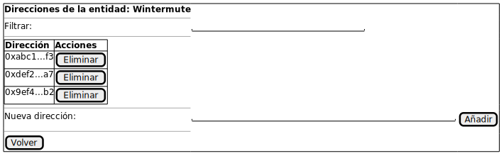
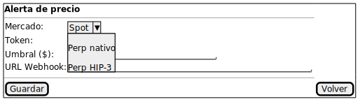

# Prototipos de interfaz

## Propósito

Siguiendo la metodología, esta actividad responde a preguntas que solo pueden contestarse sobre algo tangible: qué elementos de interfaz permiten a cada actor ejecutar sus casos de uso, cómo se relacionan entre sí y qué aspecto tienen. Es aquí —y no antes— donde caben las decisiones sobre la disposición visual del sistema.

Los prototipos siguientes son **bocetos de baja fidelidad** destinados a validar con el cliente (Infinite Fieldx) que los CdU especificados son soportables por una interfaz razonable. No predeterminan la tecnología de presentación ni la pila técnica: son insumos para la disciplina de análisis y diseño del Capítulo 3.

## Correspondencia prototipo — casos de uso

Los prototipos se organizan por caso de uso atómico, no por área de la interfaz, para preservar la trazabilidad con las actividades anteriores de esta disciplina.

|Prototipo|CdU soportados|
|-|-|
|**P1. Leaderboard**|CU-01|
|**P2. Relación de entidades**|CU-03 (origen de CU-02, CU-04, CU-05)|
|**P3. Edición de entidad**|CU-02, CU-04 (origen de CU-07)|
|**P4. Direcciones de una entidad**|CU-07 (origen de CU-06, CU-08)|
|**P5. Relación de alertas**|CU-10 (origen de CU-09, CU-11, CU-12)|
|**P6. Edición de alerta**|CU-09, CU-11|

---

## P1 — Leaderboard

Soporta **CU-01** (Consultar leaderboard). Presenta mercado, token y temporalidad como parámetros configurables por el Usuario y la clasificación de direcciones por volumen de compra y venta, con los nombres de las entidades conocidas ya resueltos.

## P2 — Relación de entidades

Soporta **CU-03** (Abrir entidades) y actúa como punto de entrada a CU-02 (Crear entidad), CU-04 (Editar entidad) y CU-05 (Eliminar entidad).

## P3 — Edición de entidad

Soporta **CU-02** (Crear entidad) y **CU-04** (Editar entidad), y ofrece acceso al contexto de direcciones de la entidad (CU-07).

## P4 — Direcciones de una entidad

Soporta **CU-07** (Abrir direcciones) y es punto de entrada a CU-06 (Añadir dirección) y CU-08 (Eliminar dirección).

## P5 — Relación de alertas

Soporta **CU-10** (Abrir alertas de precio) y es punto de entrada a las operaciones sobre alertas concretas (CU-09, CU-11, CU-12).

## P6 — Edición de alerta

Soporta **CU-09** (Crear alerta de precio) y **CU-11** (Editar alerta de precio). Recoge mercado, token, umbral y dirección del webhook.

---

## Validación

La validación de estos prototipos con Infinite Fieldx persigue obtener un "no" temprano: detectar antes de invertir esfuerzo en implementación cualquier decisión de presentación que no case con los flujos reales de trabajo de los operadores. La retroalimentación recogida retroalimenta las actividades anteriores de esta disciplina si procede.
