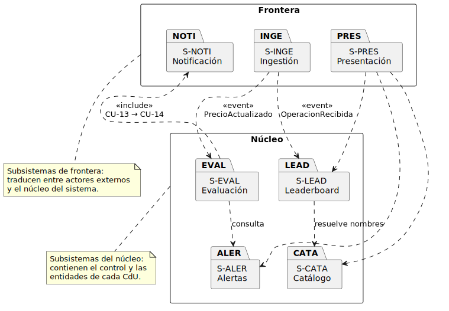
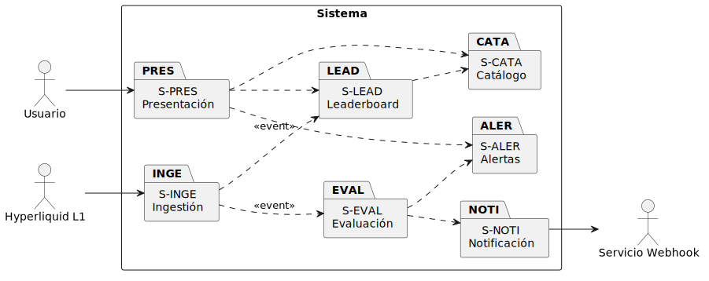

# Análisis de la arquitectura

## Propósito

El análisis de la arquitectura toma el conjunto de CdU y de requisitos suplementarios capturado en el Capítulo 2 y produce una **descomposición preliminar del sistema en subsistemas**, con sus responsabilidades, dependencias e interacciones, sin todavía comprometer decisiones tecnológicas. Es el primer puente desde el lenguaje del cliente hasta el lenguaje del desarrollador y prepara el terreno para las actividades posteriores de análisis (clases, CdU y paquetes) y para el diseño.

|||
|-|-|
|**Punto de partida**|Modelo del dominio, CdU detallados y priorizados, requisitos suplementarios|
|**Resultado**|Subsistemas con responsabilidad acotada, mecanismos arquitectónicos comunes, asignación de CdU a subsistemas|
|**Restricción**|Tecnológicamente neutro — las elecciones (lenguaje, persistencia, despliegue) se introducen en el diseño|

## Identificación de subsistemas

Aplicando el principio de **alta cohesión funcional** se identifican **siete subsistemas** que reflejan las cinco áreas funcionales del modelo de CdU (Leaderboard, Entidades, Direcciones, Alertas y Evaluación automática) más dos subsistemas de frontera, uno hacia el Usuario y otro hacia los actores externos (Hyperliquid L1 y Servicio Webhook).

|Código|Subsistema|Responsabilidad|CdU que realiza|
|-|-|-|-|
|**S-PRES**|Presentación|Pone a disposición del Usuario las funcionalidades del sistema y traduce sus solicitudes en peticiones a los subsistemas internos|*frontera de* CU-01 a CU-12|
|**S-INGE**|Ingestión|Establece y mantiene la conexión con Hyperliquid L1, recibe el flujo continuo de operaciones y precios, y los publica como eventos del dominio para los demás subsistemas|*frontera de* CU-01, CU-13|
|**S-LEAD**|Leaderboard|Mantiene la agregación incremental de volúmenes de compra y venta por dirección para cada combinación (mercado, token, temporalidad) y resuelve los nombres de las entidades conocidas|CU-01|
|**S-CATA**|Catálogo|Gestiona el ciclo de vida de entidades y direcciones que permiten resolver nombres en el leaderboard|CU-02 a CU-08|
|**S-ALER**|Alertas|Gestiona el ciclo de vida de las alertas de precio (creación, listado, edición, eliminación)|CU-09 a CU-12|
|**S-EVAL**|Evaluación|Reacciona a cada actualización de precio recibida, comprueba qué alertas operativas cumplen su condición y desencadena la notificación|CU-13|
|**S-NOTI**|Notificación|Construye y transmite las notificaciones al webhook receptor, gestiona reintentos en caso de fallo y registra el resultado|CU-14|

## Dependencias entre subsistemas

Las dependencias se establecen exclusivamente en el sentido **frontera → núcleo → dominio**. Ningún subsistema del núcleo conoce directamente a los subsistemas de frontera, y ningún subsistema del núcleo conoce a otro subsistema del núcleo salvo cuando un CdU lo exige explícitamente (CU-13 incluye CU-14).

|Origen|Destino|Naturaleza de la dependencia|
|-|-|-|
|S-PRES|S-LEAD, S-CATA, S-ALER|Invoca los servicios de cada subsistema para satisfacer las solicitudes del Usuario|
|S-INGE|S-LEAD, S-EVAL|**Notifica** —no invoca— mediante eventos: `OperacionRecibida` para el leaderboard, `PrecioActualizado` para la evaluación|
|S-EVAL|S-ALER|Consulta las alertas operativas para un token *(lectura)*|
|S-EVAL|S-NOTI|Solicita el envío de una notificación cuando una alerta dispara *(CU-13 `<<include>>` CU-14)*|
|S-LEAD|S-CATA|Consulta el catálogo para resolver nombres de entidades en la presentación de la clasificación *(lectura)*|

> La notación de dependencia mediante eventos en lugar de invocación directa es una decisión de **análisis** (no de diseño): expresa que la frontera de Ingestión no debe quedar acoplada a quiénes consumen los datos, dado que el conjunto de consumidores es el principal eje de extensibilidad del sistema (RS-04).

## Mecanismos arquitectónicos genéricos

El análisis identifica **cuatro mecanismos arquitectónicos** que aparecen de forma recurrente en los CdU y que conviene tratar como infraestructura compartida en lugar de resolverlos por separado en cada caso. Cada mecanismo se concretará en el [Diseño de la arquitectura](disenoArquitectura.md) con tecnologías específicas.

|Mecanismo|Razón de existir|Subsistemas que lo usan|RS asociado|
|-|-|-|-|
|**Comunicación con sistemas externos**|Aislamiento de los protocolos concretos (REST, WebSocket, HTTP) frente al núcleo|S-INGE, S-NOTI|RS-08|
|**Notificación de eventos del dominio**|Desacoplar a los productores de eventos (S-INGE) de los consumidores (S-LEAD, S-EVAL); permitir añadir consumidores sin modificar a los existentes|S-INGE, S-LEAD, S-EVAL|RS-04, RS-05|
|**Persistencia**|Conservar el estado de entidades, alertas y notificaciones más allá del ciclo de vida del proceso|S-CATA, S-ALER, S-NOTI|RS-09, RS-10|
|**Procesamiento concurrente**|Sostener el flujo continuo de la L1 sin bloquear las solicitudes del Usuario|S-INGE, S-LEAD, S-EVAL, S-PRES|RS-01, RS-02, RS-05|

## Vista lógica preliminar

La siguiente vista presenta los subsistemas, los actores que los enmarcan y las dependencias entre ellos. Es **lógica** y no **física**: no anticipa procesos, contenedores ni máquinas; ese mapeo se aborda en el [Diagrama de despliegue](despliegue.md).

## Justificación desde los requisitos suplementarios

La descomposición propuesta no es la única posible, pero sí la que mejor responde a los requisitos suplementarios capturados en el Capítulo 2. Cada decisión de descomposición se justifica contra los RS que la condicionan.

|Decisión de análisis|RS que la motiva|Mecanismo|
|-|-|-|
|Subsistema de Ingestión separado del resto|RS-08 (sustituibilidad API↔nodo no validador)|Aislar la dependencia del proveedor concreto en una única frontera|
|Comunicación por eventos entre Ingestión y consumidores (Leaderboard, Evaluación)|RS-04 (extensibilidad: nuevas herramientas)|Permitir añadir un nuevo consumidor sin tocar a los existentes|
|Subsistemas de área funcional independientes (Leaderboard, Catálogo, Alertas)|RS-05 (las tres áreas accesibles sin interferencias)|Aislar el flujo del leaderboard de las operaciones de gestión|
|Subsistema de Notificación separado de Evaluación|RS-07 (reintento), RS-09 (trazabilidad)|Localizar el reintento y el registro en una única responsabilidad|
|Mecanismo común de procesamiento concurrente|RS-01 (latencia leaderboard), RS-02 (latencia alertas), RS-03 (24/7)|Garantizar que un subsistema lento no bloquea a otro|
|Persistencia tratada como mecanismo, no como subsistema|RS-09 (trazabilidad), RS-10 (confidencialidad de webhooks)|Cada subsistema decide qué persiste; el mecanismo decide cómo|

## Asignación de CdU a subsistemas

Cada CdU detallado en el Capítulo 2 se asigna al subsistema que actúa como **dueño de su control**. Los subsistemas de frontera (S-PRES, S-INGE, S-NOTI) participan en la realización pero no son dueños del control salvo en sus propios CdU.

|CdU|Dueño|Participantes|
|-|-|-|
|CU-01 Consultar leaderboard|S-LEAD|S-PRES, S-INGE, S-CATA|
|CU-02 Crear entidad|S-CATA|S-PRES|
|CU-03 Abrir entidades|S-CATA|S-PRES|
|CU-04 Editar entidad|S-CATA|S-PRES|
|CU-05 Eliminar entidad|S-CATA|S-PRES|
|CU-06 Añadir dirección|S-CATA|S-PRES|
|CU-07 Abrir direcciones|S-CATA|S-PRES|
|CU-08 Eliminar dirección|S-CATA|S-PRES|
|CU-09 Crear alerta de precio|S-ALER|S-PRES|
|CU-10 Abrir alertas de precio|S-ALER|S-PRES|
|CU-11 Editar alerta de precio|S-ALER|S-PRES|
|CU-12 Eliminar alerta de precio|S-ALER|S-PRES|
|CU-13 Evaluar alertas activas|S-EVAL|S-INGE, S-ALER, S-NOTI|
|CU-14 Enviar notificación|S-NOTI|—|

## Trazabilidad hacia las disciplinas posteriores

Esta descomposición de subsistemas establece un compromiso público que las actividades restantes de este capítulo y el Capítulo 4 deben respetar:

|Hacia|Compromiso|
|-|-|
|[Análisis de los CdU](analisisCdU.md)|Cada CdU se realiza con clases asignadas al subsistema dueño y, eventualmente, a los participantes|
|[Análisis de clases](analisisClases.md)|Cada clase de análisis pertenece a uno y solo un subsistema|
|[Análisis de paquetes](analisisPaquetes.md)|Los paquetes de análisis reflejan los subsistemas identificados|
|[Diseño de la arquitectura](disenoArquitectura.md)|Cada decisión tecnológica se mapea a un subsistema o a un mecanismo arquitectónico|
|[Diagrama de despliegue](despliegue.md)|La asignación de subsistemas a procesos y nodos respeta los límites identificados aquí|

