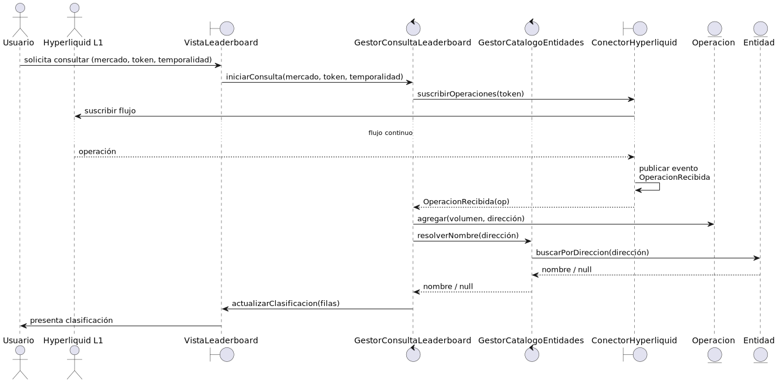
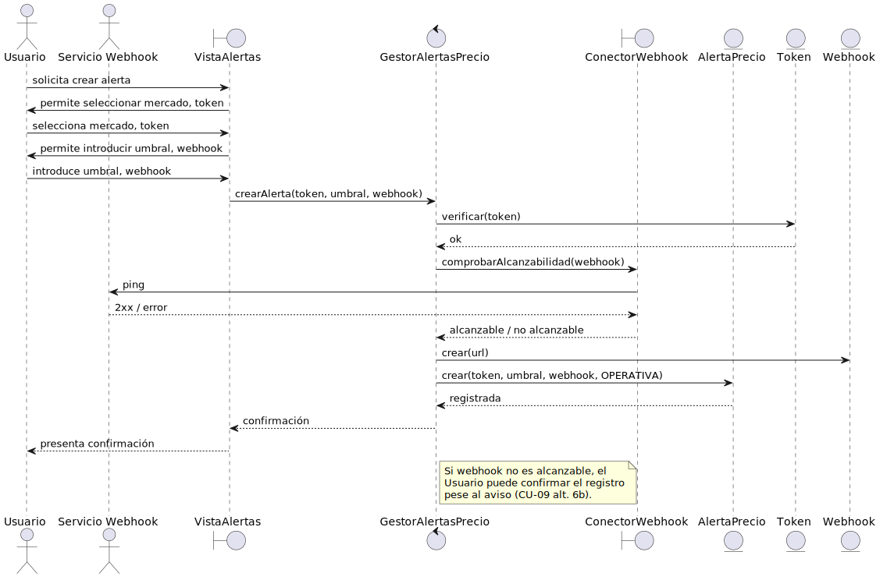
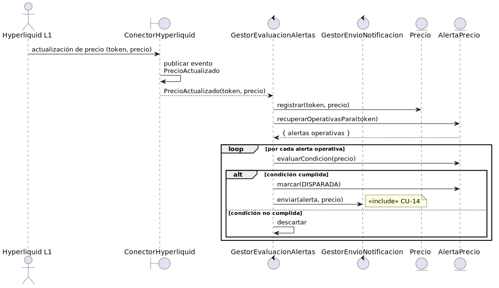
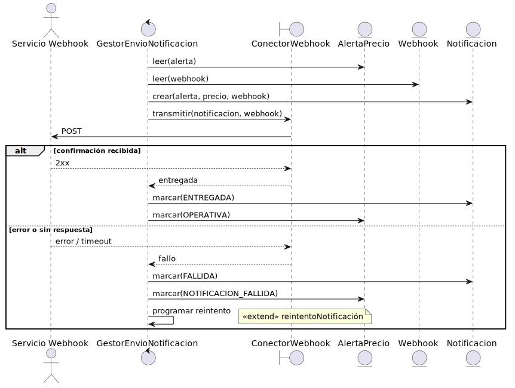
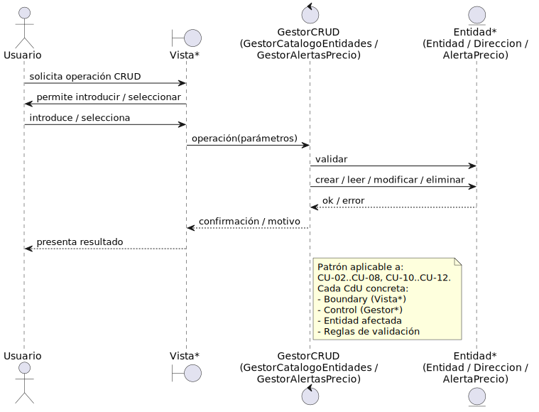

# Análisis de los casos de uso

## Propósito

El análisis de los CdU traduce cada flujo escrito en el Capítulo 2 en una **colaboración entre clases de análisis** que lo realiza, identificando qué clase recibe la solicitud del actor, qué clase coordina la realización y qué clases del dominio participan. La colaboración resultante es **agnóstica de tecnología**: no menciona frameworks, bases de datos ni protocolos concretos, y permite verificar que los subsistemas identificados en el [Análisis de la arquitectura](analisisArquitectura.md) son suficientes para soportar cada CdU.

|||
|-|-|
|**Punto de partida**|CdU detallados, modelo del dominio, subsistemas identificados|
|**Resultado**|Una **realización de análisis** `R(CU-XX)` por cada CdU detallado: el conjunto de clases que colaboran y la secuencia o el diagrama de comunicación que describe cómo lo hacen|

## Notación

Se sigue la notación de Jacobson para clases de análisis:

|Estereotipo|Significado|Icono|Subsistemas en los que aparecen|
|-|-|-|-|
|`<<boundary>>`|Comunica con un actor — adapta el lenguaje del actor al del sistema y viceversa|Círculo con T a la izquierda|S-PRES, S-INGE, S-NOTI|
|`<<control>>`|Coordina la realización de un CdU — encapsula la lógica del flujo|Círculo con flecha|S-LEAD, S-CATA, S-ALER, S-EVAL, S-NOTI|
|`<<entity>>`|Información del dominio — representa conceptos del modelo del dominio|Círculo con línea inferior|Compartidas entre los subsistemas del núcleo|

> Las clases de control siguen el patrón **"un control por CdU"** establecido en la guía de la disciplina: cada CdU detallado tiene su propio `<<control>>`, lo que garantiza la trazabilidad entre el modelo de CdU y el modelo de clases.

## Catálogo de clases de análisis participantes

|Clase|Estereotipo|Subsistema|Origen|
|-|-|-|-|
|`VistaLeaderboard`|`<<boundary>>`|S-PRES|Vista para el actor *Usuario* — primaria, soporta CU-01|
|`VistaEntidades`|`<<boundary>>`|S-PRES|Vista para el actor *Usuario* — primaria, soporta CU-02 a CU-08|
|`VistaAlertas`|`<<boundary>>`|S-PRES|Vista para el actor *Usuario* — primaria, soporta CU-09 a CU-12|
|`ConectorHyperliquid`|`<<boundary>>`|S-INGE|Vista de comunicaciones para el actor *Hyperliquid L1*|
|`ConectorWebhook`|`<<boundary>>`|S-NOTI|Vista de comunicaciones para el actor *Servicio Webhook*|
|`GestorConsultaLeaderboard`|`<<control>>`|S-LEAD|Control de CU-01|
|`GestorCatalogoEntidades`|`<<control>>`|S-CATA|Control de CU-02 a CU-08 *(detalle tabular al final)*|
|`GestorAlertasPrecio`|`<<control>>`|S-ALER|Control de CU-09 a CU-12|
|`GestorEvaluacionAlertas`|`<<control>>`|S-EVAL|Control de CU-13|
|`GestorEnvioNotificacion`|`<<control>>`|S-NOTI|Control de CU-14|
|`Mercado`, `Token`, `Precio`, `Operacion`, `Direccion`, `Entidad`, `AlertaPrecio`, `Webhook`, `Notificacion`|`<<entity>>`|Compartidas|Modelo del dominio del [Capítulo 2](../capitulo2/modeloDelDominio.md)|

> En el [Análisis de clases](analisisClases.md) se documenta cada una de estas clases con sus responsabilidades, atributos y operaciones tentativas. Aquí se utilizan únicamente para describir cómo colaboran al realizar cada CdU.

---

## Realización R(CU-01) — Consultar leaderboard

### Clases participantes

|Rol|Clase|Responsabilidad en la realización|
|-|-|-|
|Boundary primaria|`VistaLeaderboard`|Captura los parámetros (mercado, token, temporalidad) y presenta la clasificación al Usuario, actualizándola al recibir nuevos eventos|
|Boundary central|`ConectorHyperliquid`|Mantiene la suscripción al flujo de operaciones del token solicitado y publica el evento `OperacionRecibida`|
|Control|`GestorConsultaLeaderboard`|Recibe la solicitud, suscribe al flujo, agrega volúmenes por dirección y resuelve nombres consultando al catálogo|
|Entities|`Token`, `Mercado`, `Operacion`, `Direccion`, `Entidad`|Aportan el dato del dominio que se agrega y se resuelve|

### Colaboración

### Notas de análisis

|||
|-|-|
|**Acumulador conceptual**|La clasificación es una **vista derivada** del flujo de `Operacion` agregadas por `Direccion`. En análisis no se prescribe estructura concreta de almacenamiento; el [Diseño de clases](disenoClases.md) introducirá una clase `LeaderboardEnVivo` que materializa la agregación|
|**Flujo continuo**|`ConectorHyperliquid` no entrega un único resultado: publica eventos a medida que llegan operaciones. La realización describe lo que ocurre en cada evento|
|**Reactividad**|`GestorConsultaLeaderboard` se suscribe al evento `OperacionRecibida` filtrado por token al iniciarse la consulta y se desuscribe cuando el Usuario cambia de selección o abandona la vista|
|**Resolución de nombres**|`GestorConsultaLeaderboard` consulta a `GestorCatalogoEntidades` (subsistema S-CATA) cuando recibe nuevas direcciones aún no resueltas|

---

## Realización R(CU-09) — Crear alerta de precio

### Clases participantes

|Rol|Clase|Responsabilidad en la realización|
|-|-|-|
|Boundary primaria|`VistaAlertas`|Captura los parámetros (mercado, token, umbral, dirección del webhook) y presenta confirmación o errores|
|Boundary central|`ConectorWebhook`|Realiza la comprobación de alcanzabilidad del webhook indicado por el Usuario|
|Control|`GestorAlertasPrecio`|Valida los parámetros, registra la alerta como operativa, inyecta el webhook como entidad asociada|
|Entities|`AlertaPrecio`, `Token`, `Webhook`|Constituyen el resultado persistente de la realización|

### Colaboración

### Notas de análisis

|||
|-|-|
|**Validación en dos niveles**|`VistaAlertas` valida formato local; `GestorAlertasPrecio` valida reglas de negocio (token existente, umbral coherente)|
|**Alcanzabilidad del webhook**|`ConectorWebhook` realiza una comprobación tentativa (CU-09 paso 6); su resultado es **informativo**, no bloqueante (CU-09 *6b*: el Usuario puede confirmar pese al aviso)|
|**Estado inicial**|La alerta se registra en estado `OPERATIVA` (cf. *Diagrama de estados de AlertaPrecio* del Capítulo 2)|

---

## Realización R(CU-13) — Evaluar alertas activas

### Clases participantes

|Rol|Clase|Responsabilidad en la realización|
|-|-|-|
|Boundary central|`ConectorHyperliquid`|Publica el evento `PrecioActualizado` con el token y el nuevo precio|
|Control principal|`GestorEvaluacionAlertas`|Reacciona al evento, recupera las alertas operativas del token, evalúa cada condición, marca como disparadas las que cumplen y solicita el envío|
|Control incluido|`GestorEnvioNotificacion`|Realiza CU-14 por cada alerta disparada *(`<<include>>`)*|
|Entities|`Precio`, `Token`, `AlertaPrecio`|Aportan el dato evaluado y el conjunto a comprobar|

### Colaboración

### Notas de análisis

|||
|-|-|
|**Disparo por evento**|`GestorEvaluacionAlertas` no es invocado por el Usuario: reacciona al evento `PrecioActualizado` publicado por `ConectorHyperliquid`. Esto materializa el **mecanismo de notificación de eventos del dominio** identificado en el análisis de la arquitectura|
|**Filtrado eficiente**|La consulta de alertas se hace ya filtrada por token, evitando recorrer alertas irrelevantes (RS-02)|
|**Atomicidad por alerta**|Cada alerta se procesa de forma independiente: el fallo en una no impide la evaluación de las demás (CU-13 alternativa *3a*)|
|**Idempotencia**|Una alerta marcada como `DISPARADA` no se vuelve a evaluar hasta que CU-14 la rearma o un fallo de notificación la deja en `NOTIFICACION_FALLIDA`|

---

## Realización R(CU-14) — Enviar notificación

### Clases participantes

|Rol|Clase|Responsabilidad en la realización|
|-|-|-|
|Boundary central|`ConectorWebhook`|Construye y transmite la petición al webhook receptor; recibe la confirmación o el error|
|Control|`GestorEnvioNotificacion`|Compone la `Notificacion` con los datos de la alerta y el precio disparador, registra el resultado y rearma la alerta|
|Entities|`AlertaPrecio`, `Webhook`, `Notificacion`|Notificación persistida con trazabilidad al disparo (RS-09); webhook tratado como dato confidencial (RS-10)|

### Colaboración

### Notas de análisis

|||
|-|-|
|**Rearme tras éxito**|Tras la confirmación del Servicio Webhook, la alerta vuelve a estado `OPERATIVA` para volver a evaluarse en futuras actualizaciones de precio|
|**Reintento tras fallo**|Si `ConectorWebhook` no recibe confirmación, `GestorEnvioNotificacion` deja la alerta en `NOTIFICACION_FALLIDA` y programa un reintento diferido (RS-07). Esta variante materializa el `<<extend>>` *reintentoNotificación* identificado en la [Estructuración de los CdU](../capitulo2/estructuraCdU.md)|
|**Trazabilidad**|`Notificacion` queda persistida con referencia a la `AlertaPrecio` y al `Precio` que la disparó (RS-09). El contenido del webhook se almacena de forma confidencial (RS-10)|

---

## CdU restantes — derivación por simetría

Los CdU CU-02 a CU-08 (gestión de entidades y direcciones) y CU-10 a CU-12 (gestión de alertas) comparten una estructura común: el Usuario actúa sobre la `VistaEntidades` o la `VistaAlertas`, el `<<control>>` correspondiente valida y persiste, y la entidad del dominio queda creada, modificada o eliminada. Documentarlos con un diagrama propio cada uno aportaría redundancia sin información nueva.

|Patrón|CdU que lo siguen|Boundary|Control|Entities|
|-|-|-|-|-|
|**Crear** entidad del dominio|CU-02, CU-06, CU-09|`VistaEntidades` / `VistaAlertas`|`GestorCatalogoEntidades` / `GestorAlertasPrecio`|`Entidad` / `Direccion` / `AlertaPrecio`|
|**Abrir** (listar y filtrar)|CU-03, CU-07, CU-10|*ídem*|*ídem*|*ídem*|
|**Editar**|CU-04, CU-11|*ídem*|*ídem*|*ídem*|
|**Eliminar**|CU-05, CU-08, CU-12|*ídem*|*ídem*|*ídem*|

> Las particularidades de cada CdU CRUD (validaciones específicas, postcondiciones, flujos alternativos) están recogidas en el [Detalle de los CdU](../capitulo2/detalleCdU.md) y se incorporan a las clases correspondientes en el [Análisis de clases](analisisClases.md). El [Diseño de los CdU](disenoCdU.md) ampliará el detalle de los CdU detallados aquí (CU-01, CU-09, CU-13, CU-14) con las decisiones tecnológicas concretas.

## Validación de la realización

|Criterio|Comprobación|
|-|-|
|**Completitud**|Cada CdU detallado en el Capítulo 2 tiene una realización de análisis (CU-01, CU-09, CU-13, CU-14) o queda cubierto por el patrón CRUD documentado al final|
|**Asignación a subsistemas**|Cada clase de control pertenece al subsistema dueño del CdU según el [Análisis de la arquitectura](analisisArquitectura.md). Cada boundary pertenece al subsistema de frontera del actor correspondiente|
|**Mecanismos arquitectónicos**|R(CU-01) y R(CU-13) usan el mecanismo de notificación de eventos. R(CU-14) usa el mecanismo de comunicación con sistemas externos. Todas usan implícitamente el mecanismo de persistencia|
|**Trazabilidad inversa**|El nombre `R(CU-XX)` permite identificar de qué CdU proviene cada colaboración. Los nombres de boundary y control siguen una nomenclatura común que se conservará en el diseño|

