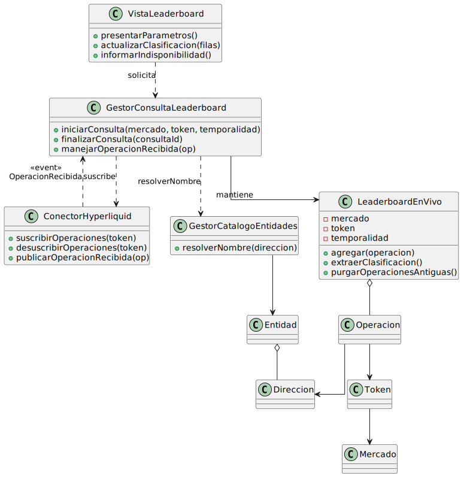
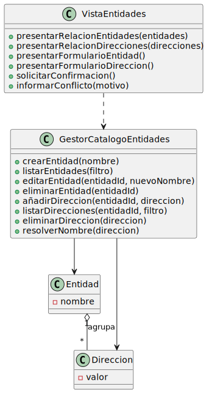
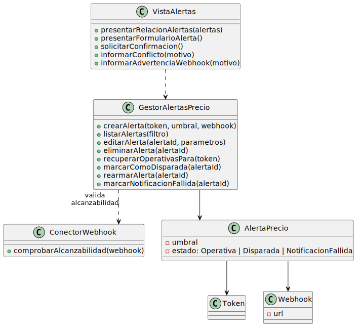
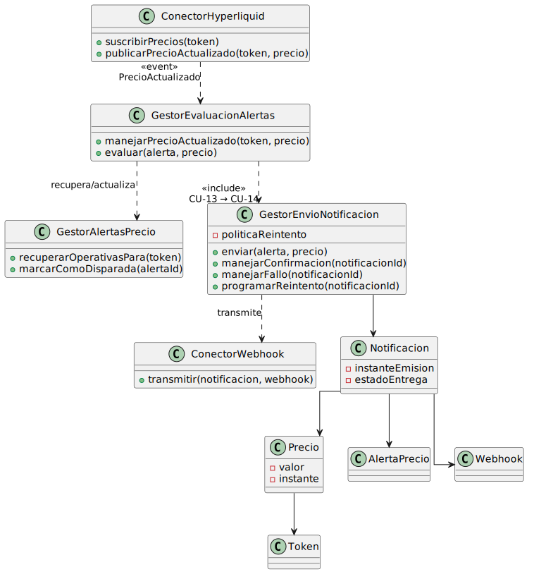
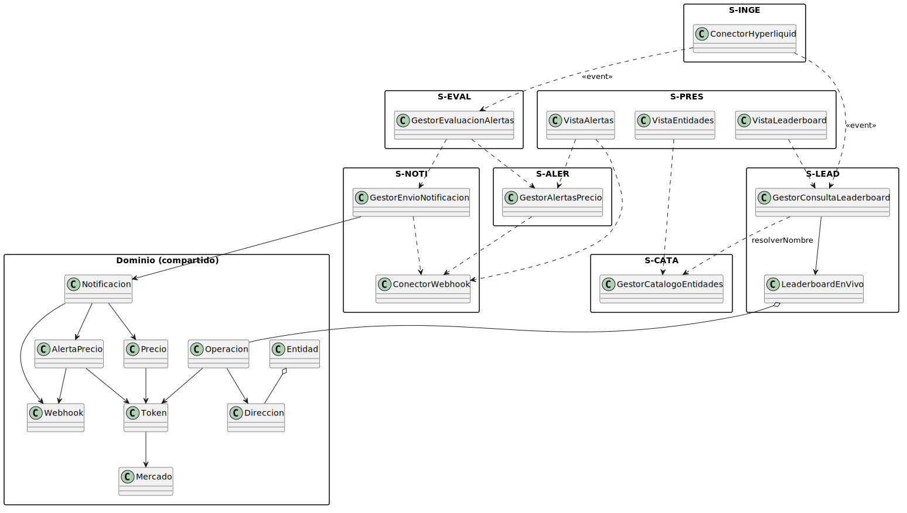

# Análisis de clases

## Propósito

El análisis de clases toma las clases identificadas en las realizaciones de los CdU y las documenta con sus **responsabilidades, atributos y operaciones tentativas**, sin todavía comprometer firmas técnicas, tipos de lenguaje ni decisiones de implementación. El resultado es un modelo de clases agnóstico de tecnología que el [Diseño de clases](disenoClases.md) refinará y completará.

|||
|-|-|
|**Punto de partida**|Clases identificadas en el [Análisis de los CdU](analisisCdU.md), modelo del dominio del Capítulo 2|
|**Resultado**|Catálogo completo de clases de análisis con responsabilidades acotadas, agrupadas por área funcional|

## Convenciones

|||
|-|-|
|**Estereotipos**|`<<boundary>>`, `<<control>>`, `<<entity>>` siguiendo Jacobson|
|**Operaciones**|Verbos en infinitivo, en el vocabulario del dominio. Los parámetros se nombran sin tipos técnicos|
|**Atributos**|Nombres en singular, con tipo conceptual entre paréntesis (no tipo de lenguaje)|
|**Granularidad**|Cada clase encapsula una sola responsabilidad cohesiva (preparación para SRP)|
|**Relaciones**|Asociación, agregación y composición se expresan con su semántica del dominio. La herencia se reserva para casos en los que el modelo del dominio la haya hecho explícita|

---

## Área Leaderboard

Clases que participan en la realización de **CU-01** *Consultar leaderboard*. Corresponden a los subsistemas **S-PRES**, **S-INGE** y **S-LEAD**.

### Boundaries

|`<<boundary>>` `VistaLeaderboard`|S-PRES|
|-|-|
|*Responsabilidad*|Permitir al Usuario configurar la consulta y presentar la clasificación actualizándola en tiempo real|
|*Atributos*|`mercadoSeleccionado` (Mercado), `tokenSeleccionado` (Token), `temporalidadSeleccionada` (Temporalidad), `clasificacionActual` (lista de filas)|
|*Operaciones*|`presentarParametros()`, `actualizarClasificacion(filas)`, `informarIndisponibilidad()`|

|`<<boundary>>` `ConectorHyperliquid`|S-INGE|
|-|-|
|*Responsabilidad*|Mantener la conexión con Hyperliquid L1 y publicar los eventos `OperacionRecibida` y `PrecioActualizado` a sus consumidores. Sustituible por un nodo no validador sin afectar al resto del sistema (RS-08)|
|*Atributos*|`estadoConexion` (Conectado / Desconectado / Reintentando)|
|*Operaciones*|`suscribirOperaciones(token)`, `desuscribirOperaciones(token)`, `suscribirPrecios(token)`, `publicarOperacionRecibida(op)`, `publicarPrecioActualizado(token, precio)`|

### Control

|`<<control>>` `GestorConsultaLeaderboard`|S-LEAD|
|-|-|
|*Responsabilidad*|Realizar CU-01: agregar volúmenes por dirección, resolver nombres y mantener al día la clasificación|
|*Atributos*|`acumuladoresActivos` (LeaderboardEnVivo por (mercado, token, temporalidad))|
|*Operaciones*|`iniciarConsulta(mercado, token, temporalidad)`, `finalizarConsulta(consultaId)`, `manejarOperacionRecibida(op)`|

### Entities específicas del área

|`<<entity>>` `LeaderboardEnVivo`|S-LEAD|
|-|-|
|*Responsabilidad*|Mantener la agregación incremental por dirección dentro de una temporalidad rodante. Es una entidad **derivada** del flujo de operaciones, no persistente|
|*Atributos*|`mercado` (Mercado), `token` (Token), `temporalidad` (Temporalidad), `volumenesPorDireccion` (mapa Direccion → {compra, venta})|
|*Operaciones*|`agregar(operacion)`, `extraerClasificacion()`, `purgarOperacionesAntiguas()`|

> En el [Diseño de clases](disenoClases.md), `LeaderboardEnVivo` se materializará como una estructura mantenida en memoria caliente (Redis), con purga por ventana deslizante para satisfacer RS-01.

### Entities del dominio que aporta el área

`Operacion`, `Token`, `Mercado`, `Direccion`, `Entidad` (cf. *Entidades del dominio* al final).

### Diagrama del área

---

## Área Catálogo

Clases que participan en la realización de **CU-02 a CU-08** (gestión de entidades y direcciones). Corresponden a los subsistemas **S-PRES** y **S-CATA**.

### Boundaries

|`<<boundary>>` `VistaEntidades`|S-PRES|
|-|-|
|*Responsabilidad*|Permitir al Usuario gestionar el catálogo de entidades y sus direcciones asociadas|
|*Atributos*|`entidadesPresentadas` (lista de Entidad), `criterioFiltro` (texto), `entidadEnContexto` (Entidad o nulo)|
|*Operaciones*|`presentarRelacionEntidades(entidades)`, `presentarRelacionDirecciones(direcciones)`, `presentarFormularioEntidad()`, `presentarFormularioDireccion()`, `solicitarConfirmacion()`, `informarConflicto(motivo)`|

### Control

|`<<control>>` `GestorCatalogoEntidades`|S-CATA|
|-|-|
|*Responsabilidad*|Realizar los CdU CRUD sobre `Entidad` y `Direccion`, garantizar la unicidad de nombres de entidad y la unicidad de asociación de direcciones a entidades|
|*Atributos*|*(no mantiene estado conversacional)*|
|*Operaciones*|`crearEntidad(nombre)`, `listarEntidades(filtro)`, `editarEntidad(entidadId, nuevoNombre)`, `eliminarEntidad(entidadId)`, `añadirDireccion(entidadId, direccion)`, `listarDirecciones(entidadId, filtro)`, `eliminarDireccion(direccion)`, `resolverNombre(direccion)`|

> `resolverNombre` es la operación que el subsistema S-LEAD invoca en R(CU-01) para resolver direcciones a nombres. Se ubica en `GestorCatalogoEntidades` para mantener la cohesión: solo el dueño del catálogo debe consultar el catálogo.

### Diagrama del área

---

## Área Alertas

Clases que participan en la realización de **CU-09 a CU-12** (gestión del ciclo de vida de las alertas de precio). Corresponden a los subsistemas **S-PRES**, **S-ALER** y, transitoriamente, **S-NOTI** (al validar la alcanzabilidad del webhook).

### Boundary

|`<<boundary>>` `VistaAlertas`|S-PRES|
|-|-|
|*Responsabilidad*|Permitir al Usuario gestionar las alertas de precio|
|*Atributos*|`alertasPresentadas` (lista de AlertaPrecio), `criterioFiltro` (texto)|
|*Operaciones*|`presentarRelacionAlertas(alertas)`, `presentarFormularioAlerta()`, `solicitarConfirmacion()`, `informarConflicto(motivo)`, `informarAdvertenciaWebhook(motivo)`|

### Control

|`<<control>>` `GestorAlertasPrecio`|S-ALER|
|-|-|
|*Responsabilidad*|Realizar los CdU CRUD sobre `AlertaPrecio`, validar parámetros (token, umbral, webhook), mantener el ciclo de vida (`OPERATIVA`, `DISPARADA`, `NOTIFICACION_FALLIDA`)|
|*Atributos*|*(no mantiene estado conversacional)*|
|*Operaciones*|`crearAlerta(token, umbral, webhook)`, `listarAlertas(filtro)`, `editarAlerta(alertaId, parametros)`, `eliminarAlerta(alertaId)`, `recuperarOperativasPara(token)`, `marcarComoDisparada(alertaId)`, `rearmarAlerta(alertaId)`, `marcarNotificacionFallida(alertaId)`|

### Diagrama del área

---

## Área Evaluación

Clases que participan en la realización de **CU-13** *Evaluar alertas activas* y **CU-14** *Enviar notificación*. Corresponden a los subsistemas **S-INGE**, **S-EVAL** y **S-NOTI**.

### Boundary central

|`<<boundary>>` `ConectorWebhook`|S-NOTI|
|-|-|
|*Responsabilidad*|Comunicación saliente con el actor *Servicio Webhook*. Comprueba alcanzabilidad y transmite notificaciones, abstrayendo el protocolo HTTP del resto del sistema|
|*Atributos*|*(no mantiene estado entre llamadas)*|
|*Operaciones*|`comprobarAlcanzabilidad(webhook)`, `transmitir(notificacion, webhook)`|

### Controls

|`<<control>>` `GestorEvaluacionAlertas`|S-EVAL|
|-|-|
|*Responsabilidad*|Realizar CU-13: reaccionar a `PrecioActualizado`, recuperar las alertas operativas del token y desencadenar la notificación de las que cumplen su condición|
|*Operaciones*|`manejarPrecioActualizado(token, precio)`, `evaluar(alerta, precio)`|

|`<<control>>` `GestorEnvioNotificacion`|S-NOTI|
|-|-|
|*Responsabilidad*|Realizar CU-14: componer la `Notificacion`, transmitir mediante `ConectorWebhook` y gestionar el rearme o el reintento de la alerta|
|*Atributos*|`politicaReintento` (Reintento)|
|*Operaciones*|`enviar(alerta, precio)`, `manejarConfirmacion(notificacionId)`, `manejarFallo(notificacionId)`, `programarReintento(notificacionId)`|

### Diagrama del área

---

## Entidades del dominio (compartidas)

Las siguientes clases de entidad provienen del [Modelo del dominio](../capitulo2/modeloDelDominio.md) y se enriquecen aquí con los atributos y operaciones que los CdU exigen. No están adscritas a un único subsistema: son el **vocabulario común** que comparten los subsistemas del núcleo.

|`<<entity>>` `Usuario`|
|-|
|*Responsabilidad*: Operador de Infinite Fieldx. Es titular de las acciones de gestión sobre el sistema|
|*Atributos*: `identificador`|

|`<<entity>>` `Mercado`|
|-|
|*Responsabilidad*: Categoría de un token (`Spot`, `PerpNativo`, `PerpHIP3`)|
|*Atributos*: `tipo` (Spot / PerpNativo / PerpHIP3)|

|`<<entity>>` `Token`|
|-|
|*Responsabilidad*: Activo listado en Hyperliquid, identificable por su mercado|
|*Atributos*: `simbolo`, `mercado` (Mercado)|

|`<<entity>>` `Precio`|
|-|
|*Responsabilidad*: Valor del token en un instante. Aporta el dato evaluado por las alertas|
|*Atributos*: `token` (Token), `valor`, `instante`|

|`<<entity>>` `Operacion`|
|-|
|*Responsabilidad*: Compra o venta ejecutada en Hyperliquid sobre un token, atribuida a una dirección|
|*Atributos*: `token` (Token), `direccion` (Direccion), `lado` (Compra / Venta), `volumen`, `instante`|

|`<<entity>>` `Direccion`|
|-|
|*Responsabilidad*: Dirección pública de Hyperliquid|
|*Atributos*: `valor`|

|`<<entity>>` `Entidad`|
|-|
|*Responsabilidad*: Agrupación de direcciones bajo un nombre asignado por el Usuario|
|*Atributos*: `nombre`, `direcciones` (conjunto de Direccion)|

|`<<entity>>` `AlertaPrecio`|
|-|
|*Responsabilidad*: Alerta que monitoriza el precio de un token respecto a un umbral. Mantiene un estado de ciclo de vida (cf. *Diagrama de estados* del Capítulo 2)|
|*Atributos*: `token` (Token), `umbral`, `webhook` (Webhook), `estado` (Operativa / Disparada / NotificacionFallida)|

|`<<entity>>` `Webhook`|
|-|
|*Responsabilidad*: Endpoint URL receptor de notificaciones. Tratamiento confidencial (RS-10)|
|*Atributos*: `url`|

|`<<entity>>` `Notificacion`|
|-|
|*Responsabilidad*: Mensaje generado al disparar una alerta, con la trazabilidad al precio que lo provocó (RS-09)|
|*Atributos*: `alerta` (AlertaPrecio), `precioDisparador` (Precio), `webhook` (Webhook), `instanteEmision`, `estadoEntrega` (Pendiente / Entregada / Fallida)|

---

## Diagrama global de clases de análisis

El siguiente diagrama presenta las clases de análisis del sistema completo, agrupadas por subsistema, con las dependencias clave entre ellas. Es un mapa de referencia, no una vista detallada — el detalle por área se encuentra en los diagramas anteriores.

## Validación del modelo de clases

|Criterio|Comprobación|
|-|-|
|**Trazabilidad con CdU**|Cada control nombra el CdU que realiza. Cada boundary nombra el actor con el que se comunica|
|**Trazabilidad con el dominio**|Las clases entity del modelo del dominio del Capítulo 2 aparecen explícitas en el catálogo|
|**Cohesión por subsistema**|Cada clase pertenece exactamente a un subsistema; las entidades compartidas se documentan como "vocabulario común"|
|**Granularidad de control**|Se mantiene el patrón "un control por CdU" para los CdU detallados, agrupando los CdU CRUD por entidad gestionada en un único control para evitar fragmentación artificial|
|**Sin compromiso tecnológico**|Las operaciones se nombran en el lenguaje del dominio. No aparecen tipos de lenguaje, frameworks ni decisiones de persistencia|

> El [Análisis de paquetes](analisisPaquetes.md) agrupa estas clases en paquetes navegables y formaliza las dependencias entre ellos.
