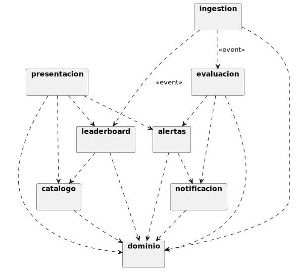

# Análisis de paquetes

## Propósito

El análisis de paquetes agrupa las clases de análisis identificadas en el [Análisis de clases](analisisClases.md) en unidades navegables (paquetes) y formaliza sus **dependencias**, comprobando que el sistema admite una **descomposición acíclica** y que cada paquete satisface los criterios de diseño modular —alta cohesión, bajo acoplamiento, tamaño adecuado— antes de pasar al diseño.

|||
|-|-|
|**Punto de partida**|Catálogo de clases de análisis, subsistemas identificados en el [Análisis de la arquitectura](analisisArquitectura.md)|
|**Resultado**|Diagrama de paquetes de análisis con dependencias explícitas, una clase asignada a un paquete y un solo paquete|

## Criterios aplicados

La agrupación se rige por los principios del diseño modular tal como se desarrollan en la asignatura de Ingeniería del Software II.

|Criterio|Aplicación en este análisis|
|-|-|
|**Alta cohesión (funcional)**|Cada paquete contiene clases que colaboran para realizar un mismo conjunto de CdU. Si dos clases solo tienen en común "estar en el sistema", no comparten paquete|
|**Bajo acoplamiento**|Los paquetes se comunican mediante un número mínimo de clases puente. Las dependencias son **eferentes** a paquetes más estables y nunca aferentes a paquetes inestables|
|**Tamaño adecuado**|Cada paquete contiene entre 1 y 5 clases. Si un paquete crece más, es un indicio de que oculta dos responsabilidades sin separar|
|**Aciclicidad**|El grafo de dependencias entre paquetes es un DAG. Cualquier ciclo en análisis se considera un defecto que debe romperse antes del diseño|
|**Estabilidad**|Los paquetes con más dependencias entrantes contienen menos clases y cambian con menos frecuencia (preparación para la Inversión de Dependencias del diseño)|

## Paquetes identificados

Cada subsistema del [Análisis de la arquitectura](analisisArquitectura.md) se materializa como un paquete de análisis. A estos se añade un paquete `dominio` que agrupa las entidades compartidas (vocabulario común).

|Paquete|Subsistema|Clases que contiene|Tamaño|
|-|-|-|:-:|
|`presentacion`|S-PRES|`VistaLeaderboard`, `VistaEntidades`, `VistaAlertas`|3|
|`ingestion`|S-INGE|`ConectorHyperliquid`|1|
|`notificacion`|S-NOTI|`ConectorWebhook`, `GestorEnvioNotificacion`|2|
|`leaderboard`|S-LEAD|`GestorConsultaLeaderboard`, `LeaderboardEnVivo`|2|
|`catalogo`|S-CATA|`GestorCatalogoEntidades`|1|
|`alertas`|S-ALER|`GestorAlertasPrecio`|1|
|`evaluacion`|S-EVAL|`GestorEvaluacionAlertas`|1|
|`dominio`|*compartido*|`Mercado`, `Token`, `Precio`, `Operacion`, `Direccion`, `Entidad`, `AlertaPrecio`, `Webhook`, `Notificacion`|9|

> El paquete `dominio` contiene las entidades del [Modelo del dominio](../capitulo2/modeloDelDominio.md) sin enriquecer con responsabilidades de control. Es el paquete **más estable** del sistema: cambia solo cuando cambia el lenguaje del negocio.

## Dependencias entre paquetes

Las dependencias entre paquetes son la consolidación de las dependencias entre clases pertenecientes a paquetes distintos.

|Origen|Destino|Naturaleza|Justificación|
|-|-|-|-|
|`presentacion`|`leaderboard`|Invocación|`VistaLeaderboard` solicita la consulta a `GestorConsultaLeaderboard`|
|`presentacion`|`catalogo`|Invocación|`VistaEntidades` opera contra `GestorCatalogoEntidades`|
|`presentacion`|`alertas`|Invocación|`VistaAlertas` opera contra `GestorAlertasPrecio`|
|`ingestion`|`leaderboard`|Notificación de eventos|`ConectorHyperliquid` publica `OperacionRecibida`, suscrito por `GestorConsultaLeaderboard`|
|`ingestion`|`evaluacion`|Notificación de eventos|`ConectorHyperliquid` publica `PrecioActualizado`, suscrito por `GestorEvaluacionAlertas`|
|`leaderboard`|`catalogo`|Invocación|`GestorConsultaLeaderboard` invoca `resolverNombre` para resolver direcciones|
|`alertas`|`notificacion`|Invocación|`GestorAlertasPrecio` usa `ConectorWebhook` para validar alcanzabilidad en CU-09|
|`evaluacion`|`alertas`|Invocación|`GestorEvaluacionAlertas` consulta y actualiza alertas operativas|
|`evaluacion`|`notificacion`|Invocación|`GestorEvaluacionAlertas` desencadena CU-14 (`<<include>>`)|
|*todos los anteriores*|`dominio`|Uso de tipos|Las entidades del dominio son el vocabulario común|

## Diagrama de paquetes

## Validación de la descomposición

### Aciclicidad

|Comprobación|Verificación|
|-|-|
|Topológicamente ordenable|Sí. Un orden válido es: `dominio` → `notificacion` → `alertas` → `evaluacion` → `catalogo` → `leaderboard` → `ingestion` → `presentacion`|
|Sin dependencias circulares|Verificado por inspección del grafo. Ningún paquete depende, directa o transitivamente, de sí mismo|

### Cohesión y acoplamiento

|Paquete|Cohesión|Acoplamiento eferente|Acoplamiento aferente|
|-|-|:-:|:-:|
|`dominio`|Funcional — vocabulario común del negocio|0|7|
|`notificacion`|Funcional — todo lo que entra y sale por el webhook|1 *(dominio)*|2|
|`alertas`|Funcional — gestión de alertas|2 *(dominio, notificacion)*|2|
|`evaluacion`|Funcional — reacción a precio + disparo|3 *(dominio, alertas, notificacion)*|1|
|`catalogo`|Funcional — gestión del catálogo|1 *(dominio)*|2|
|`leaderboard`|Funcional — agregación + presentación de la clasificación|2 *(dominio, catalogo)*|2|
|`ingestion`|Funcional — frontera con la L1|1 *(dominio)*|0|
|`presentacion`|Funcional — vistas del actor Usuario|3 *(leaderboard, catalogo, alertas)*|0|

> El paquete `dominio` es el más estable (acoplamiento aferente alto, eferente nulo). Los paquetes `presentacion` e `ingestion` son los más inestables (acoplamiento eferente, aferente nulo). El sistema cumple el **Principio de Dependencias Estables**: las dependencias siempre apuntan hacia paquetes más estables.

### Tamaño

|Comprobación|Verificación|
|-|-|
|Ningún paquete excede 9 clases|Sí. El más grande (`dominio`, 9 clases) lo es por aglutinar el vocabulario del negocio|
|Ningún paquete contiene una sola clase trivial|Los paquetes con una clase (`ingestion`, `catalogo`, `alertas`, `evaluacion`) lo son porque su única clase es un control con responsabilidades cohesivas suficientes para no fragmentarse|

## Trazabilidad hacia el diseño

Esta descomposición de paquetes es la **base del [Diseño de paquetes](disenoPaquetes.md)**, donde se incorporarán:

|Refinamiento previsto|En el diseño|
|-|-|
|Paquete `dominio`|Se descompone en submódulos por agregado (entidades del catálogo, mercado, alertas, notificación) y se separan las clases puramente de datos de las que llevan reglas de negocio|
|Paquete `infraestructura`|*Nuevo*: aparece en diseño para alojar los adaptadores tecnológicos (cliente Hyperliquid, persistencia PostgreSQL, cliente Redis, cliente HTTP del webhook)|
|Paquete `aplicación`|*Nuevo*: aloja los servicios de aplicación que en análisis se llaman "controles". Es donde la arquitectura hexagonal define los **puertos de entrada**|
|Paquete `presentacion`|Se descompone en submódulos por canal (REST, WebSocket, frontend SPA)|

