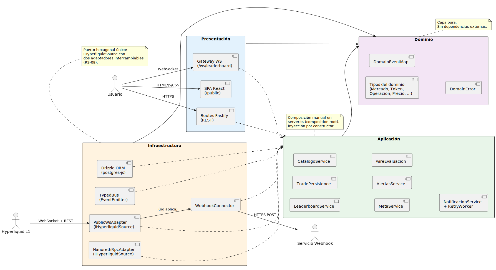
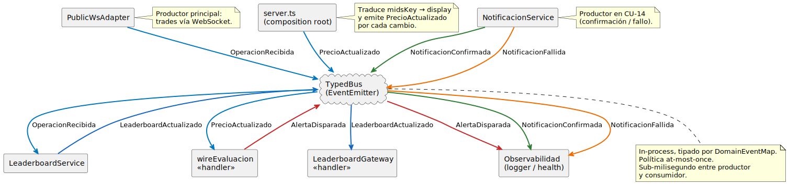
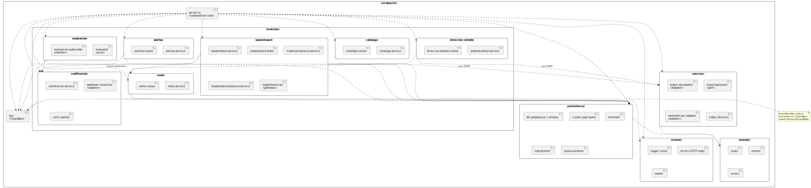

# Diseño de la arquitectura

## Propósito

El diseño de la arquitectura toma la descomposición lógica producida en el [Análisis de la arquitectura](analisisArquitectura.md) y la compromete con **decisiones tecnológicas concretas** —lenguaje, frameworks, persistencia, comunicación, despliegue— manteniendo intactas las propiedades arquitectónicas que la motivaron (cohesión por área, sustituibilidad de la frontera de Ingestión, extensibilidad por eventos). Es el puente final entre el modelo de análisis y el código del Capítulo 4.

||||
|-|-|
|**Punto de partida**|Subsistemas, mecanismos arquitectónicos y dependencias del análisis; requisitos suplementarios|
|**Resultado**|Estilo arquitectónico, stack tecnológico, módulos del backend, mecanismos refinados, vista física preliminar|
|**Restricción**|Cada decisión cita el RS o los CdU que la justifican y respeta los límites de subsistema fijados en el análisis|

## Decisiones tecnológicas globales

|Aspecto|Decisión|Alternativas descartadas|RS justificado|
|-|-|-|-|
|Lenguaje del backend|**TypeScript** sobre Node.js 20 LTS|Python (más lento para I/O concurrente sostenido), Java/Kotlin (overhead operativo en self-hosting)|RS-01, RS-02, RS-03|
|Framework del backend|**NestJS 10**|Express puro (sin DI ni modularidad), Fastify puro (ídem)|RS-04, RS-05|
|Bus de eventos en proceso|**`@nestjs/event-emitter`** (EventEmitter2) síncrono con propagación asíncrona|RxJS *Subject* (más potente pero acoplaría el código a un paradigma reactivo), Kafka/NATS (overhead inadmisible en self-hosting de un solo nodo)|RS-04, RS-05|
|Persistencia primaria|**PostgreSQL 16** vía **TypeORM**|MongoDB (sin transacciones ACID multidocumento que CU-09/CU-11 exigen), SQLite (no soporta concurrencia escritura)|RS-09, RS-10|
|Almacenamiento caliente|**Redis 7** vía **ioredis**, con estructura *Sorted Set*|Memoria del proceso (no sobrevive a reinicios), Memcached (sin estructuras ordenadas)|RS-01, RS-02|
|Lenguaje del frontend|**TypeScript** sobre **React 18** (Vite)|Angular (curva más alta sin beneficio adicional para la SPA mínima del Capítulo 1), Svelte (ecosistema más limitado)|RS-04|
|Comunicación tiempo real|**WebSockets nativos** (`ws` en server, `WebSocket` en cliente)|Server-Sent Events (unidireccional), polling (incompatible con RS-01)|RS-01, RS-02|
|Empaquetado y despliegue|**Docker Compose** sobre infraestructura Infinite Fieldx|Kubernetes (sobredimensionado), instalación nativa (incompatible con la voluntad de portabilidad)|RS-03, RS-08|

> Las versiones se fijan al inicio de implementación. Los criterios de selección se discuten en el Capítulo 4 al concretar `package.json` y `Dockerfile`.

## Estilo arquitectónico: hexagonal con núcleo orientado a eventos

El sistema adopta el estilo **Hexagonal** (también conocido como *Ports and Adapters*) por dos razones que se siguen directamente de los RS:

|Razón|RS|Cómo lo resuelve hexagonal|
|-|-|-|
|La frontera de Ingestión debe ser sustituible (API → nodo no validador) sin afectar al núcleo|RS-08|El núcleo expresa su necesidad como un **puerto** (interfaz) y la implementación concreta es un **adaptador**. Sustituir uno por otro es cambiar la implementación inyectada|
|Las áreas funcionales deben extenderse (nuevas herramientas) sin coordinación entre ellas|RS-04|Cada área expone sus puertos de entrada (servicios de aplicación) y sus puertos de salida (repositorios, conectores). Una nueva área se conecta inyectando los puertos que necesita; no toca el código existente|

### Capas

El núcleo se descompone en tres capas concéntricas; la frontera (adaptadores) las rodea.

|Capa|Responsabilidad|Conoce a|No conoce a|
|-|-|-|-|
|**Dominio** (`domain`)|Reglas de negocio puras: entidades, objetos valor, eventos del dominio, especificaciones, excepciones del dominio|*Nada* fuera de sí mismo|Aplicación, infraestructura, presentación|
|**Aplicación** (`application`)|Orquestación de los CdU. Define los **puertos**: de entrada (interfaces de servicios de aplicación) y de salida (interfaces de repositorios y conectores). Aloja los servicios de aplicación que realizan los CdU|Dominio|Infraestructura, presentación|
|**Infraestructura** (`infrastructure`)|**Adaptadores secundarios**: implementaciones concretas de los puertos de salida (repositorios TypeORM, cliente Redis, cliente Hyperliquid, cliente HTTP del webhook)|Aplicación, dominio|Presentación|
|**Presentación** (`presentation`)|**Adaptadores primarios**: REST controllers (NestJS), gateway WebSocket, frontend SPA. Traducen la entrada externa a invocaciones de puertos de entrada|Aplicación, dominio|Infraestructura|

### Regla de dependencia

> **Las dependencias apuntan siempre hacia adentro.** El dominio no depende de nada. La aplicación depende solo del dominio. La infraestructura y la presentación dependen de la aplicación y del dominio. La inversión de dependencias se materializa con la **inyección de dependencias** que aporta NestJS: los servicios de aplicación reciben los puertos como constructor parameters, no instancian implementaciones concretas.

### Bus de eventos del dominio

La comunicación entre subsistemas independientes (ingestión → leaderboard, ingestión → evaluación, evaluación → notificación) se realiza mediante un **bus de eventos en proceso**. Es un mecanismo de aplicación, no de infraestructura: vive en la capa de aplicación porque los eventos transportan **conceptos del dominio**, no detalles técnicos.

|Aspecto|Decisión|
|-|-|
|Implementación|`EventEmitter2` (`@nestjs/event-emitter`)|
|Naming|Eventos en pasado, dominio puro: `OperacionRecibida`, `PrecioActualizado`, `AlertaDisparada`, `NotificacionConfirmada`, `NotificacionFallida`|
|Delivery|*At-most-once*, en proceso. Un consumidor caído no recibe el evento — aceptable porque todos los eventos se persisten o se regeneran (operaciones se reciben continuamente, precios se reciben continuamente)|
|Backpressure|Cada consumidor implementa su propia política. `GestorConsultaLeaderboard` acumula en Redis; `GestorEvaluacionAlertas` evalúa en línea (latencia esperada < 1 ms por evento)|
|Persistencia|**No se persiste el bus en sí.** Los eventos que el sistema necesita conservar (notificaciones disparadas) se persisten en PostgreSQL como entidades del dominio, no como mensajes del bus|

> El bus es **un mecanismo de aplicación, no de integración entre procesos**. Si en el futuro Infinite Fieldx tuviese que escalar a varios procesos, el bus en memoria se sustituiría por NATS o Redis Streams sin tocar al núcleo: solo cambiaría el adaptador.

## Mapeo subsistema → módulo NestJS

Cada subsistema del análisis se materializa como un **módulo NestJS** (clase con decorador `@Module`). La frontera de presentación se descompone en dos módulos hermanos: uno HTTP (controladores REST) y otro WebSocket (gateway en tiempo real). El paquete `dominio` no es un módulo NestJS porque no necesita inyección: es código puro.

|Subsistema|Módulo NestJS|Provee|Importa|
|-|-|-|-|
|S-PRES (HTTP)|`HttpModule` *(custom)*|REST controllers para CU-02..CU-12|`CatalogoModule`, `AlertasModule`|
|S-PRES (WS)|`RealtimeModule`|Gateway WebSocket para CU-01|`LeaderboardModule`, `CatalogoModule`|
|S-INGE|`IngestionModule`|`HyperliquidConnector` (adapter), publicación de eventos|`SharedKernelModule`|
|S-LEAD|`LeaderboardModule`|Servicios de aplicación + handler de `OperacionRecibida`|`CatalogoModule` *(para resolver nombres)*, `SharedKernelModule`|
|S-CATA|`CatalogoModule`|Servicios CRUD entidades/direcciones, repositorio Postgres|`SharedKernelModule`|
|S-ALER|`AlertasModule`|Servicios CRUD alertas, repositorio Postgres|`NotificacionModule` *(validar webhook)*, `SharedKernelModule`|
|S-EVAL|`EvaluacionModule`|Handler de `PrecioActualizado`, evaluación, emisión de `AlertaDisparada`|`AlertasModule`, `SharedKernelModule`|
|S-NOTI|`NotificacionModule`|Handler de `AlertaDisparada`, conector webhook, política de reintentos|`AlertasModule`, `SharedKernelModule`|
|*Compartido*|`SharedKernelModule`|`EventEmitter2`, configuración, logging, conexión a BD|—|

### Reglas de modularización

|Regla|Justificación|
|-|-|
|Cada módulo expone solo los **servicios de aplicación** (puertos de entrada). Los repositorios y adaptadores se mantienen privados al módulo|Encapsulación: un módulo cliente nunca toca el repositorio de otro módulo. Si lo necesita, abre un puerto de entrada nuevo|
|Las dependencias entre módulos siguen el grafo del análisis. Un ciclo en el grafo de módulos NestJS es un fallo de diseño|Aciclicidad ya validada en el [Análisis de paquetes](analisisPaquetes.md)|
|`SharedKernelModule` es global (`@Global()`). Cualquier módulo puede inyectar de él sin importarlo|Evita la importación repetida en todos los módulos de funcionalidades transversales (logger, configuración)|

## Refinamiento de los mecanismos arquitectónicos

Los cuatro mecanismos identificados en el análisis se concretan ahora con tecnologías y patrones específicos.

### Mecanismo 1 — Comunicación con sistemas externos

|||
|-|-|
|**Subsistemas**|S-INGE, S-NOTI|
|**Patrón**|Adapter (sobre puertos de salida)|
|**Frontera entrante**|Hyperliquid L1 — protocolo WebSocket sobre la API pública|
|**Frontera saliente**|Servicio Webhook — protocolo HTTPS POST con cuerpo JSON|
|**Decisión clave**|El núcleo no conoce *ni* la URL *ni* el protocolo. Recibe los eventos del dominio que el adapter le entrega. El cambio de proveedor (RS-08) es cambiar la clase adapter|
|**Configuración**|Endpoint, credenciales y timeouts se inyectan vía `@nestjs/config` desde variables de entorno|

### Mecanismo 2 — Notificación de eventos del dominio

|||
|-|-|
|**Subsistemas**|Todos los del núcleo|
|**Patrón**|Observer / Pub-Sub (decorador `@OnEvent` de `@nestjs/event-emitter`)|
|**Topología**|*One-to-many* en proceso. Un productor publica; cero, uno o varios consumidores reaccionan|
|**Latencia objetivo**|< 1 ms (en proceso, sin serialización ni red)|
|**Garantía**|*Best effort*. Para los eventos en los que la pérdida es inaceptable (notificaciones), el consumidor persiste el resultado en Postgres antes de confirmar — RS-09|

### Mecanismo 3 — Persistencia

|||
|-|-|
|**Subsistemas**|S-CATA, S-ALER, S-NOTI (PostgreSQL); S-LEAD (Redis)|
|**Patrón**|Repository (interfaz en `application/`, implementación TypeORM en `infrastructure/`)|
|**ORM**|TypeORM 0.3 con migraciones generadas automáticamente|
|**Transaccionalidad**|Decorador `@Transactional` (paquete `typeorm-transactional`) para los servicios de aplicación que mutan más de una entidad (CU-09 al validar webhook + crear alerta)|
|**Confidencialidad de webhooks**|RS-10. Las URLs de webhook se almacenan cifradas con `pgp_sym_encrypt` (extensión `pgcrypto` de PostgreSQL) usando una clave maestra de proceso. El campo `url` en BD es `bytea`, no `text`|

### Mecanismo 4 — Procesamiento concurrente

|||
|-|-|
|**Subsistemas**|Todos|
|**Modelo de concurrencia**|Single-threaded event loop de Node.js + I/O asíncrono|
|**Aislamiento entre áreas (RS-05)**|Aprovechamiento del event loop: cada handler es asíncrono y no bloquea. La evaluación de alertas se ejecuta en su propio "tick" sin retener el thread|
|**Reintentos de notificación (RS-07)**|Cola Redis en lista (`LPUSH` / `BRPOP`) con backoff exponencial. El consumidor de la cola es un servicio de aplicación que reutiliza el mismo `ConectorWebhook`|
|**Resiliencia (RS-03)**|Health check en `/health` (Terminus). Docker Compose reinicia el contenedor en caso de caída|

## Vista física preliminar

La vista física consolidada se presenta en el [Diagrama de despliegue](despliegue.md). Aquí se anticipa la división en procesos que cada subsistema ocupará:

|Proceso|Subsistemas alojados|Tecnología|Razón|
|-|-|-|-|
|`backend`|S-PRES, S-INGE, S-LEAD, S-CATA, S-ALER, S-EVAL, S-NOTI|Node 20 + NestJS|Single process: el bus de eventos requiere memoria compartida. Aislar más subsistemas exigiría sustituir el bus por un broker, gasto innecesario para el alcance|
|`frontend`|*(parte de S-PRES)*|Servidor estático (Nginx) sirviendo el bundle React|Desacopla el ciclo de vida del front del back; redespliegues independientes|
|`postgres`|*(persistencia de S-CATA, S-ALER, S-NOTI)*|PostgreSQL 16 oficial|Servicio gestionado, datos persistentes en volumen|
|`redis`|*(estado caliente de S-LEAD, cola de reintentos de S-NOTI)*|Redis 7 oficial|Servicio gestionado, AOF habilitado para recuperar tras reinicio|

## Justificación cruzada de las decisiones

Cada decisión técnica se rastrea hasta los RS y los CdU que la motivaron y hasta los artefactos de análisis que la prefiguraron.

|Decisión técnica|Hereda de análisis|Resuelve RS|Habilita CdU|
|-|-|-|-|
|Hexagonal + DI|Mecanismo "comunicación con sistemas externos", subsistema S-INGE separado|RS-04, RS-05, RS-08|CU-01, CU-13|
|Event Bus en proceso|Mecanismo "notificación de eventos del dominio"|RS-04, RS-05|CU-01, CU-13|
|PostgreSQL + TypeORM|Mecanismo "persistencia"|RS-09, RS-10|CU-02..CU-12|
|Redis Sorted Set|*LeaderboardEnVivo* como entidad derivada en análisis|RS-01, RS-02|CU-01|
|WebSocket nativo|Boundary `VistaLeaderboard` con presentación reactiva|RS-01, RS-02|CU-01|
|`pgcrypto` para webhooks|Tratamiento confidencial mencionado en `Webhook` del modelo de análisis|RS-10|CU-09..CU-12, CU-14|
|Cola de reintentos en Redis|Mecanismo "procesamiento concurrente"|RS-07, RS-09|CU-14|
|Docker Compose|Mecanismo "procesamiento concurrente" + RS-03 sobre 24/7|RS-03, RS-08|*Despliegue completo*|

## Trazabilidad hacia las disciplinas posteriores

|Hacia|Compromiso|
|-|-|
|[Diseño de los CdU](disenoCdU.md)|Cada CdU se realiza con clases asignadas a su módulo NestJS, comunicándose por puertos|
|[Diseño de clases](disenoClases.md)|Cada control de análisis se materializa como un servicio de aplicación con interfaz de puerto|
|[Diseño de paquetes](disenoPaquetes.md)|La estructura de carpetas refleja exactamente la separación hexagonal y los módulos NestJS|
|[Modelo de datos](modeloDeDatos.md)|Cada entidad persistente del dominio tiene su tabla; `LeaderboardEnVivo` se modela como Sorted Set Redis|
|[Diagrama de despliegue](despliegue.md)|Cada proceso del despliegue corresponde a un servicio de Docker Compose|

