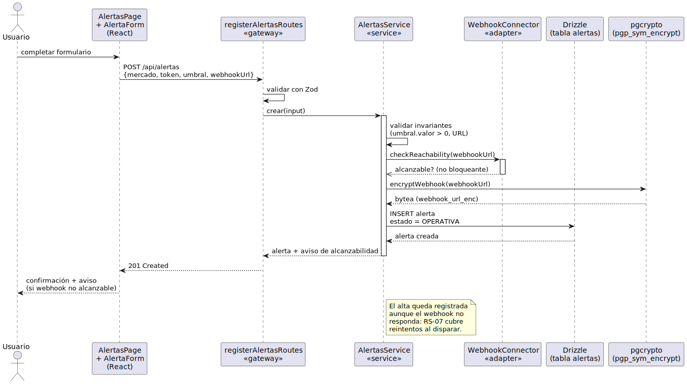
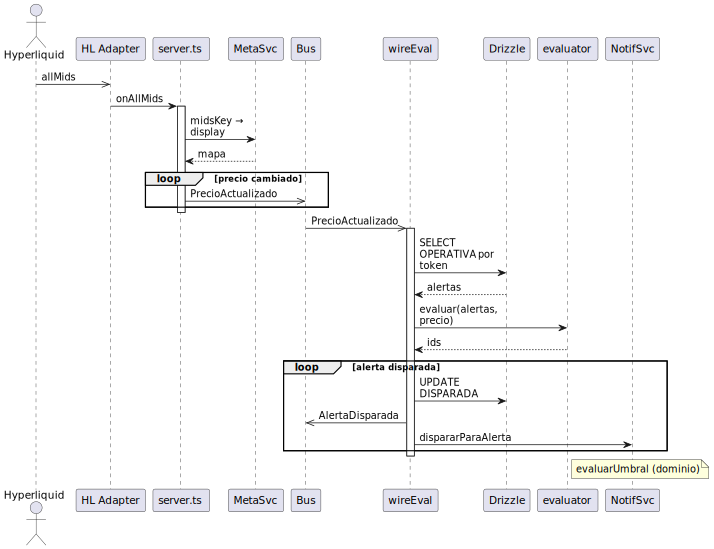
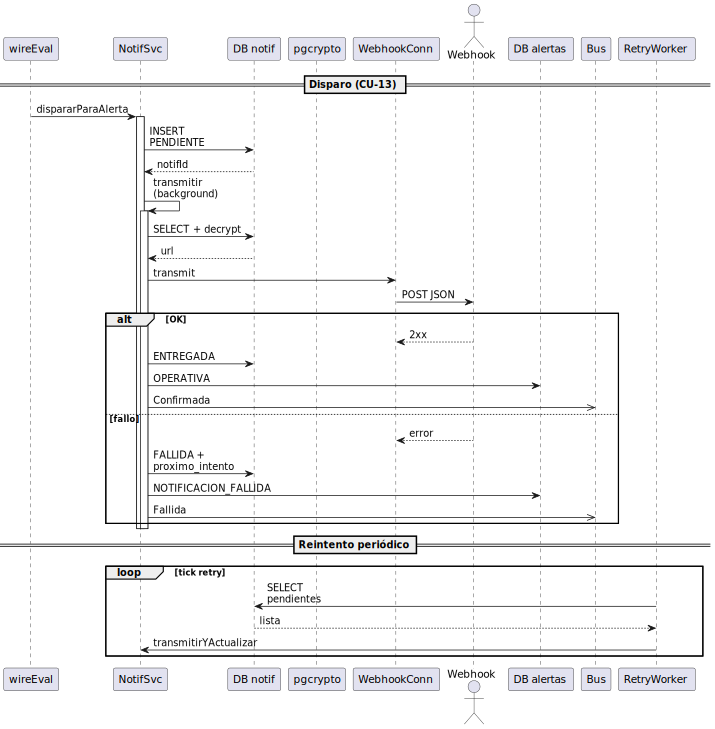
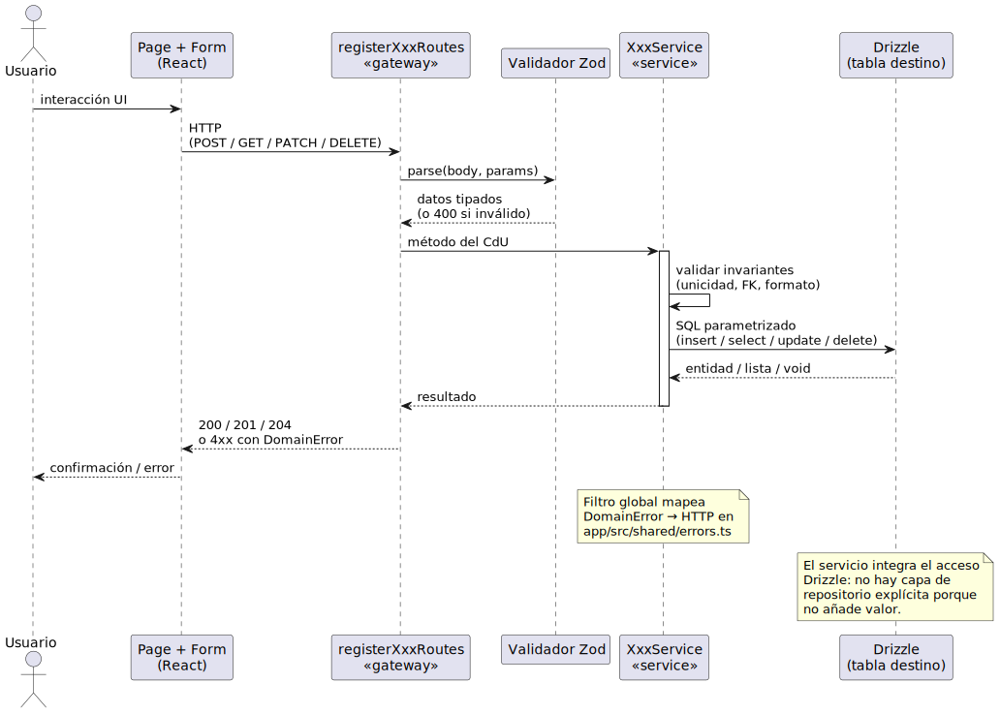

# Diseño de los casos de uso

## Propósito

El diseño de los CdU refina las realizaciones de análisis (`R(CU-XX)`) hasta el nivel necesario para implementarlas: cada participante se identifica con su clase concreta, cada mensaje con su firma técnica y su mecanismo (invocación síncrona, llamada HTTP, mensaje WebSocket, evento del bus), cada decisión de transaccionalidad y cada interacción con la persistencia. El resultado son **diagramas de secuencia de diseño** que actúan como contrato directo para la implementación del Capítulo 4.

||||
|-|-|
|**Punto de partida**|Realizaciones de análisis del [Análisis de los CdU](analisisCdU.md), módulos NestJS del [Diseño de la arquitectura](disenoArquitectura.md)|
|**Resultado**|Diagrama de secuencia de diseño por CdU detallado, con tecnología, transaccionalidad y eventos explícitos|
|**Restricción**|Cada mensaje del diagrama tiene una firma TypeScript ejecutable; cada participante existe como clase real del [Diseño de clases](disenoClases.md)|

## Convenciones de los diagramas

|Convención|Significado|
|-|-|
|`UsuarioBrowser`|Navegador del Usuario, ejecutando el bundle React|
|`<<controller>>`|Adaptador primario REST (NestJS controller con decorador `@Controller`)|
|`<<gateway>>`|Adaptador primario WebSocket (NestJS gateway con decorador `@WebSocketGateway`)|
|`<<service>>`|Servicio de aplicación (clase con decorador `@Injectable` que implementa un puerto de entrada)|
|`<<repo>>`|Adaptador secundario de persistencia (implementación TypeORM o ioredis)|
|`<<adapter>>`|Adaptador secundario hacia un sistema externo (Hyperliquid, Webhook)|
|`EventBus`|Instancia global de `EventEmitter2` inyectada en cada productor|
|`emit(...)`|Publicación de un evento del dominio (asíncrona, sin retorno)|
|`@OnEvent('X')`|Suscripción declarativa de un consumidor a un evento|
|*activación discontinua*|Operación asíncrona que se completa fuera del flujo síncrono del CdU|

## Realización de CU-01 — Consultar leaderboard

### Participantes

|Rol de análisis|Clase de diseño|Módulo|Estereotipo|
|-|-|-|-|
|Actor `Usuario`|`UsuarioBrowser`|*frontend*|—|
|`VistaLeaderboard`|`LeaderboardView` (componente React) + `LeaderboardClient` (cliente WS)|*frontend*|—|
|—|`LeaderboardGateway`|`RealtimeModule`|`<<gateway>>`|
|`GestorConsultaLeaderboard`|`LeaderboardService`|`LeaderboardModule`|`<<service>>`|
|`LeaderboardEnVivo`|`LeaderboardSnapshotRepository`|`LeaderboardModule`|`<<repo>>` *(Redis)*|
|`GestorCatalogoEntidades` *(parcial)*|`AddressNameResolver`|`CatalogoModule`|`<<service>>`|
|`ConectorHyperliquid`|`HyperliquidConnector`|`IngestionModule`|`<<adapter>>`|
|—|`OperationIngestionHandler`|`LeaderboardModule`|`<<service>>` *(handler)*|

### Flujo

1. El Usuario abre la vista; `LeaderboardClient` establece conexión WebSocket con `LeaderboardGateway` y envía un mensaje `subscribe-leaderboard` con `{mercado, token, temporalidad}`.
2. `LeaderboardGateway` invoca a `LeaderboardService.subscribe(...)`, que consulta el snapshot actual a `LeaderboardSnapshotRepository`, lo enriquece con nombres vía `AddressNameResolver` y lo emite al cliente.
3. En paralelo, `HyperliquidConnector` está publicando continuamente eventos `OperacionRecibida` en el `EventBus`. `OperationIngestionHandler` (suscrito vía `@OnEvent('OperacionRecibida')`) actualiza el Sorted Set de Redis y emite `LeaderboardActualizado` con el delta.
4. `LeaderboardGateway` está suscrito a `LeaderboardActualizado` y reenvía la actualización al cliente sobre la conexión WebSocket existente.
5. Al cerrar la vista, el cliente envía `unsubscribe-leaderboard`. Si no quedan suscriptores activos para esa terna, `LeaderboardService` instruye a `HyperliquidConnector` para cerrar el canal de operaciones.

### Decisiones de diseño explícitas

|Decisión|Justificación|
|-|-|
|**Push del backend al cliente vía WebSocket**, en lugar de polling|RS-01: latencia sub-segundo. Polling cada 100 ms saturaría la red sin garantía de frescura|
|**Sorted Set de Redis** indexado por `(mercado, token, temporalidad)` con score = volumen acumulado|`LeaderboardEnVivo` del análisis se materializa así. Inserción y consulta de los *N* primeros son O(log N)|
|**Resolución de nombres separada en `AddressNameResolver`**|Evita que `LeaderboardService` conozca el modelo de catálogo. La frontera entre módulos se mantiene|
|**Suscripción al canal de Hyperliquid solo si hay clientes conectados**|Optimización: el sistema no consume bandwidth ni CPU si nadie observa la terna. Reduce la carga sobre Hyperliquid|
|**Ventana deslizante implementada con `ZREMRANGEBYSCORE`** sobre `instante`|La purga de operaciones antiguas se ejecuta al insertar; no requiere job aparte|

## Realización de CU-09 — Crear alerta de precio

### Participantes

|Rol de análisis|Clase de diseño|Módulo|Estereotipo|
|-|-|-|-|
|Actor `Usuario`|`UsuarioBrowser`|*frontend*|—|
|`VistaAlertas`|`AlertaFormView` (componente React)|*frontend*|—|
|—|`AlertasController`|`HttpModule`|`<<controller>>`|
|`GestorAlertasPrecio`|`AlertasService`|`AlertasModule`|`<<service>>`|
|—|`AlertasRepository`|`AlertasModule`|`<<repo>>` *(Postgres)*|
|`ConectorWebhook`|`WebhookConnector`|`NotificacionModule`|`<<adapter>>`|
|—|`CatalogoQueryService`|`CatalogoModule`|`<<service>>` *(validación de token)*|

### Flujo

1. El Usuario completa el formulario y `AlertaFormView` envía `POST /api/alertas` con el `CrearAlertaDto` validado por `class-validator`.
2. `AlertasController` deserializa el DTO y delega en `AlertasService.crear(dto)`.
3. `AlertasService` valida el token consultando `CatalogoQueryService.existeToken(...)`.
4. `AlertasService` valida la alcanzabilidad del webhook llamando a `WebhookConnector.checkReachability(url)`. Si el webhook no responde, **no se aborta**: se devuelve un aviso al usuario, pero la alerta se crea (RS sobre alerta queda en estado `OPERATIVA`).
5. `AlertasService` mapea el DTO a la entidad `AlertaPrecio` (con webhook cifrado por `pgcrypto`) y persiste vía `AlertasRepository.save(alerta)`.
6. `AlertasService` emite `AlertaCreada` en el bus *(opcional, para auditoría futura)* y devuelve la entidad.
7. `AlertasController` responde `201 Created` con el DTO de respuesta (sin la URL de webhook, RS-10).

### Decisiones de diseño explícitas

|Decisión|Justificación|
|-|-|
|**Validación en dos niveles**: `class-validator` (estructural, en el controller) + reglas de negocio (en el service)|Separación de responsabilidades: el controller valida que la petición *está bien formada*; el service valida que *cumple las reglas del dominio*|
|**Webhook cifrado en BD** (`pgp_sym_encrypt`)|RS-10. La clave maestra reside en variable de entorno; el repositorio descifra al recuperar|
|**Webhook inalcanzable no aborta la creación**|Decisión de UX: el webhook puede caer transitoriamente; la alerta sigue siendo válida. El sistema reintenta al notificar (RS-07)|
|**`AlertaCreada` emitida aunque ningún consumidor lo necesite hoy**|Preparación para RS-04: futuras herramientas (e.g., audit log, dashboard de alertas) se enchufan al evento sin tocar `AlertasService`|
|**Transacción ACID para la creación**|`@Transactional` envuelve la persistencia. Si emitir el evento falla *antes* del commit, la transacción se aborta y el cliente recibe error|

## Realización de CU-13 — Evaluar alertas activas

### Participantes

|Rol de análisis|Clase de diseño|Módulo|Estereotipo|
|-|-|-|-|
|Actor `Hyperliquid L1`|*(externo)*|—|—|
|`ConectorHyperliquid`|`HyperliquidConnector`|`IngestionModule`|`<<adapter>>`|
|`GestorEvaluacionAlertas`|`PriceUpdateHandler` + `AlertEvaluator`|`EvaluacionModule`|`<<service>>`|
|`GestorAlertasPrecio` *(parcial)*|`AlertasQueryService`|`AlertasModule`|`<<service>>`|
|—|`AlertasRepository`|`AlertasModule`|`<<repo>>`|
|*(emisión de evento)*|`EventBus`|`SharedKernelModule`|—|

### Flujo

1. `HyperliquidConnector` recibe un mensaje WebSocket de Hyperliquid con un nuevo precio. Lo mapea a la entidad `Precio` y emite `PrecioActualizado` en el bus.
2. `PriceUpdateHandler` (suscrito con `@OnEvent('PrecioActualizado')`) recupera las alertas operativas para ese token vía `AlertasQueryService.recuperarOperativasPara(token)` (consulta indexada en BD).
3. Para cada alerta, `AlertEvaluator.evaluar(alerta, precio)` aplica el predicado del umbral. Si se cumple:
   - `AlertasRepository.marcarComoDisparada(alertaId)` (cambio de estado en transacción).
   - `EventBus.emit('AlertaDisparada', { alertaId, precioDisparador })` para que `S-NOTI` realice CU-14.
4. Las alertas que no cumplen se ignoran silenciosamente.
5. `PriceUpdateHandler` retorna inmediatamente; el handler de `AlertaDisparada` reside en otro módulo y se ejecuta en su propia activación.

### Decisiones de diseño explícitas

|Decisión|Justificación|
|-|-|
|**Handler asíncrono no bloqueante**|Cada `PrecioActualizado` se procesa en su propia activación del event loop. Múltiples precios concurrentes no se serializan|
|**Consulta de alertas operativas por token con índice**|RS-02: latencia ≤ 2 s. El índice `(token, estado)` en la tabla `alertas` hace la consulta O(log N + K) donde K es el número de alertas operativas para ese token|
|**Cambio de estado y emisión en transacción**|Si la persistencia del cambio falla, no se emite el evento — evita notificaciones huérfanas|
|**Separación `PriceUpdateHandler` ↔ `AlertEvaluator`**|`PriceUpdateHandler` orquesta; `AlertEvaluator` aplica la regla pura. El `AlertEvaluator` es testeable sin BD ni eventos|

## Realización de CU-14 — Enviar notificación

### Participantes

|Rol de análisis|Clase de diseño|Módulo|Estereotipo|
|-|-|-|-|
|*(consumidor del evento)*|`AlertTriggeredHandler`|`NotificacionModule`|`<<service>>`|
|`GestorEnvioNotificacion`|`NotificacionService`|`NotificacionModule`|`<<service>>`|
|`ConectorWebhook`|`WebhookConnector`|`NotificacionModule`|`<<adapter>>`|
|—|`NotificacionesRepository`|`NotificacionModule`|`<<repo>>` *(Postgres)*|
|—|`RetryQueueAdapter`|`NotificacionModule`|`<<repo>>` *(Redis list)*|
|`GestorAlertasPrecio` *(parcial)*|`AlertasService`|`AlertasModule`|`<<service>>`|
|Actor `Servicio Webhook`|*(externo)*|—|—|

### Flujo

1. `AlertTriggeredHandler` (suscrito con `@OnEvent('AlertaDisparada')`) recibe `{ alertaId, precioDisparador }`, recupera la `AlertaPrecio` (con la URL del webhook descifrada) y delega en `NotificacionService.enviar(alerta, precio)`.
2. `NotificacionService` construye la `Notificacion` (con `instanteEmision = now()` y `estadoEntrega = PENDIENTE`) y la persiste vía `NotificacionesRepository.save(notif)` *(RS-09: trazabilidad)*.
3. `NotificacionService` invoca `WebhookConnector.transmitir(notif, alerta.webhook)`.
   - **Éxito (HTTP 2xx)**: `NotificacionService` actualiza `estadoEntrega = ENTREGADA`, emite `NotificacionConfirmada` y solicita a `AlertasService.rearmarAlerta(alertaId)` *(transición DISPARADA → OPERATIVA)*.
   - **Fallo (no 2xx, timeout o red)**: `NotificacionService` actualiza `estadoEntrega = FALLIDA`, emite `NotificacionFallida`, encola en `RetryQueueAdapter.enqueue({alertaId, intento: 1})` y solicita `AlertasService.marcarNotificacionFallida(alertaId)` *(estado NOTIFICACION_FALLIDA)*.
4. Un consumidor independiente (`RetryWorker`) consume la cola con backoff exponencial. Cada intento reutiliza el mismo flujo a partir del paso 2.

### Decisiones de diseño explícitas

|Decisión|Justificación|
|-|-|
|**Persistir la notificación antes de transmitir**|RS-09: trazabilidad. Si el proceso muere durante la transmisión, la notificación queda en BD con `estadoEntrega = PENDIENTE` y un job de recuperación al arrancar la procesa|
|**Cola de reintentos en Redis (list + `BRPOP`), no en memoria**|Sobrevive a reinicios del contenedor (RS-03). Backoff exponencial: 1s, 5s, 30s, 5min, 30min, 1h (máximo 6 intentos)|
|**Rearme de alerta condicionado a confirmación**|La transición DISPARADA → OPERATIVA solo ocurre tras 2xx. Si todos los reintentos fallan, la alerta queda en `NOTIFICACION_FALLIDA` y exige acción manual (CU-11 / CU-12)|
|**Webhook descifrado en memoria solo durante la transmisión**|RS-10: la URL no se loguea, no se serializa en respuesta HTTP, no se persiste en cache|
|**Eventos `NotificacionConfirmada` y `NotificacionFallida` emitidos siempre**|Habilita auditoría futura sin tocar el flujo principal (RS-04)|

## Patrón genérico para los CdU CRUD (CU-02 a CU-08, CU-10 a CU-12)

Los CdU CRUD restantes comparten una estructura idéntica. Documentar cada uno como secuencia individual aportaría redundancia sin información nueva. En su lugar se documenta **un patrón** que cada CdU instancia con su entidad y su gestor.

### Estructura de la secuencia

|Paso|Participante origen|Participante destino|Mecanismo|
|-|-|-|-|
|1|`UsuarioBrowser`|`VistaXxx` (componente React)|UI nativa|
|2|`VistaXxx`|`XxxController`|HTTP `POST` / `GET` / `PATCH` / `DELETE`|
|3|`XxxController`|`XxxService`|Inyección de dependencia (Nest DI)|
|4|`XxxService`|`XxxRepository`|Llamada síncrona|
|5|`XxxRepository`|`PostgreSQL`|SQL parametrizado vía TypeORM|
|6|`XxxService`|`EventBus`|`emit('XxxEvento', payload)` *(opcional)*|
|7|`XxxController`|`UsuarioBrowser`|HTTP `200 OK` / `201 Created` / `204 No Content` con `XxxResponseDto`|

### Instanciación del patrón

|CdU|`VistaXxx`|`XxxController`|`XxxService`|`XxxRepository`|Evento opcional|
|-|-|-|-|-|-|
|CU-02 Crear entidad|`EntidadFormView`|`EntidadesController.crear`|`CatalogoService.crearEntidad`|`EntidadesRepository`|`EntidadCreada`|
|CU-03 Abrir entidades|`EntidadesListView`|`EntidadesController.listar`|`CatalogoService.listarEntidades`|`EntidadesRepository`|—|
|CU-04 Editar entidad|`EntidadFormView`|`EntidadesController.editar`|`CatalogoService.editarEntidad`|`EntidadesRepository`|`EntidadEditada`|
|CU-05 Eliminar entidad|`EntidadesListView`|`EntidadesController.eliminar`|`CatalogoService.eliminarEntidad`|`EntidadesRepository`|`EntidadEliminada`|
|CU-06 Añadir dirección|`DireccionFormView`|`DireccionesController.añadir`|`CatalogoService.añadirDireccion`|`DireccionesRepository`|`DireccionAñadida`|
|CU-07 Abrir direcciones|`DireccionesListView`|`DireccionesController.listar`|`CatalogoService.listarDirecciones`|`DireccionesRepository`|—|
|CU-08 Eliminar dirección|`DireccionesListView`|`DireccionesController.eliminar`|`CatalogoService.eliminarDireccion`|`DireccionesRepository`|`DireccionEliminada`|
|CU-10 Abrir alertas|`AlertasListView`|`AlertasController.listar`|`AlertasService.listar`|`AlertasRepository`|—|
|CU-11 Editar alerta|`AlertaFormView`|`AlertasController.editar`|`AlertasService.editar`|`AlertasRepository`|`AlertaEditada`|
|CU-12 Eliminar alerta|`AlertasListView`|`AlertasController.eliminar`|`AlertasService.eliminar`|`AlertasRepository`|`AlertaEliminada`|

### Reglas comunes a todos los CRUD

|Regla|Aplicación|
|-|-|
|**Validación estructural en el controller**|Decoradores `@IsString`, `@IsUrl`, `@IsNotEmpty` de `class-validator` sobre el DTO de entrada|
|**Validación de negocio en el service**|Unicidad de nombres, existencia de relaciones, estados válidos|
|**Transaccionalidad**|`@Transactional` en operaciones que mutan más de una entidad (alta de entidad con direcciones iniciales, eliminación con cascada)|
|**Códigos HTTP**|201 en creaciones, 200 en listados/ediciones, 204 en eliminaciones, 409 en conflictos de unicidad, 404 en recurso inexistente, 422 en validación|
|**Paginación de listados**|Query params `?page=N&size=K` por defecto K=20 — documentado como `Pageable` en el contrato OpenAPI|
|**Eventos opcionales emitidos siempre**|RS-04: futuras herramientas se conectan sin modificar el flujo|

## Validación del diseño de los CdU

|Criterio|Comprobación|
|-|-|
|**Cada participante existe en el [Diseño de clases](disenoClases.md)**|Sí — los nombres son los mismos|
|**Cada mensaje tiene firma TypeScript ejecutable**|Sí — los DTOs y métodos están definidos en el diseño de clases|
|**Cada CdU respeta los límites de módulo**|Verificado: ningún `XxxService` invoca un repositorio de otro módulo|
|**Eventos modelados correctamente**|`AlertaDisparada` cruza el límite `EvaluacionModule` → `NotificacionModule` por el bus, no por invocación directa|
|**RS críticos cubiertos**|RS-01 (CU-01 vía Redis + WS), RS-02 (CU-13 vía índice + handler asíncrono), RS-04 (eventos), RS-07 (CU-14 con cola), RS-09 (notificaciones persistidas), RS-10 (webhooks cifrados)|

## Trazabilidad

|De|A|Mecanismo|
|-|-|-|
|Realización de análisis `R(CU-XX)`|Diseño de la secuencia de CU-XX|Mismo orden de mensajes; participantes con la misma responsabilidad bajo nombre técnico|
|Diseño de la secuencia|Implementación|Cada mensaje del diagrama es un método invocado en código|
|Decisiones de diseño explícitas|Pruebas|Cada decisión justifica un caso de prueba: cifrado de webhook → test que verifica la columna `bytea`; reintentos → test que provoca 5xx y verifica el encolado|

