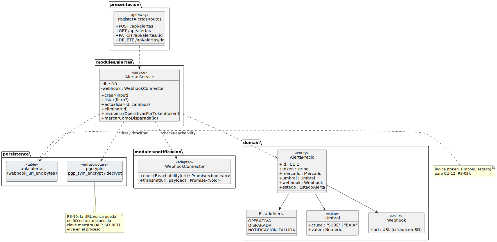
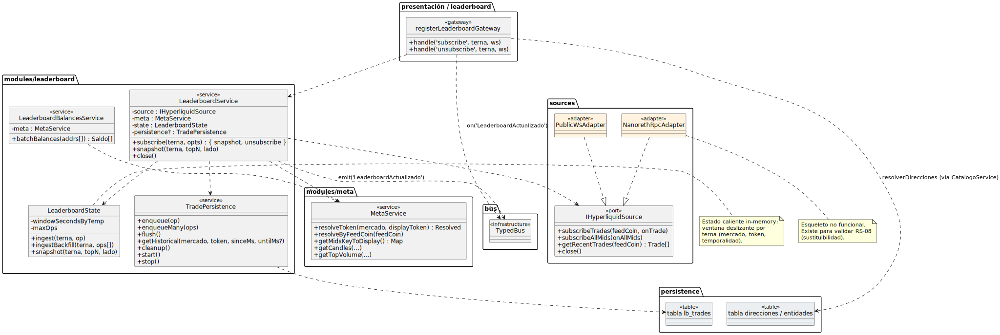
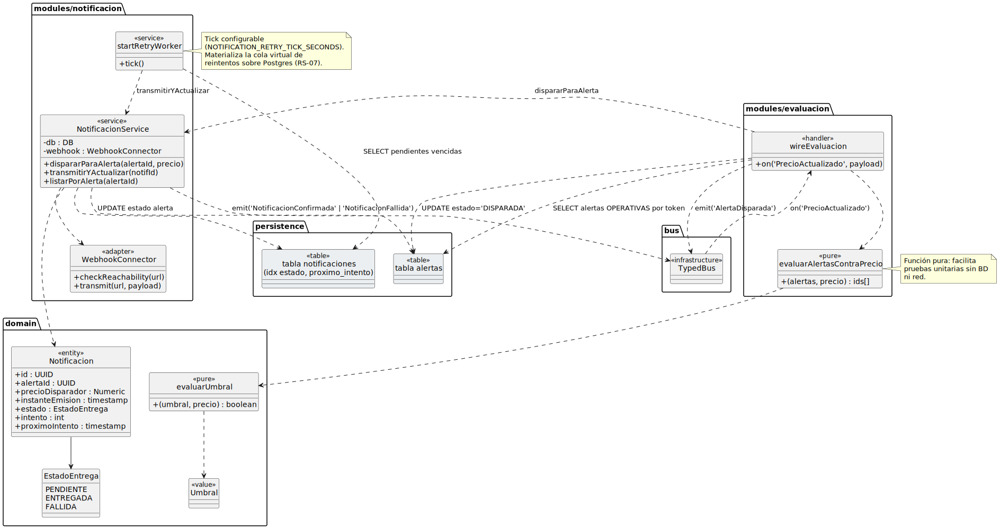
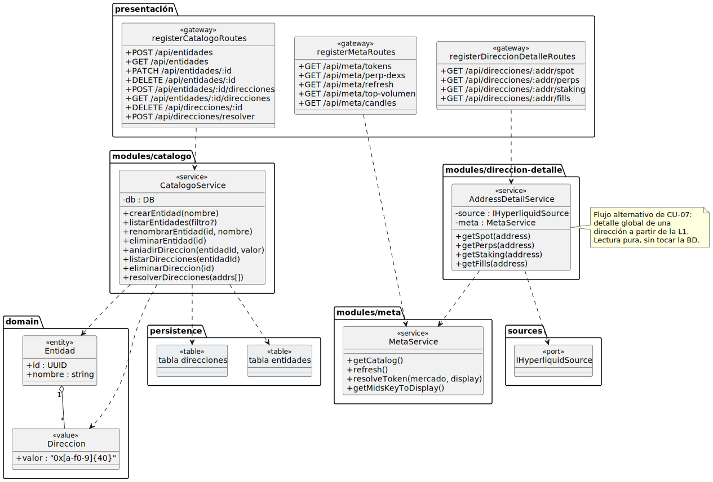

# Diseño de clases

## Propósito

El diseño de clases refina el [Análisis de clases](analisisClases.md) hasta el detalle ejecutable: cada clase de análisis se materializa en una o varias clases de diseño TypeScript con **firmas de método tipadas**, **decoradores NestJS** que activan los mecanismos arquitectónicos, **DTOs y mappers** que cruzan los bordes del sistema y **adaptadores** que implementan los puertos definidos por la aplicación. El catálogo resultante es la última pieza antes del código del Capítulo 4.

<div align=center>

||||
|-|-|
|**Punto de partida**|Clases de análisis (boundary/control/entity), arquitectura hexagonal y módulos NestJS del [Diseño de la arquitectura](disenoArquitectura.md)|
|**Resultado**|Catálogo de clases de diseño por módulo, con interfaces de puerto, servicios de aplicación, repositorios, adaptadores, DTOs y mappers|
|**Restricción**|Cada clase de diseño nombra el rol de análisis del que procede; cada interfaz de puerto refleja una operación del control de análisis|

</div>

## Convenciones

<div align=center>

|Convención|Aplicación|
|-|-|
|**Nombrado**|Servicios de aplicación: `XxxService`. Puertos de entrada: `XxxUseCase` o `IXxxService`. Repositorios: `XxxRepository`. Adaptadores externos: `XxxConnector` o `XxxAdapter`. DTOs: `CrearXxxDto`, `XxxResponseDto`. Eventos: nombres en pasado, sin prefijo|
|**Decoradores**|`@Injectable()` para servicios, `@Controller('ruta')` para REST controllers, `@WebSocketGateway()` para gateways WS, `@OnEvent('X')` para handlers de bus, `@Entity()` para mapping ORM|
|**Tipado**|Estricto. `noImplicitAny` activado. Tipos de dominio (no `string`/`number` desnudos) cuando aporten valor: `Address`, `TokenSymbol`, `Volume` como brand types|
|**Visibilidad**|Repositorios y adaptadores `private` al módulo (no se exportan). Solo los servicios de aplicación se exportan con el array `exports` de `@Module`|
|**Inmutabilidad**|DTOs y eventos con `readonly` en todos los campos. Entidades del dominio mutables solo a través de métodos que respeten invariantes (no setters públicos)|
|**Errores**|Excepciones del dominio extienden `DomainException` (clase abstracta en `domain/`). Los controllers las traducen a HTTP via `ExceptionFilter`|

</div>

---

## Capa de dominio (`domain/`)

Independiente de NestJS, TypeORM y de cualquier framework. Solo TypeScript puro.

### Entidades del dominio

Cada entidad del [Modelo del dominio](../capitulo2/modeloDelDominio.md) se materializa como una clase TypeScript con **invariantes en el constructor** y métodos que mantienen la consistencia.

```typescript
export class Entidad {
  constructor(
    public readonly id: EntidadId,
    private nombre: NombreEntidad,
    private direcciones: Direccion[],
  ) {
    this.invariante();
  }
  cambiarNombre(nuevo: NombreEntidad): void { ... }
  añadirDireccion(d: Direccion): void { ... }
  eliminarDireccion(d: Direccion): void { ... }
  private invariante(): void {
    if (this.direcciones.length === 0) throw new EntidadSinDireccionesException();
  }
}

export class AlertaPrecio {
  constructor(
    public readonly id: AlertaId,
    public readonly token: Token,
    public readonly umbral: Umbral,
    public readonly webhook: Webhook,
    private estado: EstadoAlerta = EstadoAlerta.OPERATIVA,
  ) {}
  evaluar(precio: Precio): boolean { ... }
  marcarDisparada(): void { this.transitar(EstadoAlerta.DISPARADA); }
  rearmar(): void { this.transitar(EstadoAlerta.OPERATIVA); }
  marcarFallida(): void { this.transitar(EstadoAlerta.NOTIFICACION_FALLIDA); }
  private transitar(destino: EstadoAlerta): void { ... }
}
```

> Las máquinas de estado (`AlertaPrecio`, `Notificacion`) ya identificadas en el Capítulo 2 se implementan con un método `transitar` que valida la matriz de transiciones permitidas.

### Objetos valor (Value Objects)

<div align=center>

|Clase|Encapsula|Invariantes|
|-|-|-|
|`EntidadId`, `AlertaId`, `DireccionId`, `NotificacionId`|UUID v4|Formato UUID v4 válido|
|`NombreEntidad`|`string`|Longitud 1..64, sin caracteres de control|
|`TokenSymbol`|`string`|Solo `[A-Z0-9-]{1,16}`|
|`Address`|`string`|Hexadecimal `0x[a-f0-9]{40}`|
|`Volume`|`bigint`|Positivo, ≤ `10**24`|
|`Precio`|`{ valor: number, instante: Date, token: Token }`|`valor > 0`, `instante` no futuro|
|`Umbral`|`{ direccion: Cruce, valor: number }`|`Cruce ∈ {SUBE, BAJA}`, `valor > 0`|
|`Webhook`|`URL`|HTTPS obligatorio (RS-10), longitud máxima 2048|

</div>

### Eventos del dominio

```typescript
export abstract class DomainEvent {
  abstract readonly eventName: string;
  readonly ocurridoEn: Date = new Date();
}

export class OperacionRecibida extends DomainEvent {
  readonly eventName = 'OperacionRecibida';
  constructor(public readonly operacion: Operacion) { super(); }
}
export class PrecioActualizado extends DomainEvent { ... }
export class AlertaDisparada extends DomainEvent { ... }
export class NotificacionConfirmada extends DomainEvent { ... }
export class NotificacionFallida extends DomainEvent { ... }
```

### Excepciones del dominio

`DomainException` (abstracta) → `EntidadDuplicadaException`, `DireccionYaAsignadaException`, `WebhookInaccesibleException`, `TransicionEstadoNoPermitida`, `AlertaNoEncontrada`, …

---

## Capa de aplicación (`application/`)

Define los **puertos** y aloja los **servicios de aplicación** que implementan los CdU. No conoce a TypeORM, ioredis ni HTTP.

### Puertos de entrada (interfaces de servicio)

Cada control del análisis se traduce en una interfaz de puerto. Los controllers REST y los gateways WS dependen de la interfaz, no de la implementación.

```typescript
export interface IAlertasService {
  crear(dto: CrearAlertaDto): Promise<AlertaResponseDto>;
  listar(filtro: FiltroAlertaDto): Promise<AlertaResponseDto[]>;
  editar(id: AlertaId, dto: EditarAlertaDto): Promise<AlertaResponseDto>;
  eliminar(id: AlertaId): Promise<void>;
}

export interface ILeaderboardService {
  obtenerSnapshot(q: ConsultaLeaderboardDto): Promise<FilaLeaderboardDto[]>;
  suscribir(q: ConsultaLeaderboardDto, cliente: ClienteWS): Promise<Suscripcion>;
}

export interface ICatalogoService {
  crearEntidad(dto: CrearEntidadDto): Promise<EntidadResponseDto>;
  listarEntidades(filtro: string): Promise<EntidadResponseDto[]>;
  resolverNombre(direccion: Address): Promise<string | null>;
  ...
}
```

### Puertos de salida (interfaces de adaptador)

Definen **lo que la aplicación necesita** del exterior. La implementación reside en `infrastructure/`.

```typescript
export interface IAlertasRepository {
  save(a: AlertaPrecio): Promise<void>;
  findById(id: AlertaId): Promise<AlertaPrecio | null>;
  findOperativasPorToken(t: TokenSymbol): Promise<AlertaPrecio[]>;
  delete(id: AlertaId): Promise<void>;
}

export interface ILeaderboardSnapshotRepository {
  añadirOperacion(t: Terna, op: Operacion): Promise<void>;
  obtenerTopN(t: Terna, n: number): Promise<FilaLeaderboard[]>;
  purgarVentana(t: Terna, hasta: Date): Promise<void>;
}

export interface IWebhookConnector {
  checkReachability(url: Webhook): Promise<boolean>;
  transmitir(notificacion: Notificacion, url: Webhook): Promise<ResultadoTransmision>;
}

export interface IRetryQueue {
  enqueue(payload: RetryPayload): Promise<void>;
  consume(handler: (p: RetryPayload) => Promise<void>): void;
}
```

### Servicios de aplicación

Cada servicio implementa uno o varios puertos de entrada y orquesta la realización del CdU. Inyecta los puertos de salida que necesita.

```typescript
@Injectable()
export class AlertasService implements IAlertasService {
  constructor(
    private readonly alertas: IAlertasRepository,
    private readonly catalogo: ICatalogoQueryService,
    private readonly webhook: IWebhookConnector,
    private readonly bus: IEventBus,
  ) {}

  @Transactional()
  async crear(dto: CrearAlertaDto): Promise<AlertaResponseDto> {
    const token = await this.catalogo.resolverToken(dto.token);
    const alcanzable = await this.webhook.checkReachability(dto.webhook);
    const alerta = AlertaPrecioMapper.fromDto(dto, token);
    await this.alertas.save(alerta);
    this.bus.emit(new AlertaCreada(alerta.id));
    return AlertaPrecioMapper.toResponse(alerta, alcanzable);
  }
  // listar, editar, eliminar análogas
}

@Injectable()
export class PriceUpdateHandler {
  constructor(
    private readonly alertas: IAlertasQueryService,
    private readonly evaluador: AlertEvaluator,
    private readonly bus: IEventBus,
  ) {}

  @OnEvent('PrecioActualizado')
  async handle(ev: PrecioActualizado): Promise<void> {
    const operativas = await this.alertas.recuperarOperativasPara(ev.precio.token);
    for (const a of operativas) if (this.evaluador.evaluar(a, ev.precio))
      this.bus.emit(new AlertaDisparada(a.id, ev.precio));
  }
}
```

### DTOs y mappers

Cada borde del sistema cruza con un DTO inmutable. Los mappers traducen entre DTOs ↔ entidades del dominio. **No** se exponen entidades del dominio sobre HTTP.

```typescript
export class CrearAlertaDto {
  @IsString() @Matches(/^[A-Z0-9-]{1,16}$/)
  readonly token!: string;
  @IsNumber() @IsPositive()
  readonly umbral!: number;
  @IsIn(['SUBE','BAJA'])
  readonly cruce!: 'SUBE' | 'BAJA';
  @IsUrl({ protocols: ['https'] })
  readonly webhook!: string;
}

export class AlertaResponseDto {
  readonly id!: string;
  readonly token!: string;
  readonly umbral!: number;
  readonly cruce!: 'SUBE' | 'BAJA';
  readonly estado!: 'OPERATIVA' | 'DISPARADA' | 'NOTIFICACION_FALLIDA';
  readonly webhookAlcanzable!: boolean;
  // url del webhook NUNCA se serializa de vuelta (RS-10)
}

export class AlertaPrecioMapper {
  static fromDto(dto: CrearAlertaDto, token: Token): AlertaPrecio { ... }
  static toResponse(a: AlertaPrecio, alcanzable: boolean): AlertaResponseDto { ... }
}
```

---

## Capa de infraestructura (`infrastructure/`)

Implementa los puertos de salida. El núcleo no conoce esta capa.

### Repositorios (PostgreSQL via TypeORM)

```typescript
@Injectable()
export class AlertasRepositoryTypeOrm implements IAlertasRepository {
  constructor(
    @InjectRepository(AlertaOrmEntity)
    private readonly repo: Repository<AlertaOrmEntity>,
  ) {}

  async save(a: AlertaPrecio): Promise<void> {
    const orm = AlertaOrmMapper.toOrm(a);
    await this.repo.save(orm);
  }
  async findOperativasPorToken(t: TokenSymbol): Promise<AlertaPrecio[]> {
    const rows = await this.repo.find({ where: { token: t.value, estado: 'OPERATIVA' } });
    return rows.map(AlertaOrmMapper.fromOrm);
  }
  ...
}
```

> El `AlertaOrmEntity` es una clase distinta de `AlertaPrecio`. La entidad ORM lleva los decoradores `@Entity`, `@Column`, `@Index`. La entidad del dominio queda libre de tecnología. El `AlertaOrmMapper` traduce en ambos sentidos.

### Repositorio Redis para el leaderboard

```typescript
@Injectable()
export class LeaderboardSnapshotRepositoryRedis implements ILeaderboardSnapshotRepository {
  constructor(@InjectRedis() private readonly redis: Redis) {}

  async añadirOperacion(t: Terna, op: Operacion): Promise<void> {
    const key = this.keyDe(t);
    await this.redis.zincrby(key, Number(op.volumen), op.direccion.value);
    await this.redis.zremrangebyscore(`${key}:tiempos`, 0, t.ventana.desde.getTime());
  }
  async obtenerTopN(t: Terna, n: number): Promise<FilaLeaderboard[]> { ... }
  private keyDe(t: Terna): string { return `lb:${t.mercado}:${t.token}:${t.temporalidad}`; }
}
```

### Adaptadores de sistemas externos

```typescript
@Injectable()
export class HyperliquidConnector implements IHyperliquidPort {
  constructor(
    private readonly bus: IEventBus,
    private readonly cfg: ConfigService,
  ) { this.connect(); }

  private async connect(): Promise<void> {
    const ws = new WebSocket(this.cfg.get('HYPERLIQUID_WS_URL')!);
    ws.on('message', (data) => this.onMessage(data));
    ...
  }
  private onMessage(raw: WebSocket.Data): void {
    const msg = HyperliquidMessageParser.parse(raw);
    if (msg.type === 'trade')   this.bus.emit(new OperacionRecibida(msg.toOperacion()));
    if (msg.type === 'tick')    this.bus.emit(new PrecioActualizado(msg.toPrecio()));
  }
}
```

> El `HyperliquidConnector` es el **único punto del sistema que conoce el protocolo de Hyperliquid**. Sustituirlo por un adaptador para nodo no validador (RS-08) es cambiar la implementación inyectada para `IHyperliquidPort` en `IngestionModule`.

```typescript
@Injectable()
export class WebhookConnectorHttp implements IWebhookConnector {
  constructor(private readonly http: HttpService) {}

  async checkReachability(url: Webhook): Promise<boolean> {
    try { await firstValueFrom(this.http.head(url.value, { timeout: 3000 })); return true; }
    catch { return false; }
  }
  async transmitir(n: Notificacion, url: Webhook): Promise<ResultadoTransmision> {
    try {
      const res = await firstValueFrom(
        this.http.post(url.value, NotificacionMapper.toWebhookPayload(n), { timeout: 5000 })
      );
      return res.status >= 200 && res.status < 300 ? Resultado.OK : Resultado.FALLO;
    } catch { return Resultado.FALLO; }
  }
}
```

---

## Capa de presentación (`presentation/`)

### REST controllers

```typescript
@Controller('alertas')
@UseFilters(DomainExceptionFilter)
export class AlertasController {
  constructor(private readonly svc: IAlertasService) {}

  @Post()
  async crear(@Body() dto: CrearAlertaDto): Promise<AlertaResponseDto> {
    return this.svc.crear(dto);
  }
  @Get()
  async listar(@Query() filtro: FiltroAlertaDto): Promise<AlertaResponseDto[]> {
    return this.svc.listar(filtro);
  }
  @Patch(':id')
  async editar(@Param('id') id: string, @Body() dto: EditarAlertaDto): Promise<AlertaResponseDto> {
    return this.svc.editar(AlertaId.parse(id), dto);
  }
  @Delete(':id') @HttpCode(204)
  async eliminar(@Param('id') id: string): Promise<void> {
    return this.svc.eliminar(AlertaId.parse(id));
  }
}
```

### WebSocket gateway

```typescript
@WebSocketGateway({ path: '/ws/leaderboard' })
export class LeaderboardGateway {
  constructor(private readonly svc: ILeaderboardService) {}

  @SubscribeMessage('subscribe-leaderboard')
  async onSubscribe(@MessageBody() q: ConsultaLeaderboardDto, @ConnectedSocket() c: Socket): Promise<void> {
    const sub = await this.svc.suscribir(q, new ClienteWSAdapter(c));
    c.on('disconnect', () => sub.cancel());
  }

  @OnEvent('LeaderboardActualizado')
  notificar(ev: LeaderboardActualizado): void {
    this.broadcastA(ev.terna, ev.delta);
  }
}
```

---

## Aplicación de los principios SOLID

<div align=center>

|Principio|Manifestación en el diseño|
|-|-|
|**S**RP — Single Responsibility|Cada clase tiene un propósito (crear alertas, evaluar precios, persistir, transmitir). `AlertasService` no conoce HTTP; `AlertasController` no conoce TypeORM|
|**O**CP — Open/Closed|Añadir un nuevo tipo de alerta requiere implementar la interfaz `IEvaluadorAlerta` y registrarlo en el contenedor; no se modifican `PriceUpdateHandler` ni `AlertEvaluator` existentes|
|**L**SP — Liskov Substitution|`HyperliquidConnector` y un futuro `NodoNoValidadorConnector` cumplen `IHyperliquidPort`; sustituir uno por otro no rompe a `IngestionModule`|
|**I**SP — Interface Segregation|`ICatalogoService` (cliente: presentación) e `ICatalogoQueryService` (cliente: leaderboard, alertas) son interfaces distintas, aunque las implemente el mismo `CatalogoService`. Cada cliente depende solo de lo que usa|
|**D**IP — Dependency Inversion|Todas las capas hacia adentro dependen de interfaces, no de implementaciones. La inyección se resuelve en los `@Module` con providers `{ provide: 'IXxx', useClass: XxxImpl }`|

</div>

## Patrones de diseño aplicados

<div align=center>

|Patrón|Dónde|Razón|
|-|-|-|
|**Repository**|`IAlertasRepository`, `IEntidadesRepository`, `ILeaderboardSnapshotRepository`|Encapsular acceso a la persistencia detrás de una interfaz del dominio|
|**Adapter**|`HyperliquidConnector`, `WebhookConnectorHttp`, `LeaderboardSnapshotRepositoryRedis`|Aislar el núcleo del protocolo concreto del exterior|
|**Strategy**|`AlertEvaluator` con futuras subclases por tipo de alerta|Permitir nuevos tipos de alerta sin tocar el handler|
|**Observer / Pub-Sub**|`@OnEvent` sobre el `EventBus`|Desacoplar productores y consumidores de eventos|
|**Template Method**|`DomainEvent` (base) con `eventName` abstracto|Estandarizar la forma de los eventos del dominio|
|**Command**|`CrearAlertaDto`, `EditarAlertaDto`|Encapsular la solicitud junto con sus parámetros, validable y serializable|
|**DTO + Mapper**|En cada borde del sistema|Evitar fugas del modelo de dominio hacia HTTP, BD o eventos|
|**Specification**|`Umbral.evaluar(precio): boolean`|Encapsular la regla del umbral como objeto del dominio|

</div>

## Diagrama de clases por módulo

### Módulo `AlertasModule`

<div align=center>



</div>

### Módulo `LeaderboardModule` + `IngestionModule`

<div align=center>



</div>

### Módulo `EvaluacionModule` + `NotificacionModule`

<div align=center>



</div>

### Módulo `CatalogoModule`

<div align=center>



</div>

## Trazabilidad análisis → diseño

<div align=center>

|Clase de análisis|Clase(s) de diseño|Mecanismo|
|-|-|-|
|`VistaLeaderboard`|`LeaderboardView` (React) + `LeaderboardClient` (cliente WS)|Componente UI + cliente de protocolo|
|`VistaEntidades`|`EntidadesListView`, `EntidadFormView`, `DireccionFormView`|Descomposición en componentes|
|`VistaAlertas`|`AlertasListView`, `AlertaFormView`|Descomposición en componentes|
|`ConectorHyperliquid`|`HyperliquidConnector` *(impl)* + `IHyperliquidPort` *(interfaz)*|Adapter|
|`ConectorWebhook`|`WebhookConnectorHttp` + `IWebhookConnector`|Adapter|
|`GestorConsultaLeaderboard`|`LeaderboardService` + `OperationIngestionHandler`|Service + Event handler|
|`GestorCatalogoEntidades`|`CatalogoService` + `EntidadesRepository` + `DireccionesRepository`|Service + Repositorios|
|`GestorAlertasPrecio`|`AlertasService` + `AlertasRepository` + `AlertasQueryService`|Service + Repositorios + interfaz especializada (ISP)|
|`GestorEvaluacionAlertas`|`PriceUpdateHandler` + `AlertEvaluator`|Handler + estrategia pura|
|`GestorEnvioNotificacion`|`AlertTriggeredHandler` + `NotificacionService` + `RetryWorker`|Handler + Service + Worker para reintentos|
|`LeaderboardEnVivo`|`LeaderboardSnapshotRepositoryRedis` + estructura Sorted Set|Repository + Estructura Redis|
|*Entidades del dominio*|Clases puras en `domain/` + `XxxOrmEntity` en `infrastructure/`|Separación dominio ↔ ORM|

</div>

## Validación del diseño de clases

<div align=center>

|Criterio|Comprobación|
|-|-|
|**Trazabilidad con análisis**|Cada clase de diseño se mapea a un rol de análisis. Cero clases huérfanas|
|**Inversión de dependencias**|Servicios de aplicación dependen de interfaces de puerto, no de TypeORM ni ioredis|
|**Tipado del dominio**|`Address`, `TokenSymbol`, `Volume` aparecen en lugar de `string` y `number` desnudos|
|**Encapsulación de mecanismos**|Eventos: solo en `domain/events/`. Persistencia: solo en `infrastructure/repositories/`. HTTP: solo en `presentation/http/`|
|**Cero dependencias inversas**|`domain/` no importa nada de `application/`, `infrastructure/` ni `presentation/`. Validable con ESLint regla `no-restricted-imports`|

</div>

## Trazabilidad hacia el resto del capítulo y la implementación

<div align=center>

|Hacia|Compromiso|
|-|-|
|[Diseño de paquetes](disenoPaquetes.md)|La estructura de carpetas refleja la separación dominio/aplicación/infraestructura/presentación|
|[Modelo de datos](modeloDeDatos.md)|Cada `XxxOrmEntity` se materializa en una tabla; los `Sorted Set` Redis siguen el esquema de claves|
|Capítulo 4|Las firmas TypeScript son ejecutables: el código se obtiene completando los cuerpos de método|

</div>
