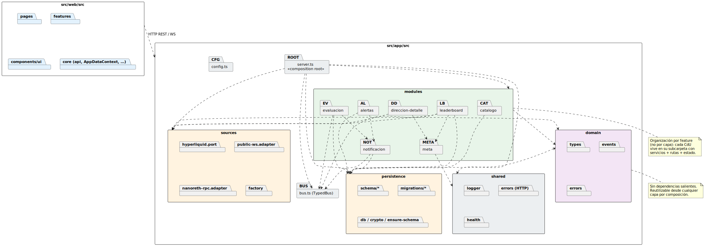

# Diseño de paquetes

## Propósito

El diseño de paquetes consolida los paquetes de análisis ([Análisis de paquetes](analisisPaquetes.md)) y la separación hexagonal ([Diseño de la arquitectura](disenoArquitectura.md)) en una **estructura de carpetas concreta del repositorio**, navegable por un desarrollador, comprobable por reglas estáticas y reflejada uno a uno en los módulos NestJS. La organización resultante actúa como contrato físico de la implementación.

<div align=center>

||||
|-|-|
|**Punto de partida**|Paquetes de análisis (`presentacion`, `ingestion`, `leaderboard`, `catalogo`, `alertas`, `evaluacion`, `notificacion`, `dominio`); capas hexagonales (`domain`, `application`, `infrastructure`, `presentation`)|
|**Resultado**|Estructura de carpetas del monorepo backend + frontend, reglas de dependencia entre carpetas, mecanismo de validación estática|
|**Restricción**|La estructura física debe permitir aplicar **reglas de import** que prohíban dependencias inversas; el sistema debe poder fallar en compilación si un módulo cruza la frontera|

</div>

## Estructura del repositorio

El proyecto se organiza como **monorepo** con dos *workspaces* npm: `backend` y `frontend`. La documentación, los diagramas y las imágenes residen en la raíz, fuera de los workspaces, ya que no se empaquetan en los artefactos de despliegue.

```text
infinite-fieldx/
├── README.md                         (raíz del proyecto)
├── docker-compose.yml                (orquestación Docker)
├── .env.example                      (variables de entorno documentadas)
├── package.json                      (workspaces root)
│
├── docs/                             (capítulos 1-5)
│   ├── capitulo1/
│   ├── capitulo2/
│   ├── capitulo3/
│   ├── capitulo4/
│   └── capitulo5/
│
├── modelosUML/                       (fuentes PlantUML)
│   ├── capitulo2/
│   └── capitulo3/
│
├── imagenes/                         (SVG renderizados)
│   ├── capitulo2/
│   └── capitulo3/
│
├── backend/
│   ├── package.json
│   ├── tsconfig.json
│   ├── nest-cli.json
│   ├── Dockerfile
│   ├── .eslintrc.cjs                 (reglas de import inter-capa)
│   ├── test/                         (e2e)
│   └── src/
│       ├── main.ts
│       ├── app.module.ts
│       ├── domain/                   (capa interna — vocabulario común)
│       ├── application/              (puertos de entrada y salida)
│       ├── infrastructure/           (adaptadores secundarios)
│       ├── presentation/             (adaptadores primarios)
│       └── shared/                   (kernel compartido)
│
└── frontend/
    ├── package.json
    ├── tsconfig.json
    ├── vite.config.ts
    ├── Dockerfile
    └── src/
        ├── main.tsx
        ├── App.tsx
        ├── pages/                    (rutas top-level)
        ├── features/                 (casos de uso del front)
        ├── shared/                   (UI kit, hooks, clientes)
        └── core/                     (cliente HTTP, cliente WS, estado global)
```

## Estructura del backend en detalle

La capa hexagonal se materializa en cuatro carpetas top-level dentro de `backend/src/`. Dentro de cada capa, los **paquetes funcionales** (catálogo, alertas, …) se descomponen como subcarpetas. Esta doble dimensión —capa × paquete funcional— es lo que permite navegar tanto por área como por mecanismo arquitectónico.

```text
backend/src/
│
├── domain/                                  (capa interna)
│   ├── shared/
│   │   ├── domain-event.ts                  (DomainEvent base)
│   │   ├── domain-exception.ts
│   │   ├── value-objects/                   (Address, TokenSymbol, Volume…)
│   │   └── ids.ts                           (EntidadId, AlertaId…)
│   ├── catalogo/
│   │   ├── entidad.ts
│   │   ├── direccion.ts
│   │   └── exceptions.ts
│   ├── alertas/
│   │   ├── alerta-precio.ts
│   │   ├── umbral.ts
│   │   ├── estado-alerta.ts
│   │   └── exceptions.ts
│   ├── leaderboard/
│   │   ├── operacion.ts
│   │   ├── leaderboard-en-vivo.ts           (struct conceptual; sin ORM)
│   │   └── terna.ts                         (Mercado × Token × Temporalidad)
│   ├── notificacion/
│   │   ├── notificacion.ts
│   │   ├── webhook.ts                       (value object con cifrado)
│   │   └── estado-entrega.ts
│   ├── mercado/
│   │   ├── token.ts
│   │   ├── precio.ts
│   │   └── mercado.ts
│   └── events/
│       ├── operacion-recibida.ts
│       ├── precio-actualizado.ts
│       ├── alerta-disparada.ts
│       ├── notificacion-confirmada.ts
│       └── notificacion-fallida.ts
│
├── application/                             (puertos y servicios)
│   ├── catalogo/
│   │   ├── ports/
│   │   │   ├── catalogo.service.ts          (IcatalogoService)
│   │   │   ├── catalogo-query.service.ts    (ICatalogoQueryService — ISP)
│   │   │   ├── entidades.repository.ts
│   │   │   └── direcciones.repository.ts
│   │   ├── catalogo.service.impl.ts         (@Injectable)
│   │   └── dto/
│   ├── alertas/
│   │   ├── ports/
│   │   │   ├── alertas.service.ts
│   │   │   ├── alertas-query.service.ts
│   │   │   └── alertas.repository.ts
│   │   ├── alertas.service.impl.ts
│   │   └── dto/
│   ├── leaderboard/
│   │   ├── ports/
│   │   │   ├── leaderboard.service.ts
│   │   │   └── leaderboard-snapshot.repository.ts
│   │   ├── leaderboard.service.impl.ts
│   │   ├── operation-ingestion.handler.ts   (@OnEvent)
│   │   └── dto/
│   ├── ingestion/
│   │   └── ports/
│   │       └── hyperliquid.port.ts          (IHyperliquidPort)
│   ├── evaluacion/
│   │   ├── price-update.handler.ts          (@OnEvent)
│   │   └── alert-evaluator.ts               (estrategia pura, testeable)
│   ├── notificacion/
│   │   ├── ports/
│   │   │   ├── notificacion.service.ts
│   │   │   ├── webhook.connector.ts         (IWebhookConnector)
│   │   │   ├── notificaciones.repository.ts
│   │   │   └── retry-queue.ts               (IRetryQueue)
│   │   ├── notificacion.service.impl.ts
│   │   ├── alert-triggered.handler.ts       (@OnEvent)
│   │   ├── retry.worker.ts
│   │   └── dto/
│   └── shared/
│       ├── event-bus.port.ts                (IEventBus)
│       └── transactional.decorator.ts
│
├── infrastructure/                          (adaptadores secundarios)
│   ├── persistence/
│   │   ├── postgres/
│   │   │   ├── entities/                    (TypeORM @Entity)
│   │   │   │   ├── alerta.orm-entity.ts
│   │   │   │   ├── entidad.orm-entity.ts
│   │   │   │   ├── direccion.orm-entity.ts
│   │   │   │   └── notificacion.orm-entity.ts
│   │   │   ├── repositories/
│   │   │   │   ├── alertas.repository.typeorm.ts
│   │   │   │   ├── entidades.repository.typeorm.ts
│   │   │   │   ├── direcciones.repository.typeorm.ts
│   │   │   │   └── notificaciones.repository.typeorm.ts
│   │   │   ├── mappers/
│   │   │   │   ├── alerta.orm-mapper.ts
│   │   │   │   └── ...
│   │   │   ├── migrations/
│   │   │   └── postgres.module.ts
│   │   └── redis/
│   │       ├── leaderboard-snapshot.repository.redis.ts
│   │       ├── retry-queue.redis.ts
│   │       └── redis.module.ts
│   ├── connectors/
│   │   ├── hyperliquid/
│   │   │   ├── hyperliquid.connector.ts
│   │   │   ├── hyperliquid-message.parser.ts
│   │   │   └── hyperliquid.module.ts
│   │   └── webhook/
│   │       ├── webhook.connector.http.ts
│   │       └── webhook.module.ts
│   └── eventbus/
│       └── event-bus.adapter.ts             (wrap de EventEmitter2)
│
├── presentation/                            (adaptadores primarios)
│   ├── http/
│   │   ├── catalogo/
│   │   │   ├── entidades.controller.ts
│   │   │   └── direcciones.controller.ts
│   │   ├── alertas/
│   │   │   └── alertas.controller.ts
│   │   ├── filters/
│   │   │   └── domain-exception.filter.ts
│   │   ├── interceptors/
│   │   └── http.module.ts
│   └── realtime/
│       ├── leaderboard.gateway.ts
│       ├── cliente-ws.adapter.ts
│       └── realtime.module.ts
│
└── shared/                                  (kernel compartido del backend)
    ├── config/
    │   ├── config.module.ts
    │   └── env.validation.ts
    ├── logging/
    └── shared-kernel.module.ts              (@Global)
```

### Mapeo paquete de análisis → carpetas físicas

<div align=center>

|Paquete de análisis|Materialización en backend|
|-|-|
|`presentacion`|`presentation/http/*` + `presentation/realtime/*`|
|`ingestion`|`application/ingestion/ports/` + `infrastructure/connectors/hyperliquid/`|
|`leaderboard`|`domain/leaderboard/` + `application/leaderboard/` + `infrastructure/persistence/redis/leaderboard-*.ts`|
|`catalogo`|`domain/catalogo/` + `application/catalogo/` + `infrastructure/persistence/postgres/repositories/entidades-*.ts` y `direcciones-*.ts`|
|`alertas`|`domain/alertas/` + `application/alertas/` + `infrastructure/persistence/postgres/repositories/alertas-*.ts`|
|`evaluacion`|`application/evaluacion/`|
|`notificacion`|`domain/notificacion/` + `application/notificacion/` + `infrastructure/connectors/webhook/` + `infrastructure/persistence/postgres/repositories/notificaciones-*.ts` + `infrastructure/persistence/redis/retry-queue.redis.ts`|
|`dominio`|`domain/shared/` + descomposición en agregados (`domain/catalogo/`, `domain/alertas/`, `domain/leaderboard/`, `domain/mercado/`, `domain/notificacion/`)|

</div>

> El paquete `dominio` del análisis se descompone en submódulos **por agregado**, como se anticipó en la trazabilidad del análisis. Esto facilita los imports puntuales (`import { AlertaPrecio } from '@domain/alertas/alerta-precio'`) y evita un fichero monolítico.

## Reglas de dependencia entre carpetas

La separación hexagonal solo es útil si se hace **comprobable**. El diseño fija dos mecanismos —ambos materializables en el Capítulo 4— que garantizan que ningún *import* cruce la frontera prohibida:

<div align=center>

|Mecanismo|Función|
|-|-|
|**Aliases por capa**|Cada capa hexagonal expone un alias único (`@domain`, `@application`, `@infrastructure`, `@presentation`, `@shared`). Cualquier import revela explícitamente la capa de origen, lo que vuelve obvia una dependencia ilegítima en cualquier revisión|
|**Regla estática de imports**|Una regla de análisis estático rechaza, en *lint* y en *CI*, los imports que violen la matriz de dependencias permitidas|

</div>

### Matriz de dependencias permitidas

<div align=center>

|Carpeta|Puede importar de|
|-|-|
|`domain/`|*solo* `domain/`|
|`application/`|`domain/`, `application/`|
|`infrastructure/`|`domain/`, `application/`, `infrastructure/`|
|`presentation/`|`domain/`, `application/`, `presentation/`|
|`shared/`|*solo* `shared/`|

</div>

> Las violaciones más relevantes que esta regla impide son: que un *controller* importe directamente la tecnología de persistencia (`presentation/` → `infrastructure/`), o que un servicio de aplicación importe el cliente de Redis (`application/` → `infrastructure/`). Es la materialización ejecutable de la regla de dependencia hexagonal y la condición que permite invertir la dependencia mediante la inyección de los puertos.

## Estructura del frontend en detalle

El frontend sigue una estructura **feature-based** alineada con los CdU. No replica la separación hexagonal del back porque el front es un cliente delgado: su única responsabilidad es presentar y orquestar las llamadas al back.

```text
frontend/src/
├── main.tsx
├── App.tsx
├── routes.tsx                               (configuración de React Router)
│
├── pages/                                   (rutas top-level)
│   ├── leaderboard.page.tsx
│   ├── entidades.page.tsx
│   └── alertas.page.tsx
│
├── features/                                (CdU del front)
│   ├── leaderboard/
│   │   ├── components/
│   │   │   ├── LeaderboardView.tsx
│   │   │   ├── LeaderboardFilters.tsx
│   │   │   └── LeaderboardTable.tsx
│   │   ├── hooks/
│   │   │   └── useLeaderboardSubscription.ts
│   │   └── types.ts
│   ├── catalogo/
│   │   ├── components/
│   │   │   ├── EntidadesListView.tsx
│   │   │   ├── EntidadFormView.tsx
│   │   │   ├── DireccionesListView.tsx
│   │   │   └── DireccionFormView.tsx
│   │   ├── hooks/
│   │   └── api/                             (clientes REST específicos)
│   └── alertas/
│       ├── components/
│       │   ├── AlertasListView.tsx
│       │   └── AlertaFormView.tsx
│       ├── hooks/
│       └── api/
│
├── shared/                                  (transversal del front)
│   ├── ui/                                  (UI kit)
│   ├── hooks/
│   └── utils/
│
└── core/
    ├── http/
    │   ├── api-client.ts                    (Axios pre-configurado)
    │   └── error-mapper.ts
    ├── ws/
    │   └── ws-client.ts                     (cliente WebSocket reconectable)
    └── store/                               (estado global mínimo)
```

> El frontend se mantiene deliberadamente simple: no usa Redux ni librerías de estado complejas. Cada *feature* gestiona su estado con `useState` y `useReducer`; las suscripciones WebSocket se encapsulan en hooks (`useLeaderboardSubscription`).

## Diagrama de paquetes de diseño

El siguiente diagrama refleja la materialización física de los paquetes de análisis sobre la separación hexagonal. Cada nodo es una carpeta del repositorio; cada arco es una dependencia permitida.

<div align=center>



</div>

## Validación de la descomposición física

<div align=center>

|Criterio|Comprobación|
|-|-|
|**Aciclicidad**|El grafo de dependencias entre carpetas es un DAG. Cualquier ciclo introducido se detecta por análisis estático y se trata como defecto del diseño|
|**Regla de capas**|Cada *import* respeta la matriz de dependencias permitidas. La comprobación se hace en *lint* y se bloquea en *CI*|
|**Trazabilidad con análisis**|Cada paquete de análisis tiene su carpeta correspondiente. Cero paquetes huérfanos en cualquier dirección|
|**Tamaño de carpeta**|Ningún submódulo dentro de una capa supera el orden de la decena de ficheros. Si crece más, se descompone por subcaso|
|**Cohesión por feature**|Frontend: cada *feature* es autocontenida (componentes, hooks, cliente de API) y se borra como unidad si la feature desaparece|

</div>

## Trazabilidad

<div align=center>

|De|A|Mecanismo|
|-|-|-|
|[Análisis de paquetes](analisisPaquetes.md)|Carpetas del backend|Mismo nombre, descomposición por capa hexagonal añadida|
|[Diseño de la arquitectura](disenoArquitectura.md)|`backend/src/{domain,application,infrastructure,presentation}/`|Una carpeta por capa hexagonal|
|[Diseño de clases](disenoClases.md)|Ficheros físicos|Una clase por fichero, naming `kebab-case` con sufijo de tipo (`.service.ts`, `.repository.ts`, `.adapter.ts`)|
|[Modelo de datos](modeloDeDatos.md)|`backend/src/infrastructure/persistence/postgres/entities/`|Cada `XxxOrmEntity` tiene su tabla|
|Capítulo 4|Estructura de carpetas final|La implementación crea exactamente esta estructura; no se permite divergencia sin actualizar este capítulo|

</div>
