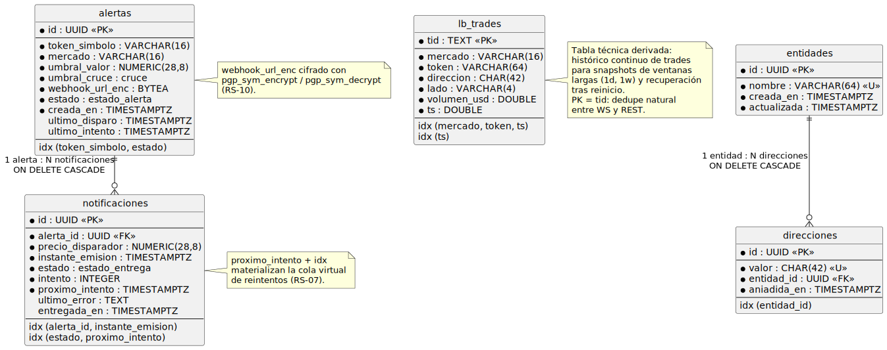

# Modelo de datos

## Propósito

El modelo de datos materializa el [Modelo del dominio](../capitulo2/modeloDelDominio.md) en **almacenes concretos**: PostgreSQL para las entidades persistentes con reglas transaccionales (entidades, direcciones, alertas, notificaciones), Redis para los datos de alto ritmo y vida corta (snapshot del leaderboard, cola de reintentos). Cada decisión de modelado se justifica desde los CdU que lo motivan y los requisitos suplementarios que lo restringen.

<div align=center>

||||
|-|-|
|**Punto de partida**|Modelo del dominio del Capítulo 2; clases de entidad de dominio del [Diseño de clases](disenoClases.md); decisiones de almacenamiento del [Diseño de la arquitectura](disenoArquitectura.md)|
|**Resultado**|DER PostgreSQL con tipos, índices y constraints; esquema de claves Redis; políticas de retención y cifrado|
|**Restricción**|Cada tabla persistente debe ser recuperable tras reinicio del proceso (RS-03); las URLs de webhook se almacenan cifradas (RS-10); las consultas críticas deben servirse en tiempo (RS-01, RS-02)|

</div>

## PostgreSQL — Modelo entidad-relación

### Esquema completo

<div align=center>



</div>

### Tablas

#### `entidades`

Materializa la entidad del dominio `Entidad` y soporta CU-02..CU-05.

```sql
CREATE TABLE entidades (
  id           UUID         PRIMARY KEY DEFAULT gen_random_uuid(),
  nombre       VARCHAR(64)  NOT NULL,
  creada_en    TIMESTAMPTZ  NOT NULL DEFAULT now(),
  actualizada  TIMESTAMPTZ  NOT NULL DEFAULT now(),
  CONSTRAINT entidades_nombre_unico UNIQUE (nombre),
  CONSTRAINT entidades_nombre_no_vacio CHECK (length(trim(nombre)) > 0)
);
```

<div align=center>

|Decisión|Justificación|
|-|-|
|`id` UUID v4 *(`gen_random_uuid()`)*|No expone orden de creación al cliente; permite generación segura desde el cliente sin bloqueo de secuencia|
|`UNIQUE (nombre)`|CU-02 / CU-04 prohíben duplicados — la unicidad se delega a la BD para evitar TOCTOU|
|`actualizada` con trigger `BEFORE UPDATE`|Trazabilidad mínima sin acoplar el código aplicativo|

</div>

#### `direcciones`

Materializa `Direccion` con la asociación a `Entidad`. Soporta CU-06..CU-08.

```sql
CREATE TABLE direcciones (
  id           UUID          PRIMARY KEY DEFAULT gen_random_uuid(),
  valor        CHAR(42)      NOT NULL,                       -- "0x" + 40 hex
  entidad_id   UUID          NOT NULL REFERENCES entidades(id) ON DELETE CASCADE,
  añadida_en   TIMESTAMPTZ   NOT NULL DEFAULT now(),
  CONSTRAINT direcciones_valor_unico UNIQUE (valor),
  CONSTRAINT direcciones_formato CHECK (valor ~ '^0x[a-f0-9]{40}$')
);
CREATE INDEX direcciones_entidad ON direcciones (entidad_id);
```

<div align=center>

|Decisión|Justificación|
|-|-|
|`UNIQUE (valor)`|Una dirección pertenece a *como máximo* una entidad — invariante del modelo del dominio|
|`ON DELETE CASCADE`|Eliminar una entidad arrastra sus direcciones — CU-05 exige semántica de borrado en cascada|
|`CHECK` formato hex|Validación en el último anillo: aunque la app valide, un INSERT defectuoso no entra a la BD|
|Índice por `entidad_id`|CU-07 (listar direcciones de una entidad) ejecuta `WHERE entidad_id = ?`|

</div>

#### `alertas`

Materializa `AlertaPrecio` con el estado del ciclo de vida. Soporta CU-09..CU-13.

```sql
CREATE TYPE estado_alerta AS ENUM ('OPERATIVA','DISPARADA','NOTIFICACION_FALLIDA');
CREATE TYPE cruce         AS ENUM ('SUBE','BAJA');

CREATE TABLE alertas (
  id              UUID            PRIMARY KEY DEFAULT gen_random_uuid(),
  token_simbolo   VARCHAR(16)     NOT NULL,
  mercado         VARCHAR(16)     NOT NULL CHECK (mercado IN ('Spot','PerpNativo','PerpHIP3')),
  umbral_valor    NUMERIC(28,8)   NOT NULL CHECK (umbral_valor > 0),
  umbral_cruce    cruce           NOT NULL,
  webhook_url_enc BYTEA           NOT NULL,                       -- cifrado pgp_sym_encrypt
  estado          estado_alerta   NOT NULL DEFAULT 'OPERATIVA',
  creada_en       TIMESTAMPTZ     NOT NULL DEFAULT now(),
  ultima_disparo  TIMESTAMPTZ     NULL,
  ultimo_intento  TIMESTAMPTZ     NULL
);
CREATE INDEX alertas_token_estado ON alertas (token_simbolo, estado);
CREATE INDEX alertas_estado       ON alertas (estado) WHERE estado <> 'OPERATIVA';
```

<div align=center>

|Decisión|Justificación|
|-|-|
|`webhook_url_enc BYTEA`|RS-10 — la URL nunca se almacena en claro. Cifrado simétrico con clave maestra de proceso (`pgp_sym_encrypt(url, secret)`)|
|`NUMERIC(28,8)`|Precios y umbrales de criptomonedas requieren precisión exacta — `float` no es admisible|
|Índice `(token_simbolo, estado)`|RS-02 (≤ 2 s): CU-13 ejecuta `WHERE token_simbolo = ? AND estado = 'OPERATIVA'` por cada `PrecioActualizado`|
|Índice parcial sobre `estado <> 'OPERATIVA'`|Listado priorizado de alertas en estado anómalo (UI), evita escanear las operativas — son la mayoría|
|`mercado` como `VARCHAR + CHECK`, no `ENUM`|`Spot`, `PerpNativo`, `PerpHIP3` se modelan como ENUM en TypeScript pero como check en BD por simplicidad de migraciones|

</div>

#### `notificaciones`

Materializa `Notificacion`. Soporta CU-13/CU-14 y la trazabilidad RS-09.

```sql
CREATE TYPE estado_entrega AS ENUM ('PENDIENTE','ENTREGADA','FALLIDA');

CREATE TABLE notificaciones (
  id                 UUID            PRIMARY KEY DEFAULT gen_random_uuid(),
  alerta_id          UUID            NOT NULL REFERENCES alertas(id) ON DELETE CASCADE,
  precio_disparador  NUMERIC(28,8)   NOT NULL,
  instante_emision   TIMESTAMPTZ     NOT NULL DEFAULT now(),
  estado             estado_entrega  NOT NULL DEFAULT 'PENDIENTE',
  intento            SMALLINT        NOT NULL DEFAULT 1,
  ultimo_error       TEXT            NULL,
  entregada_en       TIMESTAMPTZ     NULL
);
CREATE INDEX notif_alerta            ON notificaciones (alerta_id, instante_emision DESC);
CREATE INDEX notif_pendientes        ON notificaciones (estado) WHERE estado = 'PENDIENTE';
```

<div align=center>

|Decisión|Justificación|
|-|-|
|Persistencia *antes* de transmitir|RS-09: si el proceso muere durante la transmisión, la notificación queda en BD con `PENDIENTE` y un job de recuperación al arrancar la procesa|
|`intento` y `ultimo_error`|RS-07 — diagnóstico de fallos repetidos|
|Índice descendente por `instante_emision`|UI futura para auditar los últimos disparos por alerta|
|Índice parcial `estado = 'PENDIENTE'`|Recuperación de estado tras reinicio: `SELECT WHERE estado = 'PENDIENTE'` cubre exactamente la cardinalidad de interés|

</div>

#### `eventos_auditoria` *(opcional, preparación para RS-04)*

```sql
CREATE TABLE eventos_auditoria (
  id          BIGSERIAL    PRIMARY KEY,
  nombre      VARCHAR(64)  NOT NULL,
  payload     JSONB        NOT NULL,
  ocurrido_en TIMESTAMPTZ  NOT NULL DEFAULT now()
);
CREATE INDEX eventos_auditoria_nombre ON eventos_auditoria (nombre, ocurrido_en DESC);
```

> No se utiliza en el alcance del TFG, pero su existencia anticipada deja preparada la herramienta de auditoría que RS-04 prevé. Cualquier evento del bus puede persistirse aquí sin tocar el código que lo emite.

### Diagrama relacional

<div align=center>

|Origen|Destino|Cardinalidad|Acción de borrado|
|-|-|-|-|
|`direcciones.entidad_id`|`entidades.id`|N:1|`CASCADE`|
|`notificaciones.alerta_id`|`alertas.id`|N:1|`CASCADE`|

</div>

> No hay FK desde `alertas` a `tokens`/`mercados` porque el catálogo de tokens vive en Hyperliquid: la integridad referencial se valida en el servicio de aplicación contra `CatalogoQueryService.existeToken(...)`, no en la BD.

### Cifrado de webhooks (RS-10)

```sql
-- al insertar
INSERT INTO alertas (..., webhook_url_enc)
VALUES (..., pgp_sym_encrypt('https://example.com/hook', current_setting('app.secret')));

-- al recuperar
SELECT pgp_sym_decrypt(webhook_url_enc, current_setting('app.secret'))::text AS url
FROM alertas WHERE id = $1;
```

<div align=center>

|Aspecto|Decisión|
|-|-|
|Algoritmo|`pgp_sym_encrypt` (extensión `pgcrypto`) con AES-CFB 256|
|Clave maestra|Variable de entorno `APP_SECRET`, inyectada como `app.secret` en cada conexión|
|Ámbito de cifrado|Solo el campo `webhook_url_enc`. El resto de columnas no es sensible|
|Rotación|Se contempla como tarea de operación; no automatizada en el alcance del TFG|

</div>

## Redis — Estructuras y claves

Redis sostiene dos estructuras: el **snapshot del leaderboard** (Sorted Set) y la **cola de reintentos** de notificaciones (List).

### Snapshot del leaderboard

```text
KEY        : lb:{mercado}:{token}:{temporalidad}
TYPE       : ZSET (Sorted Set)
ELEMENT    : direccion (string "0x...")
SCORE      : volumen_acumulado (float64)

KEY        : lb:{mercado}:{token}:{temporalidad}:tiempos
TYPE       : ZSET
ELEMENT    : op_id (UUID)
SCORE      : timestamp_ms (int64)
```

#### Operaciones

```bash
# inserción de operación (atómica con MULTI/EXEC)
ZINCRBY lb:Spot:HYPE:5m  1500.0  0xabc...
ZADD    lb:Spot:HYPE:5m:tiempos  1714234567000  e7f3...

# purga de operaciones más antiguas que la ventana
ZREMRANGEBYSCORE lb:Spot:HYPE:5m:tiempos -inf  (now - 5m)
# (la app reduce el score correspondiente en lb:* tras leer las purgadas)

# top-N para el snapshot (CU-01)
ZREVRANGEBYSCORE lb:Spot:HYPE:5m  +inf  -inf  WITHSCORES  LIMIT 0 50
```

<div align=center>

|Decisión|Justificación|
|-|-|
|Sorted Set indexado por dirección con `score = volumen`|`ZREVRANGE` resuelve el top-N en O(log N + M); RS-01 satisfecho con margen|
|Clave compuesta `{mercado}:{token}:{temporalidad}`|Permite mantener leaderboards independientes en paralelo|
|Sorted Set auxiliar `:tiempos`|La purga por ventana deslizante exige conocer el instante de cada operación; el ZSET principal solo tiene volumen|
|AOF (Append-Only File) habilitado en Redis|RS-03: el leaderboard sobrevive a un reinicio del contenedor; el "calentamiento" se reduce al desfase de la AOF (segundos)|
|Sin TTL global|La purga manual por ventana es más precisa que un TTL; si la ventana es 24h, un TTL invalidaría datos antes de la purga lógica|

</div>

### Cola de reintentos de notificaciones (RS-07)

```text
KEY        : notif:retry
TYPE       : LIST (FIFO)
ELEMENT    : payload JSON { "notificacionId": UUID, "intento": N, "proximoIntento": ISO8601 }
```

#### Operaciones

```bash
# encolar (en fallo de transmisión)
LPUSH notif:retry  '{"notificacionId":"...","intento":1,"proximoIntento":"2026-01-01T00:00:01Z"}'

# consumir (worker bloqueante)
BRPOP notif:retry  0
```

<div align=center>

|Aspecto|Decisión|
|-|-|
|Backoff exponencial|Intentos 1..6 con esperas 1s, 5s, 30s, 5min, 30min, 1h. El consumidor verifica `proximoIntento` y, si aún no llega, **reencola** con LPUSH (no consume hasta su tiempo)|
|Persistencia|AOF habilitado. La cola sobrevive a reinicios|
|Tope de intentos|6. Tras el sexto fallo, la alerta queda definitivamente en `NOTIFICACION_FALLIDA` y exige acción manual|

</div>

### Inventario de claves Redis

<div align=center>

|Patrón de clave|Tipo|Vida|Subsistema dueño|
|-|-|-|-|
|`lb:{mercado}:{token}:{temporalidad}`|ZSET|Persistente con AOF|S-LEAD|
|`lb:{mercado}:{token}:{temporalidad}:tiempos`|ZSET|Persistente con AOF|S-LEAD|
|`notif:retry`|LIST|Persistente con AOF|S-NOTI|

</div>

## Migraciones y semilla

Las migraciones de PostgreSQL se generan con TypeORM (`typeorm migration:generate`) y residen en `backend/src/infrastructure/persistence/postgres/migrations/`. Cada migración cubre un cambio atómico del esquema y es reversible.

<div align=center>

|Migración inicial|Contenido|
|-|-|
|`001-extensions.ts`|`CREATE EXTENSION pgcrypto;`|
|`002-types.ts`|Tipos `estado_alerta`, `cruce`, `estado_entrega`|
|`003-tablas-catalogo.ts`|Tablas `entidades`, `direcciones`, índices, triggers|
|`004-tabla-alertas.ts`|Tabla `alertas` con índices|
|`005-tabla-notificaciones.ts`|Tabla `notificaciones` con índices|
|`006-tabla-auditoria.ts`|Tabla `eventos_auditoria`|

</div>

> No se prevé seed de datos: el sistema parte vacío y se puebla por la actividad del Usuario y el flujo de Hyperliquid.

## Políticas de retención

<div align=center>

|Tabla / clave|Política|Justificación|
|-|-|-|
|`entidades`, `direcciones`, `alertas`|Sin retención: se conservan hasta que el Usuario las elimine explícitamente (CU-05, CU-08, CU-12)|Datos de configuración del Usuario|
|`notificaciones`|Conservación indefinida en el alcance del TFG; en producción se purgan tras 90 días|RS-09 exige trazabilidad pero no perpetuidad. 90 días cubre auditorías razonables sin saturar la BD|
|`eventos_auditoria`|Sin uso en el alcance; cuando se active, retención 30 días|Sondas de evaluación de extensibilidad, no datos del usuario|
|`lb:*` (Redis)|Ventana deslizante por temporalidad: 5min, 1h, 24h. Operaciones más antiguas se purgan continuamente|Modelo "leaderboard en vivo": el dato fuera de ventana no aporta|
|`notif:retry` (Redis)|Hasta consumo o expiración tras 6 intentos|Política de reintentos|

</div>

## Validación del modelo de datos

<div align=center>

|Criterio|Comprobación|
|-|-|
|**Trazabilidad con el dominio**|Cada entidad persistente del dominio tiene su tabla. `LeaderboardEnVivo` se modela en Redis con justificación documentada|
|**Cumplimiento de RS**|RS-01 vía Redis Sorted Set; RS-02 vía índice `(token_simbolo, estado)`; RS-09 vía persistencia de notificaciones; RS-10 vía `pgp_sym_encrypt`|
|**Recuperación tras reinicio**|PostgreSQL durable por defecto; Redis con AOF — el leaderboard se calienta en segundos tras restart|
|**Atomicidad**|Operaciones multi-tabla (creación de entidad con direcciones iniciales) en transacción ACID; operaciones Redis multi-clave en `MULTI/EXEC`|
|**Consultas críticas con índice**|`alertas (token_simbolo, estado)`, `direcciones (entidad_id)`, `notif (alerta_id)`, `notif_pendientes`|

</div>

## Trazabilidad

<div align=center>

|De|A|Mecanismo|
|-|-|-|
|[Modelo del dominio](../capitulo2/modeloDelDominio.md)|Tablas y estructuras Redis|Cada entidad persistente del dominio se materializa explícitamente|
|[Diseño de la arquitectura](disenoArquitectura.md)|Esta especificación|Decisión PostgreSQL+Redis se concreta en esquema y claves|
|[Diseño de clases](disenoClases.md)|Tablas|Cada `XxxOrmEntity` se mapea a su tabla; cada `XxxOrmMapper` traduce entre dominio y ORM|
|RS-01, RS-02, RS-07, RS-09, RS-10|Decisiones del modelo|Cada decisión sensible cita el RS|
|Capítulo 4|Migraciones|Las 6 migraciones son la primera entrega del Capítulo 4|

</div>
