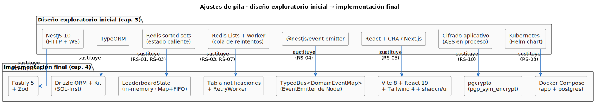

# Ajustes de pila respecto al capítulo 3

Durante la disciplina de **Implementación** se han introducido un conjunto acotado de ajustes técnicos respecto a lo planteado en el [Diseño de la arquitectura](../capitulo3/disenoArquitectura.md). Cada ajuste **conserva** las decisiones arquitectónicas (puerto hexagonal hacia Hyperliquid, separación dominio / aplicación / presentación / infraestructura, comunicación intra-proceso por bus tipado, persistencia ACID en PostgreSQL) y **reduce dependencias** sin sacrificar requisitos suplementarios.

> Esta sección documenta el espacio entre el diseño técnico del capítulo 3 y la implementación efectiva. Es coherente con el principio metodológico de RUP: el diseño se refina durante la implementación cuando hay evidencia de que un ajuste es preferible —el repositorio es la fuente de verdad, y los ajustes a posteriori se documentan, no se ocultan.

## Mapa de ajustes

El siguiente diagrama recoge, lado a lado, la pila tal como se exploró en el capítulo 3 y la pila tal como ha quedado implementada en el capítulo 4. Cada flecha es una sustitución, etiquetada con los requisitos suplementarios que la motivaron.

> Fuente PlantUML: [`/modelosUML/capitulosFinales/ajustesPila.puml`](../../modelosUML/capitulosFinales/ajustesPila.puml).

## Justificación de cada ajuste

### Framework HTTP/WS · NestJS → Fastify *(RS-01, RS-02)*

El *scaffolding* de NestJS (decoradores, módulos, providers, inyección) no aportaba valor para una API con cuatro servicios y una capa de WebSocket. **Fastify** ejecuta sobre `http` nativo con sobrecarga mínima, latencia inferior y menos magia; la validación se delega a **Zod** en cada ruta. La diferencia se nota en los CdU sensibles a latencia (CU-01 y CU-13).

### ORM · TypeORM → Drizzle *(neutro respecto a RS)*

**Drizzle** es SQL-first: las migraciones son SQL plano legible (`0000_init.sql`, `0001_lb_trades.sql`), los tipos TypeScript se derivan del esquema con `InferModel<...>` y el arranque del proceso es subsegundo. Sin reflexión ni metadatos persistidos en BD.

### Estado caliente del leaderboard · Redis → in-memory *(RS-01, RS-03)*

`LeaderboardState` mantiene un `Map<Address, Aggregate>` por terna más una cola FIFO de operaciones. El coste por trade es `O(1)`, el snapshot es `O(k log k)` con `k` = direcciones únicas en ventana, y el pipeline `LeaderboardService → LeaderboardState → WS` **ya no atraviesa red interna**. Una dependencia operativa eliminada sin pérdida funcional: el reinicio del proceso no es destructivo porque el snapshot inicial se siembra desde `lb_trades` (durable).

### Cola de reintentos · Redis Lists → cola virtual en `notificaciones` *(RS-03, RS-07)*

`RetryWorker` no consume de una cola externa: ejecuta una `SELECT estado IN ('PENDIENTE','FALLIDA') AND proximo_intento <= now()` cubierta por el índice `notif_pendientes_proximas`. La "cola" emerge de la consulta sobre la tabla que ya guarda el histórico de notificaciones por RS-09 — una sola fuente de verdad, persistencia ACID y cero servicios adicionales.

### Bus de eventos · `@nestjs/event-emitter` → `TypedBus<DomainEventMap>` *(RS-04)*

`EventEmitter` nativo de Node envuelto en una fachada tipada. El mapa de eventos del dominio (`DomainEventMap`) refuerza por construcción que productores y consumidores no diverjan en silencio. Añadir un consumidor es `bus.on('Evento', handler)`; añadir un evento exige modificar el mapa y, con él, todos los puntos que tienen que reaccionar (al compilador, no en runtime).

### Frontend · CRA / Next.js → Vite + React 19 + Tailwind 4 + shadcn/ui *(RS-05)*

Vite recompila el SPA en `< 1 s` ante cualquier cambio; shadcn/ui aporta primitivas accesibles (Radix UI por debajo) con un tema dark profesional, sin importar un sistema de diseño completo. El árbol de componentes es legible sin abstracciones específicas del framework.

### Cifrado del webhook · servicio aplicativo → `pgcrypto` *(RS-10)*

`pgp_sym_encrypt` y `pgp_sym_decrypt` se ejecutan en el servidor de BD; la clave maestra `APP_SECRET` se pasa como parámetro a la función. El cifrado deja de ser código TypeScript a mantener (sin IVs manipulados a mano) y la URL nunca aparece descifrada en logs, listados ni serializaciones intermedias.

### Despliegue · Kubernetes → Docker Compose *(RS-03)*

El despliegue objetivo del MVP es una **única máquina** académica o del cliente. Compose proporciona reproducibilidad (dos contenedores, healthchecks, `restart: unless-stopped`) sin la complejidad operativa de Kubernetes. La transición a K8s sigue siendo viable y queda documentada en [futuras líneas](futuras.md#migración-a-kubernetes-opcional).

## Lectura del mapa de ajustes

Ningún ajuste **degrada** un requisito suplementario; varios los refuerzan al simplificar el sistema. La columna *RS* del diagrama es deliberadamente reducida: solo los RS para los que el ajuste mueve la aguja respecto al diseño inicial. El resto se mantienen verificados por el resto de la arquitectura, sin que el ajuste les afecte.

## Extensión funcional del CU-07

Durante la implementación se observó que el CU-07 (*Abrir direcciones de una entidad*) era demasiado limitado para el flujo operativo real: una vez identificada una dirección de interés en el leaderboard, el operador necesitaba moverse a un explorador externo para inspeccionar saldos, exposición y delegaciones. Para evitar esa salida, el CdU se ha extendido con una vista de **detalle global de dirección**, accesible tanto desde la página de la entidad como desde cualquier celda del leaderboard.

El [mapa de navegación](mapaNavegacion.md) recoge esta extensión como el nuevo estado `DIRECCION_DETALLE_ABIERTA` (`/direcciones/:addr`), alcanzable con la transición `verDetalleDireccion()` tanto desde `LEADERBOARD_ABIERTO` como desde `DIRECCIONES_ABIERTAS`. La página agrupa cuatro vistas reconciliadas en pestañas, todas alimentadas por el puerto hexagonal `IHyperliquidSource`:

- **Perpetuos** (`GET /api/direcciones/:addr/perps`) → `IHyperliquidSource.getPerpState` *(REST `clearinghouseState`)*.
- **Spot** (`GET /api/direcciones/:addr/spot`) → `IHyperliquidSource.getSpotState` *(REST `spotClearinghouseState`)*.
- **Staking** (`GET /api/direcciones/:addr/staking`) → `IHyperliquidSource.getDelegations` *(REST `delegatorSummary` + `delegations`)*.
- **Operaciones** (`GET /api/direcciones/:addr/fills`) → `IHyperliquidSource.getUserFills` *(REST `userFills`)*.

Complementariamente, la vista enlaza a [Hypurrscan](https://hypurrscan.io) como diagnóstico externo, fuera del alcance del sistema.

Esta extensión **no introduce un CdU nuevo**: se documenta como flujo alternativo *Ver detalle global* dentro del propio CU-07. El [diagrama de actividad de CU-07](../../imagenes/capitulo2/CU-07.svg) ya recoge esta variante y el [Diseño de CdU](../capitulo3/disenoCdU.md#variación-del-cu-07--detalle-global-de-una-dirección) la realiza con el `AddressDetailService`. Sus consecuencias son:

- **Modelo del dominio intacto** — no aparecen nuevas entidades; la consulta es de lectura sobre la información ya expuesta por la L1.
- **Sustituibilidad RS-08 preservada** — las cuatro consultas se canalizan por el puerto `IHyperliquidSource`; el día que llegue `NanorethRpcAdapter`, el `AddressDetailService` lo aprovecha sin modificación.
- **Trazabilidad cap. 2 → cap. 4 cerrada** — `DireccionDetailPage` aparece en el mapa de navegación como destino doble, reflejando la naturaleza transversal de la vista.

## Trazabilidad RUP de la disciplina de Implementación

- **Implementación** *(Construcción)* → código fuente completo en [`src/`](../../src/); este documento + [Mapa de navegación](mapaNavegacion.md) + [Casos de uso implementados](casosDeUsoImplementados.md) recorren la implementación contra el diseño.
- **Pruebas** *(Construcción)* → smoke tests documentados en los [anexos](anexos.md): `tsc --noEmit` para backend y frontend, `vite build` para SPA, conexión real al WS público `wss://api.hyperliquid.xyz/ws` durante el arranque.
- **Despliegue** *(Transición, parcial)* → `docker-compose.yml` (raíz de `src/`) + `app/Dockerfile` multi-stage construyen SPA y backend en una sola imagen. Detalle en [diseño de despliegue](../capitulo3/despliegue.md) y guía de operación en los [anexos](anexos.md).
