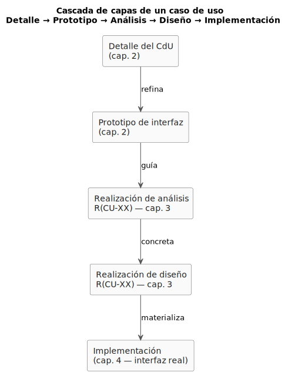
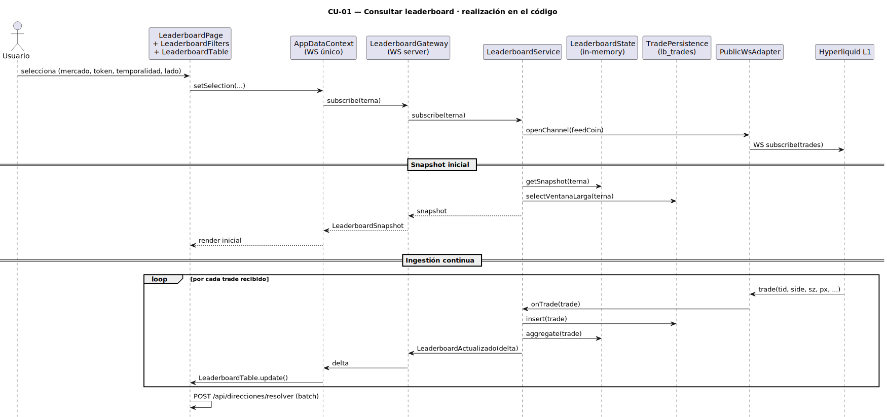
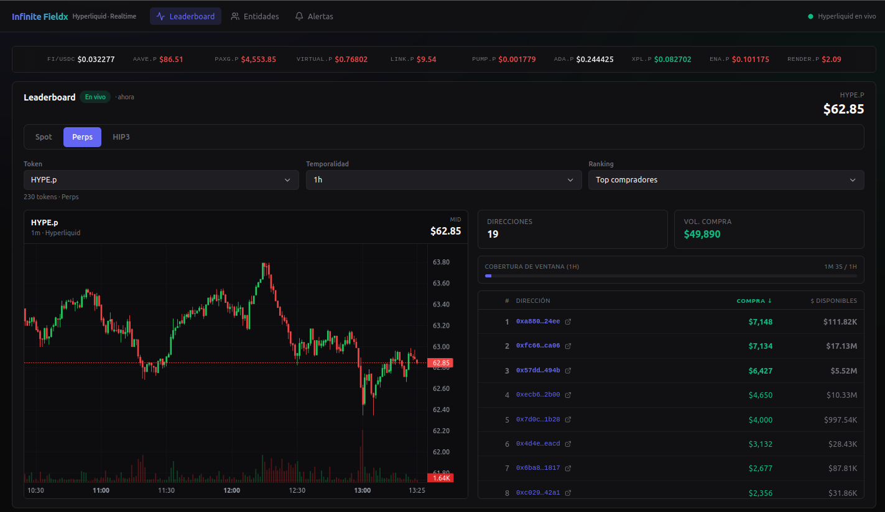
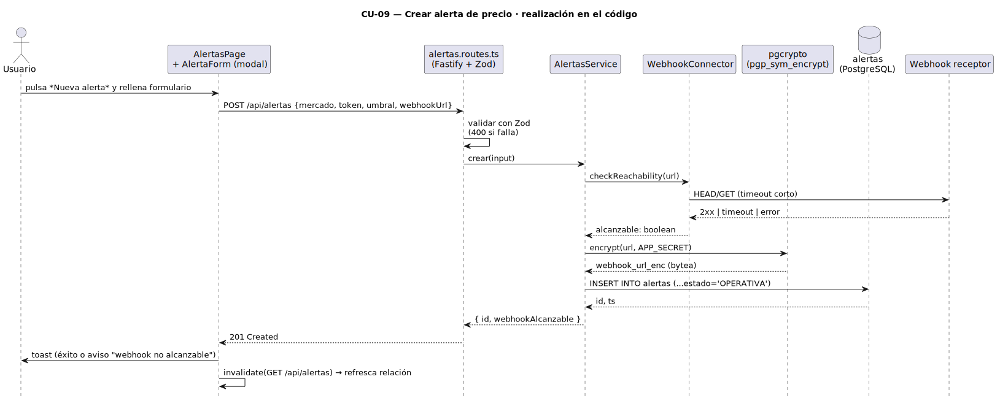
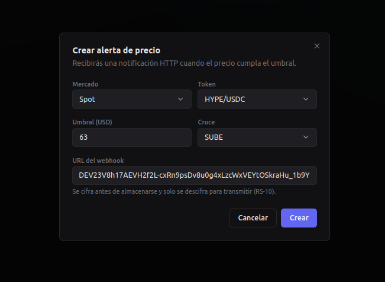
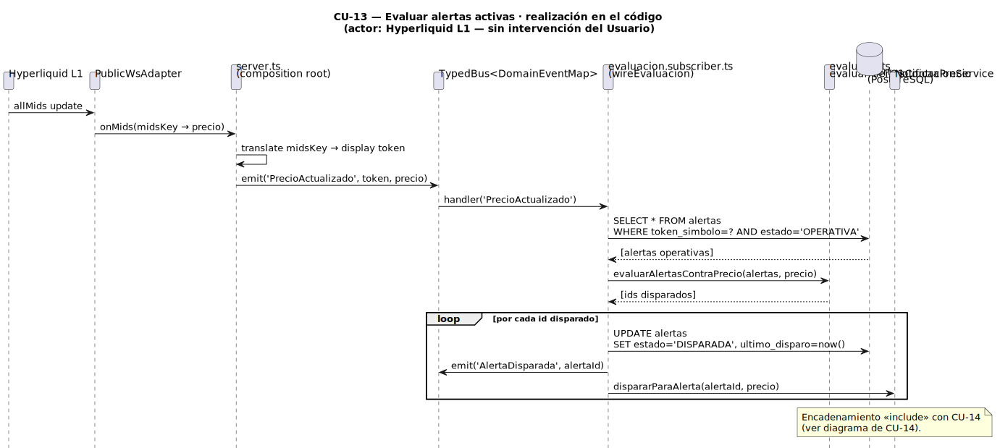
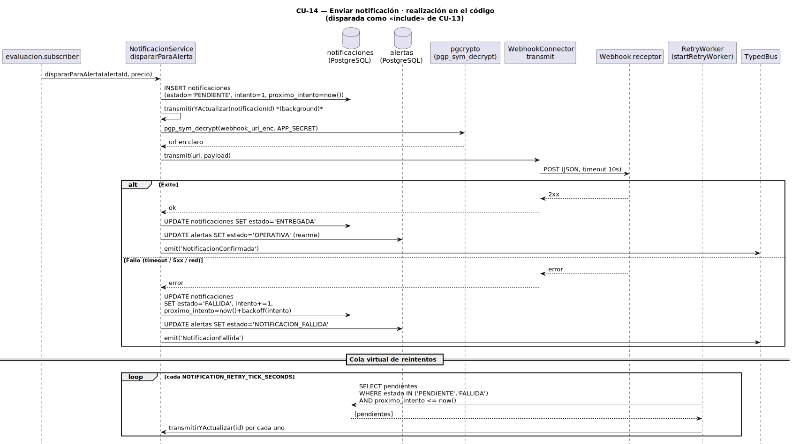
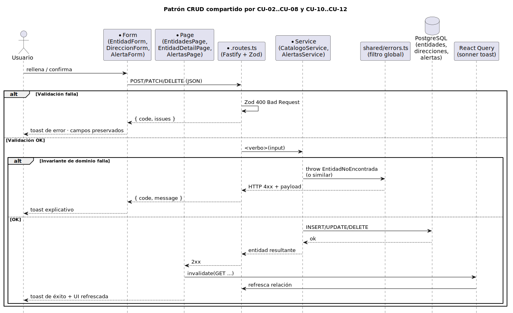

# Casos de uso implementados

La metodología pide, para esta sección del capítulo 4, mostrar la solución **a través de los casos de uso más representativos**, esta vez ya con elementos de interfaz reales. Los CdU seleccionados son los mismos cuatro que concentraron el riesgo técnico en el [análisis](../capitulo3/analisisCdU.md) y en el [diseño](../capitulo3/disenoCdU.md): **CU-01, CU-09, CU-13, CU-14**.

Para cada uno se presenta la *cascada completa* que reclama la rúbrica de descripción de la solución; la cascada es la misma para los cuatro y se documenta una sola vez aquí:

<div align=center>



</div>

> Fuente PlantUML: [`/modelosUML/capitulosFinales/cascadaCdU.puml`](../../modelosUML/capitulosFinales/cascadaCdU.puml). La implementación es el último eslabón; cada capa anterior queda enlazada desde el bloque que abre cada CdU.

Los once CdU restantes (CU-02..CU-08 y CU-10..CU-12) comparten una estructura CRUD homogénea y se recogen al final, agrupados, con el mismo nivel de detalle que en el [Diseño de CdU](../capitulo3/disenoCdU.md).

---

## CU-01 — Consultar leaderboard

### Origen de cada capa

- **Detalle del CdU** → [CU-01 en `detalleCdU.md`](../capitulo2/detalleCdU.md#cu-01--consultar-leaderboard)
- **Prototipo** → [P1. Leaderboard](../capitulo2/prototiposCdU.md#p1--leaderboard)
- **Análisis** → [`R(CU-01)` en `analisisCdU.md`](../capitulo3/analisisCdU.md) · `VistaLeaderboard` + `GestorConsultaLeaderboard` + `LeaderboardEnVivo` + `ConectorHyperliquid`
- **Diseño** → [`R(CU-01)` en `disenoCdU.md`](../capitulo3/disenoCdU.md#realización-de-cu-01--consultar-leaderboard) · `LeaderboardService` + `LeaderboardState` + `TradePersistence` + `PublicWsAdapter`
- **Implementación** → `web/src/pages/LeaderboardPage.tsx` + `web/src/features/leaderboard/*` + `web/src/core/AppDataContext.tsx` (front) · `app/src/modules/leaderboard/*` + `app/src/sources/public-ws.adapter.ts` (back)

### Realización sobre el código

<div align=center>



</div>

> Fuente PlantUML: [`/modelosUML/capitulosFinales/cu-01-secuencia.puml`](../../modelosUML/capitulosFinales/cu-01-secuencia.puml).

### Recorrido del flujo principal sobre la interfaz real

1. **Estado inicial.** El usuario abre la aplicación; el router redirige a `/leaderboard`. `AppDataContext` —ya inicializado por el bootstrap del SPA— ha precargado el catálogo de tokens y mantiene la conexión WebSocket única con el backend (RS-01).
2. **Selección de la terna.** `LeaderboardFilters` ofrece tres controles (`mercado`, `token`, `temporalidad`) y un toggle de lado (compradores/vendedores). Cualquier cambio dispara `setSelection(...)` y, a través del contexto, un mensaje WebSocket `subscribe` con la nueva terna.
3. **Apertura del canal en el backend.** `registerLeaderboardGateway` recibe la suscripción y delega en `LeaderboardService.subscribe(terna)`, que (a) traduce el `displayToken` al `feedCoin` interno de Hyperliquid usando `MetaService`, (b) abre o reutiliza el canal de trades y (c) siembra el snapshot inicial desde `LeaderboardState` y desde `lb_trades` para temporalidades largas.
4. **Ingestión continua.** `PublicWsAdapter` mantiene la suscripción al canal de trades de Hyperliquid. Cada trade se desambigua por `tid`, se persiste en `lb_trades` vía `TradePersistence` y se agrega en `LeaderboardState`.
5. **Resolución de nombres y empuje al cliente.** `LeaderboardActualizado` se publica en el bus; `LeaderboardGateway` lo reenvía al cliente. El componente `LeaderboardTable` invoca `POST /api/direcciones/resolver` por lote para sustituir las direcciones conocidas por el nombre de la entidad asociada y pinta la clasificación ordenada por volumen. La cabecera de la página muestra el precio mid del token en vivo, alimentado por el mismo flujo `allMids`.
6. **Cobertura de ventana.** Una franja `CoverageBar` informa al usuario del progreso de la ventana en vivo desde que se eligió la terna: hasta que llega al 100% (`1h`, `4h`, `6h`, `12h`, `1d`, `1w`), el ranking se está rellenando con datos que entran en tiempo real. A partir de ahí la ventana es deslizante.

### Flujos alternativos materializados

- **Cambio de selección (alt. 3a del detalle).** Cambiar mercado, token o temporalidad re-suscribe con la nueva terna; la tabla se rehace desde el snapshot inicial.
- **Hyperliquid L1 interrumpe el flujo (alt. 5a del detalle).** `PriceTicker` y `LeaderboardTable` mantienen la última clasificación; el indicador *Estado* de la cabecera del leaderboard pasa de *En vivo* a *connecting / closed* y muestra un mensaje en rojo bajo la cabecera.

### Endpoints implicados

- `WS /ws/leaderboard` — suscripción a actualizaciones incrementales y reenvío del canal `allMids`.
- `POST /api/direcciones/resolver` — resolución por lote de nombres de entidades conocidas.
- `GET /api/meta/candles` — velas históricas para `LightweightChart`.

### Captura

<div align=center>



</div>

---

## CU-09 — Crear alerta de precio

### Origen de cada capa

- **Detalle del CdU** → [CU-09 en `detalleCdU.md`](../capitulo2/detalleCdU.md#cu-09--crear-alerta-de-precio)
- **Prototipo** → [P5 (relación) + P6 (edición)](../capitulo2/prototiposCdU.md#p5--relación-de-alertas)
- **Análisis** → `VistaAlertas` + `GestorAlertasPrecio` + `ConectorWebhook` + `AlertaPrecio` + `Webhook`
- **Diseño** → [`R(CU-09)` en `disenoCdU.md`](../capitulo3/disenoCdU.md#realización-de-cu-09--crear-alerta-de-precio) · `AlertasService.crear` + `WebhookConnector.checkReachability` + `encryptWebhook` (`pgcrypto`)
- **Implementación** → `web/src/features/alertas/AlertaForm.tsx` + `web/src/pages/AlertasPage.tsx` (front) · `app/src/modules/alertas/*` + `app/src/modules/notificacion/webhook.connector.ts` (back)

### Realización sobre el código

<div align=center>



</div>

> Fuente PlantUML: [`/modelosUML/capitulosFinales/cu-09-secuencia.puml`](../../modelosUML/capitulosFinales/cu-09-secuencia.puml).

### Recorrido del flujo principal sobre la interfaz real

1. **Punto de entrada.** Desde `AlertasPage` el usuario pulsa *Nueva alerta*. El componente `AlertaForm` se abre como diálogo modal sobre la propia relación.
2. **Mercado y token.** El formulario presenta tres pestañas correspondientes a los tres mercados (`Perp`, `Spot`, `HIP-3`) y un `Combobox` agrupado con el catálogo de tokens del mercado seleccionado, alimentado por `MetaService` a través de `AppDataContext`.
3. **Umbral y webhook.** Dos controles adicionales: un *Cruce* (`SUBE` / `BAJA`) con un campo numérico para el valor del umbral, y un `Input` para la URL del webhook.
4. **Validación en el servidor.** Al confirmar, el cliente hace `POST /api/alertas`. La ruta valida el cuerpo con Zod (formato de URL, umbral > 0, mercado válido, token presente en el catálogo). `AlertasService.crear` realiza `WebhookConnector.checkReachability` (HEAD/GET con timeout corto), cifra la URL con `encryptWebhook` (`pgp_sym_encrypt`) e `INSERT` en la tabla `alertas` con estado `OPERATIVA`.
5. **Confirmación.** La respuesta incluye un campo `webhookAlcanzable: boolean` que el cliente convierte en una notificación toast: éxito si el webhook respondió, o aviso si no respondió pero la alerta quedó registrada igualmente. La relación se invalida y se vuelve a consultar.

### Flujos alternativos materializados

- **Umbral inválido (alt. 6a del detalle).** Zod responde `400 Bad Request` con un mensaje detallado; el toast lo muestra y el formulario permanece abierto con los campos rellenos.
- **Webhook no alcanzable (alt. 6b del detalle).** La alerta se crea, pero el toast informa *"Alerta creada · Webhook no alcanzable: …"*. El estado en la tabla pasa por `OPERATIVA` hasta que se dispare la primera notificación.

### Endpoints implicados

- `POST /api/alertas` — alta de alerta (CU-09).
- `GET /api/meta/tokens?mercado=…` — carga del catálogo para el combobox.

### Por qué el cifrado del webhook forma parte del CdU

El RS-10 exige que la URL del webhook no quede legible en interfaces de consulta. La realización combina tres decisiones:

- En memoria del servicio, la URL en claro vive **solo el tiempo de la transacción de alta** (validación + cifrado + `INSERT`).
- En base de datos, la columna `webhook_url_enc` es `bytea`; el campo **se descifra únicamente** cuando un actor autorizado (`AlertasService.listar` o el evaluador) lo necesita.
- La clave maestra `APP_SECRET` se inyecta por variable de entorno en el contenedor; **nunca se serializa** ni se devuelve por API.

### Captura

<div align=center>



</div>

---

## CU-13 — Evaluar alertas activas

CU-13 no es un caso de uso *del usuario*: tiene como actor a **Hyperliquid L1** y se ejecuta automáticamente cada vez que el flujo continuo entrega una actualización de precio. Su "interfaz" no es una pantalla sino el cambio de estado de las alertas registradas, visible para el usuario en `AlertasPage`.

### Origen de cada capa

- **Detalle del CdU** → [CU-13 en `detalleCdU.md`](../capitulo2/detalleCdU.md#cu-13--evaluar-alertas-activas)
- **Análisis** → `ConectorHyperliquid` + `GestorEvaluacionAlertas` + `GestorAlertasPrecio` + `AlertaPrecio`
- **Diseño** → [`R(CU-13)` en `disenoCdU.md`](../capitulo3/disenoCdU.md#realización-de-cu-13--evaluar-alertas-activas) · suscriptor `wireEvaluacion` + función pura `evaluarAlertasContraPrecio`
- **Implementación** → `app/src/server.ts` (composition root) + `app/src/modules/evaluacion/evaluacion.subscriber.ts` + `app/src/modules/evaluacion/evaluator.ts`

### Realización sobre el código

<div align=center>



</div>

> Fuente PlantUML: [`/modelosUML/capitulosFinales/cu-13-secuencia.puml`](../../modelosUML/capitulosFinales/cu-13-secuencia.puml).

### Recorrido del flujo principal sobre el sistema en marcha

1. **Recepción del precio.** `PublicWsAdapter` mantiene la suscripción `allMids`. En `server.ts` el composition root compara cada `midsKey` con la última lectura conocida; para cada cambio, traduce la clave a su *display token* con `MetaService.getMidsKeyToDisplay()` y publica `PrecioActualizado` en el bus.
2. **Suscripción al evento.** `wireEvaluacion`, registrado en el bootstrap, está suscrito a `PrecioActualizado` desde el primer instante.
3. **Recuperación de alertas operativas.** Una `SELECT ... WHERE token_simbolo=? AND estado='OPERATIVA'`, cubierta por el índice `alertas_token_estado`, devuelve las alertas activas para ese token.
4. **Evaluación pura.** `evaluarAlertasContraPrecio` aplica el predicado `evaluarUmbral(umbral, precio)` —función pura definida en `domain/types.ts`— a cada alerta y devuelve los IDs de las que han cruzado el umbral.
5. **Disparo.** Por cada alerta disparada: `UPDATE alertas SET estado='DISPARADA', ultimo_disparo=now()`, emisión de `AlertaDisparada` al bus para observabilidad, y llamada directa a `NotificacionService.dispararParaAlerta(alertaId, precio)` para encadenar CU-14 (relación `<<include>>`).

### Lo que ve el usuario

El usuario nunca dispara CU-13 directamente. Lo que observa son los cambios en `AlertasPage`, que se refresca cada 6 s: la columna *Estado* pasa de `OPERATIVA` a `DISPARADA` (o a `NOTIFICACION_FALLIDA` si CU-14 falla y se agota el reintento), y la columna *Último disparo* se rellena con `relativeTime(...)` apuntando al instante en que CU-13 dejó la alerta en `DISPARADA`.

### Cumplimiento de los requisitos suplementarios

- **RS-02 ≤ 2 s.** El pipeline `WS allMids → bus → SELECT indexado → UPDATE` se realiza en proceso, sin saltos de red entre evaluación y persistencia.
- **RS-04 Extensibilidad.** Un nuevo tipo de alerta requiere únicamente una nueva función `evaluar…` en `evaluator.ts`; el resto del flujo no cambia.
- **RS-09 Trazabilidad.** El `UPDATE alertas SET ultimo_disparo=...` y el `INSERT` en `notificaciones` desde CU-14 cierran el rastro.

### Captura

<div align=center>


</div>

---

## CU-14 — Enviar notificación

### Origen de cada capa

- **Detalle del CdU** → [CU-14 en `detalleCdU.md`](../capitulo2/detalleCdU.md#cu-14--enviar-notificación)
- **Análisis** → `GestorEnvioNotificacion` + `ConectorWebhook` + `Notificacion`
- **Diseño** → [`R(CU-14)` en `disenoCdU.md`](../capitulo3/disenoCdU.md#realización-de-cu-14--enviar-notificación) · `NotificacionService.dispararParaAlerta` + `WebhookConnector.transmit` + `startRetryWorker`
- **Implementación** → `app/src/modules/notificacion/notificacion.service.ts` + `app/src/modules/notificacion/webhook.connector.ts` + `app/src/modules/notificacion/retry.worker.ts`

### Realización sobre el código

<div align=center>



</div>

> Fuente PlantUML: [`/modelosUML/capitulosFinales/cu-14-secuencia.puml`](../../modelosUML/capitulosFinales/cu-14-secuencia.puml).

### Recorrido del flujo principal

1. **Disparo.** Tras CU-13, `NotificacionService.dispararParaAlerta(alertaId, precio)` realiza un `INSERT` en `notificaciones` con `estado='PENDIENTE'`, `precio_disparador`, `instante_emision=now()`, `intento=1`, `proximo_intento=now()`. Lanza `transmitirYActualizar(notificacionId)` en background, sin bloquear el evaluador.
2. **Recuperación de la URL.** `transmitirYActualizar` ejecuta un `SELECT` con `pgp_sym_decrypt(webhook_url_enc, APP_SECRET)` para obtener la URL en claro **solo el tiempo de la llamada saliente**.
3. **Transmisión.** `WebhookConnector.transmit(url, payload)` realiza `POST` con cuerpo JSON y timeout de 10 s.
4. **Confirmación o fallo.**
   - **Éxito**: `UPDATE notificaciones SET estado='ENTREGADA', entregada_en=now()` + `UPDATE alertas SET estado='OPERATIVA'` (rearme); emite `NotificacionConfirmada` al bus.
   - **Fallo**: calcula `proximo_intento` con la política de backoff acumulado configurable (por defecto `1, 5, 30, 300, 1800, 3600` segundos); `UPDATE notificaciones SET estado='FALLIDA' (transitorio), intento=intento+1, proximo_intento=...`; `UPDATE alertas SET estado='NOTIFICACION_FALLIDA'`; emite `NotificacionFallida`.
5. **Cola virtual de reintentos.** `startRetryWorker`, despertándose cada `NOTIFICATION_RETRY_TICK_SECONDS`, ejecuta una `SELECT ... WHERE estado IN ('PENDIENTE','FALLIDA') AND proximo_intento <= now()` (cubierta por el índice `notif_pendientes_proximas`) y vuelve a llamar a `transmitirYActualizar` para cada fila pendiente. Cuando `intento` supera el máximo configurado, la notificación queda en `FALLIDA` permanente.

### Lo que ve el usuario

En `AlertasPage`, la columna *Estado* pasa de `DISPARADA` a `OPERATIVA` al rearmarse, o a `NOTIFICACION_FALLIDA` si se agotan los reintentos. La columna *Último disparo* mantiene la marca de la última activación, independientemente del resultado de la entrega.

### Cumplimiento de los requisitos suplementarios

- **RS-07 Reintentos.** `startRetryWorker` + backoff configurable; cola virtual en `notificaciones`.
- **RS-09 Trazabilidad.** Cada disparo deja una fila en `notificaciones` con `alerta_id`, `precio_disparador`, `instante_emision`, `intento`, `estado`.
- **RS-10 Seguridad.** La URL solo se descifra durante la transmisión; no se devuelve en ningún listado público.

### Cuerpo de la notificación recibida por el webhook

```json
{
  "evento": "alerta_disparada",
  "alertaId": "8c0e…",
  "token": "BTC.p",
  "mercado": "PerpNativo",
  "umbral": { "cruce": "SUBE", "valor": 100000 },
  "precioDisparador": 100123.5,
  "instanteEmision": "2026-05-22T10:23:51.412Z",
  "intento": 1
}
```

### Captura

<div align=center>


</div>

---

## Casos de uso CRUD — CU-02..CU-08 y CU-10..CU-12

Estos once CdU comparten el mismo patrón (cliente → ruta → servicio → tabla) y se documentan agrupados, como ya se hizo en el [Diseño de CdU](../capitulo3/disenoCdU.md#patrón-crud--cu-02cu-08-y-cu-10cu-12). El siguiente diagrama recoge el patrón común que todos ellos instancian:

<div align=center>



</div>

> Fuente PlantUML: [`/modelosUML/capitulosFinales/patronCRUD.puml`](../../modelosUML/capitulosFinales/patronCRUD.puml).

La parametrización (qué componente UI, qué endpoint, qué servicio, qué tabla) se mantiene como tabla porque su naturaleza es de **catálogo de referencia**: no expresa flujo, sino que enumera 11 instancias del mismo flujo.

<div align=center>

|CdU|Componente UI|Endpoint REST|Servicio|Tabla|
|-|-|-|-|-|
|**CU-02** Crear entidad|`EntidadForm` (modal)|`POST /api/entidades`|`CatalogoService.crearEntidad`|`entidades`|
|**CU-03** Abrir entidades|`EntidadesPage` (filtro `q`)|`GET /api/entidades`|`CatalogoService.listarEntidades`|`entidades`|
|**CU-04** Editar entidad|`EntidadForm` (precargado)|`PATCH /api/entidades/:id`|`CatalogoService.renombrarEntidad`|`entidades`|
|**CU-05** Eliminar entidad|Botón papelera + `confirm`|`DELETE /api/entidades/:id`|`CatalogoService.eliminarEntidad`|`entidades` (+ cascada en `direcciones`)|
|**CU-06** Añadir dirección|`DireccionForm`|`POST /api/entidades/:id/direcciones`|`CatalogoService.aniadirDireccion`|`direcciones`|
|**CU-07** Abrir direcciones|sección *Direcciones* en `EntidadDetailPage`|`GET /api/entidades/:id/direcciones`|`CatalogoService.listarDirecciones`|`direcciones`|
|**CU-07*** Detalle global|`DireccionDetailPage` (4 pestañas)|`GET /api/direcciones/:addr/{spot,perps,staking,fills}`|`AddressDetailService.*`|*(lectura sin persistencia local)*|
|**CU-08** Eliminar dirección|Botón papelera + `confirm`|`DELETE /api/entidades/:id/direcciones/:dirId`|`CatalogoService.eliminarDireccion`|`direcciones`|
|**CU-10** Abrir alertas|`AlertasPage` (filtro de estado)|`GET /api/alertas`|`AlertasService.listar`|`alertas`|
|**CU-11** Editar alerta|`AlertaForm` (precargado)|`PATCH /api/alertas/:id`|`AlertasService.actualizar`|`alertas`|
|**CU-12** Eliminar alerta|Botón papelera + `confirm`|`DELETE /api/alertas/:id`|`AlertasService.eliminar`|`alertas` (+ cascada en `notificaciones`)|

</div>

> El detalle paso a paso de cada uno está cubierto en [Detalle de CdU](../capitulo2/detalleCdU.md). La realización de diseño está en [Diseño de CdU](../capitulo3/disenoCdU.md). La implementación —ya con interfaz real— sigue el patrón anterior sin desviaciones.

---

## Trazabilidad — del repositorio al diagrama de contexto

La trazabilidad **estado del cap. 2 → ruta del SPA → caso de uso** queda resuelta visualmente sobre el [mapa de navegación](mapaNavegacion.md): cada CdU del catálogo aparece allí como transición etiquetada entre estados que ya tienen su materialización (ruta + componente raíz). Reproducir esa trazabilidad aquí como tabla sería redundante; el diagrama de navegación **es** la tabla de trazabilidad, leída como grafo en lugar de como rejilla.

Lo que sí cabe destacar es la **trazabilidad inversa** —de cada CdU al artefacto concreto del repositorio que lo implementa—, porque ese mapeo no es visible en el diagrama y resulta útil al lector que navega por el código:

<div align=center>

|CdU|Implementación (back)|Implementación (front)|
|-|-|-|
|CU-01|`modules/leaderboard/*` + `sources/public-ws.adapter.ts`|`pages/LeaderboardPage.tsx` + `features/leaderboard/*`|
|CU-02..CU-05|`modules/catalogo/catalogo.service.ts`|`features/catalogo/EntidadForm.tsx` + `pages/EntidadesPage.tsx`|
|CU-06..CU-08|`modules/catalogo/catalogo.service.ts` + `modules/direccion-detalle/*`|`features/catalogo/DireccionForm.tsx` + `pages/EntidadDetailPage.tsx` + `pages/DireccionDetailPage.tsx`|
|CU-09..CU-12|`modules/alertas/alertas.service.ts`|`features/alertas/AlertaForm.tsx` + `pages/AlertasPage.tsx`|
|CU-13|`modules/evaluacion/evaluacion.subscriber.ts` + `evaluator.ts`|*(sin UI propia: se manifiesta en `AlertasPage`)*|
|CU-14|`modules/notificacion/notificacion.service.ts` + `webhook.connector.ts` + `retry.worker.ts`|*(sin UI propia: se manifiesta en `AlertasPage`)*|

</div>

Cada CdU del catálogo del capítulo 2 tiene su implementación en el repositorio, su sitio en el diagrama de contexto y su trazado al diseño del capítulo 3. La rúbrica de descripción de la solución se cumple **por construcción**: el repositorio es la solución, y este capítulo solo lo recorre con la guía de los CdU.
