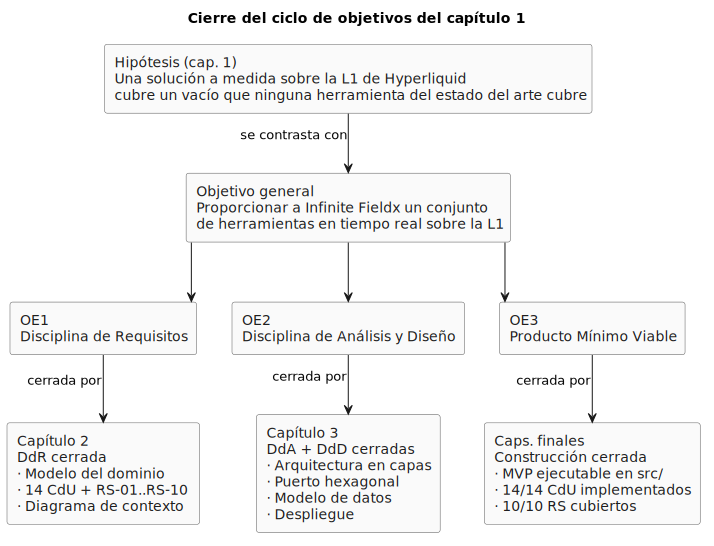
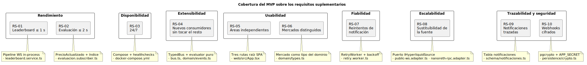

# Conclusiones

El capítulo 1 estableció una hipótesis de partida, un objetivo general y tres objetivos específicos mapeados a las disciplinas y capítulos del TFG. Cerrar el trabajo exige aportar **evidencia concreta** de que cada uno se ha cumplido. Esta sección recorre los objetivos en el mismo orden en que se formularon y, para cada uno, señala el artefacto del repositorio que da fe del cumplimiento.

## Cierre del ciclo de objetivos

<div align=center>



</div>

> Fuente PlantUML: [`/modelosUML/capitulosFinales/arbolObjetivos.puml`](../../modelosUML/capitulosFinales/arbolObjetivos.puml). Cada objetivo específico tiene su capítulo. Cada capítulo entrega los artefactos que cierran la disciplina correspondiente. La hipótesis se contrasta a través del objetivo general; el objetivo general se cumple a través de los tres específicos.

---

## OE1 — Disciplina de requisitos

> *Ejecutar la disciplina de requisitos del sistema, capturando el modelo del dominio, identificando actores y casos de uso, y estableciendo los requisitos funcionales y no funcionales.*

**Cumplido.** La disciplina se cerró en el [capítulo 2](../capitulo2/README.md) con la siguiente evidencia:

- **Modelo del dominio** (clases, objetos, estados) → [Modelo del dominio](../capitulo2/modeloDelDominio.md) · diagramas en [`/imagenes/capitulo2`](../../imagenes/capitulo2/).
- **Glosario** → [Glosario](../capitulo2/glosario.md).
- **Actores identificados** (Usuario, Hyperliquid L1, Servicio Webhook) → [Actores y casos de uso](../capitulo2/actoresYCasosDeUso.md).
- **Catálogo de 14 casos de uso** aplicando el patrón atómico CRUD → [Actores y casos de uso](../capitulo2/actoresYCasosDeUso.md) · [Priorización](../capitulo2/priorizacionCdU.md) · [Detalle](../capitulo2/detalleCdU.md).
- **Prototipos de interfaz por CdU** (P1..P6) → [Prototipos de CdU](../capitulo2/prototiposCdU.md) · imágenes en `/imagenes/capitulo2`.
- **Diagrama de contexto del sistema** (estados y transiciones) → [Diagrama de contexto](../capitulo2/diagramaDeContexto.md).
- **Requisitos suplementarios RS-01..RS-10** → [Requisitos suplementarios](../capitulo2/requisitosSupplementarios.md).

La trazabilidad de la disciplina queda probada por el [diagrama de contexto](../capitulo2/diagramaDeContexto.md): **todos** los CdU del catálogo aparecen como transiciones entre estados; **ninguna** transición carece de CdU; **ningún** estado se queda sin entrada ni salida. La completitud no se afirma, se verifica visualmente sobre el diagrama.

> **OE1 ⇒ Capítulo 2 ⇒ Disciplina de Requisitos cerrada.**

---

## OE2 — Disciplina de análisis y diseño

> *Ejecutar la disciplina de análisis y diseño, definiendo la arquitectura del sistema, las clases de análisis y diseño, y los modelos necesarios para guiar la implementación.*

**Cumplido.** La disciplina se desarrolló en el [capítulo 3](../capitulo3/README.md), aplicando en orden las cuatro actividades de Análisis y las seis de Diseño, cada una partiendo del artefacto inmediatamente anterior.

- **Analizar la arquitectura** → [`analisisArquitectura.md`](../capitulo3/analisisArquitectura.md) (subsistemas S-PRES, S-INGE, S-LEAD, S-CATA, S-ALER, S-EVAL, S-NOTI + dependencias).
- **Analizar los CdU** → [`analisisCdU.md`](../capitulo3/analisisCdU.md) (realizaciones `R(CU-XX)` con `<<boundary>>`, `<<control>>`, `<<entity>>`).
- **Analizar las clases** → [`analisisClases.md`](../capitulo3/analisisClases.md) (catálogo por área funcional).
- **Analizar los paquetes** → [`analisisPaquetes.md`](../capitulo3/analisisPaquetes.md) (agrupación cohesiva y dependencias).
- **Diseñar la arquitectura** → [`disenoArquitectura.md`](../capitulo3/disenoArquitectura.md) (arquitectura en capas + **puerto hexagonal** hacia Hyperliquid; trazabilidad RS-01..RS-10).
- **Diseñar los CdU** → [`disenoCdU.md`](../capitulo3/disenoCdU.md) (CU-01, CU-09, CU-13, CU-14 al detalle; resto por patrón CRUD).
- **Diseñar las clases** → [`disenoClases.md`](../capitulo3/disenoClases.md) (servicios, adaptadores, gateways y tipos del dominio).
- **Diseñar los paquetes** → [`disenoPaquetes.md`](../capitulo3/disenoPaquetes.md) (estructura física de directorios).
- **Modelar los datos** → [`modeloDeDatos.md`](../capitulo3/modeloDeDatos.md) (esquema lógico y físico).
- **Diseñar el despliegue** → [`despliegue.md`](../capitulo3/despliegue.md) (topología, redes, volúmenes, healthchecks).

Dos decisiones arquitectónicas soportan el resto del sistema, ambas justificadas frente a los requisitos suplementarios: la **arquitectura en capas con puerto hexagonal** hacia Hyperliquid (RS-04, RS-08, que hace sustituible la fuente de datos sin tocar el núcleo) y la **comunicación intra-proceso por bus de eventos tipado** (RS-04, que permite añadir consumidores sin modificar productores). La trazabilidad RS → decisión → artefacto se cierra en una sola tabla del [diseño de la arquitectura](../capitulo3/disenoArquitectura.md#trazabilidad-de-los-requisitos-suplementarios), sin necesidad de duplicarla aquí.

> **OE2 ⇒ Capítulo 3 ⇒ Disciplinas de Análisis y Diseño cerradas.**

---

## OE3 — Producto Mínimo Viable

> *Desarrollar una primera iteración del sistema en forma de producto mínimo viable (MVP) que responda a los requisitos capturados y al análisis y diseño realizados.*

**Cumplido.** El MVP vive en [`src/`](../../src/) y se documenta en este capítulo 4.

### Cobertura del catálogo de CdU

Los 14 casos de uso del capítulo 2 están implementados. CU-01, CU-09, CU-13 y CU-14 reciben la cascada completa en [Casos de uso implementados](casosDeUsoImplementados.md); los once restantes se documentan por el patrón CRUD común. La trazabilidad **CdU → estado del cap. 2 → ruta del SPA → artefacto del repositorio** queda materializada por el [mapa de navegación](mapaNavegacion.md) y por la tabla final de [Casos de uso implementados](casosDeUsoImplementados.md#trazabilidad--del-repositorio-al-diagrama-de-contexto).

### Cobertura de los requisitos suplementarios

Los 10 requisitos suplementarios del capítulo 2 quedan cubiertos por la solución. El siguiente diagrama recoge, para cada RS, el artefacto del repositorio que lo verifica:

<div align=center>



</div>

> Fuente PlantUML: [`/modelosUML/capitulosFinales/coberturaRS.puml`](../../modelosUML/capitulosFinales/coberturaRS.puml). Las notas bajo cada requisito apuntan al fichero del repositorio que lo realiza; el detalle paso a paso por RS está en los [anexos](anexos.md#b-requisitos-suplementarios-y-su-verificación).

### Evidencia operativa

El MVP es **ejecutable**. El repositorio incluye `docker-compose.yml` y `Dockerfile` multi-stage. Levantar la solución completa requiere dos comandos:

```bash
cp src/.env.example src/.env       # (requiere completar APP_SECRET y POSTGRES_PASSWORD)
docker compose -f src/docker-compose.yml up -d --build
```

Tras el arranque, el sistema se conecta al WS público de Hyperliquid (`wss://api.hyperliquid.xyz/ws`), precarga los canales configurados en `LEADERBOARD_PREWARM` y queda disponible en `http://localhost:3001/`. El smoke test correspondiente está documentado en los [anexos](anexos.md#e-smoke-tests-ejecutados).

> **OE3 ⇒ Capítulos finales ⇒ Construcción cerrada; Transición acotada al MVP.**

---

## Hipótesis y objetivo general

Con los tres objetivos específicos cumplidos, la **hipótesis** queda contrastada en el ámbito del MVP: existe una solución a medida que integra las tres herramientas, construida sobre la L1 de Hyperliquid, que cubre un vacío que ninguna alternativa del [estado del arte](../capitulo1/estadoDelArte.md) satisface íntegramente. La validación operativa con Infinite Fieldx —prevista como continuación natural— queda recogida en [Recomendaciones y futuras líneas](futuras.md).

El **objetivo general** está cumplido: el repositorio entrega un sistema que proporciona

- **Seguimiento de precios en tiempo real** — `PriceTicker` + canal `allMids` (RS-01).
- **Clasificación de actividad por dirección con etiquetado y clustering** — `LeaderboardTable` + `CatalogoService.resolverDirecciones` (CU-01 + CU-02..CU-08; *clustering* entendido como agrupación de direcciones bajo una misma entidad-nombre).
- **Alertas de precio con notificación vía webhook** — `AlertaForm` + `wireEvaluacion` + `NotificacionService` + `RetryWorker` (CU-09..CU-14; RS-07, RS-09, RS-10).

---

## Síntesis: del escenario al producto

El trabajo ha respetado en todo momento la cadena RUP **fases → disciplinas → entregables → criterios de transición** que definió el [capítulo 1 — Metodología](../capitulo1/metodologia.md). Cada entregable de un capítulo fue precondición del siguiente; ninguno se elaboró fuera del orden establecido. Que el resultado sea un **MVP ejecutable** —no un boceto, no un prototipo descartable— es la prueba de que el proceso, aplicado con disciplina, conduce al producto.
