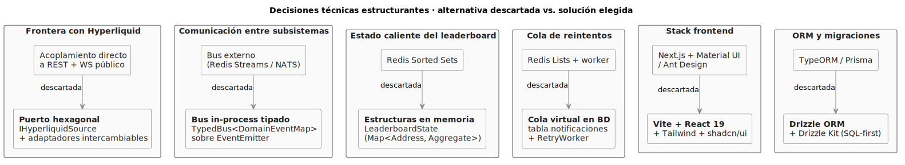
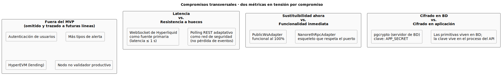

# Discusión de resultados

A diferencia del capítulo 1, que era una **presentación fundamentada de elementos** (escenario, estado del arte, objetivos), este apartado es —en gran parte— un capítulo de **opinión fundamentada**. La metodología sugiere reflexionar aquí sobre lo que han implicado las diversas decisiones y compromisos abordados durante el proceso de desarrollo. La discusión sigue ese orden: decisiones tomadas → compromisos asumidos → lo que enseña la propia ejecución del proceso.

## Sobre la naturaleza del problema

El [escenario del capítulo 1](../capitulo1/introduccion.md) describe una paradoja: Hyperliquid hace **públicos** datos que en un CEX serían privados, pero **no existían** herramientas integradas que aprovecharan esa transparencia para los operadores de market making y HFT. La solución desarrollada cubre exactamente ese hueco. La discusión que sigue se centra en los **cómo** —las decisiones que dieron forma a esa cobertura— más que en los **qué** —el catálogo de funcionalidades, ya cerrado en el capítulo 2 y verificado en el capítulo 4.

## Decisiones técnicas de mayor calado

Las seis decisiones estructurantes del sistema se sintetizan en el siguiente diagrama. Cada una se presenta como **alternativa descartada vs. solución elegida**, indicando con flechas la dirección del descarte.

> Fuente PlantUML: [`/modelosUML/capitulosFinales/decisionesTecnicas.puml`](../../modelosUML/capitulosFinales/decisionesTecnicas.puml). Las casillas en **negrita** son la solución del MVP; las casillas pálidas son las alternativas evaluadas y descartadas con la justificación que sigue.

### 1. Puerto hexagonal hacia Hyperliquid

La decisión más estructurante del sistema. La frontera con la L1 se modela como interfaz (`IHyperliquidSource`) y se materializa con dos adaptadores intercambiables por variable de entorno.

Por qué se eligió esta solución y no acoplar directamente el código a la API REST y al WebSocket público:

- **Sustituibilidad sin tocar el núcleo (RS-08).** Cambiar `HYPERLIQUID_SOURCE=public-ws` por `nanoreth` modifica el adaptador inyectado por `createHyperliquidSource()` y nada más.
- **Testabilidad.** Cualquier test del `LeaderboardService` o del evaluador puede usar una implementación falsa de `IHyperliquidSource` sin red.
- **Documentabilidad.** El contrato técnico con Hyperliquid (qué métodos, qué tipos, qué semántica) queda en **un único archivo** legible en menos de 100 líneas.

**Compromiso asumido.** Mantener dos adaptadores es disciplina añadida. El `NanorethRpcAdapter` es esqueleto y se mantiene compilando aun siendo no funcional para garantizar que la interfaz no diverge. Una alternativa habría sido eliminarlo hasta tener el nodo desplegado, pero esto habría rendido el RS-08 una promesa sin evidencia de viabilidad.

### 2. Bus de eventos in-process

La comunicación entre subsistemas (S-LEAD, S-EVAL, S-NOTI…) no usa colas externas (ni Redis Pub/Sub, ni RabbitMQ, ni Kafka): es un `EventEmitter` nativo envuelto en `TypedBus<DomainEventMap>` que vive en el mismo proceso del backend.

Por qué se eligió esta solución y no un bus distribuido externo (Redis Streams o NATS):

- **Cero dependencias adicionales.** Una dependencia de infraestructura menos en el `docker-compose.yml`; menos varianza operativa.
- **Tipos estáticos del payload.** `DomainEventMap` lo refuerza por construcción; productores y consumidores no pueden divergir en silencio.
- **Latencia mínima.** `PrecioActualizado → handler` cuesta lo que cuesta una llamada a función en el *event loop*.

**Compromiso asumido.** El bus actual **no es** la solución para escalar horizontalmente. Si el sistema necesita replicarse en varias máquinas, el bus tiene que convertirse en distribuido. Esa transición está prevista en [futuras líneas](futuras.md#crecer-de-un-proceso-a-un-cluster) y la decisión actual es coherente con la propuesta del capítulo 1 (*"primera iteración, MVP, una máquina"*): no anticipar problemas que no se tienen aún.

### 3. Estado caliente del leaderboard en memoria

El `LeaderboardEnVivo` —ya identificado como entidad **derivada** en el análisis— vive como `LeaderboardState` en RAM del proceso. La persistencia auxiliar de trades en `lb_trades` cubre las ventanas largas (`1d`, `1w`), pero el ranking se construye en memoria.

Por qué se eligió esta solución y no Redis Sorted Sets, como contemplaba el diseño inicial (recogido en [ajustes de pila](ajustesDePila.md)):

- Una sola máquina: no hay otra réplica con la que compartir estado.
- `O(1)` por trade y `O(k log k)` por snapshot (donde *k* = direcciones únicas en la ventana). No hay coste de red entre cliente y Redis ni de serialización.
- Recuperación tras reinicio: el snapshot inicial se siembra desde `lb_trades` (durable), por lo que el reinicio del proceso no es destructivo.

**Compromiso asumido.** La RAM es finita. Si el sistema tuviera que dar servicio a ternas con cardinalidad de direcciones muy grande (>100 k direcciones únicas por ventana), o si se ampliasen los pares precargados (`LEADERBOARD_PREWARM`) a decenas de tokens, el límite duro pasaría a estar en la RAM disponible del contenedor. El dimensionamiento estimado en el [diseño de despliegue](../capitulo3/despliegue.md) lo deja explícito: ≤ 1 GB para `app` con el prewarm previsto.

### 4. Cola de reintentos virtual sobre la propia tabla `notificaciones`

`RetryWorker` no consume de una cola; ejecuta una `SELECT ... WHERE estado IN ('PENDIENTE','FALLIDA') AND proximo_intento <= now()` indexada por `(estado, proximo_intento)`. La "cola" emerge de la consulta sobre la tabla que ya guarda el histórico de notificaciones por RS-09.

Por qué se eligió esta solución y no Redis Lists + worker dedicado:

- **Una sola fuente de verdad.** Si la cola fuera externa, habría que mantener consistencia entre la cola y la tabla — y los modos de fallo de esa consistencia son traicioneros.
- **ACID.** `INSERT` en `notificaciones` y `UPDATE alertas SET estado='DISPARADA'` se realizan idealmente en transacciones que el motor garantiza.
- **Indexación trivial.** `notif_pendientes_proximas` cubre el patrón con cero coste de mantenimiento.

**Compromiso asumido.** Postgres no es un broker. Si el ritmo de notificaciones por segundo creciera mucho más allá del orden de unidades por segundo, la fricción del `UPDATE` constante pasaría a notarse. Para el MVP, con un puñado de alertas activas por usuario y disparos esporádicos, está sobradamente dentro del margen.

### 5. Frontend Vite + React 19 + Tailwind 4 + shadcn/ui

Por qué se eligió esta solución y no Next.js + Material UI / Ant Design:

- **Build sub-segundo en desarrollo.** Vite recompila el SPA en `< 1 s` ante cualquier cambio.
- **Componentes accesibles, tema dark profesional.** shadcn/ui aporta primitivas con buenas prácticas (Radix UI por debajo) sin importar un sistema de diseño completo.
- **Coste cognitivo bajo.** El árbol de componentes es legible sin abstracciones específicas del framework UI.

**Compromiso asumido.** La aplicación es una SPA con *server-side rendering* nulo. Si en el futuro se hiciera necesario SSR o *static generation* (caso típico: SEO, embebido público), Vite no es la opción. El SPA actual encaja con el caso de uso real: herramienta interna para Infinite Fieldx accedida tras autenticación —cuando esta se añada—, donde el SEO es irrelevante y el TTI inicial es aceptable.

### 6. PostgreSQL 16 + Drizzle ORM

Por qué se eligió Drizzle frente a TypeORM o Prisma:

- **SQL-first.** Las migraciones (`0000_init.sql`, `0001_lb_trades.sql`) son SQL plano legible, no JSON intermedio.
- **Tipos derivados del esquema.** `InferModel<...>` produce el tipo TypeScript de la tabla sin código duplicado.
- **Peso mínimo.** Arranque del proceso `< 1 s`; sin reflexión ni metadatos persistentes en BD.

**Compromiso asumido.** Drizzle es joven; su comunidad y su ecosistema son menores que los de TypeORM o Prisma. Para el alcance del MVP esto no se ha notado, pero es un factor a evaluar si el proyecto creciera en complejidad de modelo de datos.

## Compromisos transversales

Más allá de cada decisión técnica concreta, el MVP asume cuatro compromisos transversales que conviene reconocer explícitamente. El siguiente diagrama los presenta como **tensiones entre dos métricas** en las que se ha tomado partido conscientemente:

> Fuente PlantUML: [`/modelosUML/capitulosFinales/compromisosTransversales.puml`](../../modelosUML/capitulosFinales/compromisosTransversales.puml).

### Latencia vs. resistencia a huecos

El leaderboard usa el WebSocket de Hyperliquid como fuente primaria (latencia ≤ 1 s, RS-01) y un **polling REST adaptativo** como red de seguridad. El polling no aporta latencia mejor que el WS; aporta resistencia a que el WS pierda mensajes. El intervalo es dinámico: se acelera cuando el WS lleva tiempo sin entregar nada, se frena cuando entrega con frescura. Es un compromiso explícito entre dos métricas que en cualquier sistema en tiempo real conviene reconocer: la *baja latencia* y la *no pérdida de eventos*.

### Sustituibilidad ahora vs. funcionalidad inmediata

El `NanorethRpcAdapter` está como esqueleto. La decisión es deliberada: el contrato `IHyperliquidSource` ya existe y se respeta; cuando el nodo no validador se despliegue (línea futura), su integración será una clase nueva que pasa el conjunto de tests del puerto. Si se hubiera optado por no incluirlo, no habría evidencia de que la sustituibilidad es real.

### Cifrado en BD vs. cifrado en aplicación

`pgcrypto` mueve el cifrado al servidor de BD. La clave maestra (`APP_SECRET`) sigue viviendo en el proceso de la aplicación —se pasa como parámetro a la función de cifrado— pero las primitivas criptográficas se ejecutan en el servidor de BD, no en el código TypeScript del backend. El compromiso es: una vez la conexión a la BD esté comprometida, el atacante necesita además la clave maestra. Si el atacante tiene ambos, el cifrado por sí solo no es la última línea de defensa.

### Lo que **no** se ha implementado y por qué

Algunas funcionalidades discutidas durante la captura de requisitos quedaron fuera del MVP de forma deliberada y están trazadas a [futuras líneas](futuras.md):

- **Autenticación de usuarios.** Fuera del alcance del MVP; el sistema se despliega como herramienta interna detrás de un proxy con autenticación. → [Endurecimiento de seguridad](futuras.md#endurecimiento-de-seguridad).
- **Más tipos de alerta** (por movimientos de direcciones, por volumen). El MVP alcanza la complejidad mínima viable con el tipo *precio sobre umbral*. → [Nuevos tipos de alerta](futuras.md#nuevos-tipos-de-alerta).
- **Conexión a HyperEVM** (lending, salud de posiciones). Excede el alcance del MVP y requeriría integración con contratos inteligentes individuales. → [Integración con HyperEVM](futuras.md#integración-con-hyperevm).
- **Nodo no validador productivo.** Requiere despliegue del nodo en infraestructura propia. → [Del WS público al nodo no validador](futuras.md#del-ws-público-al-nodo-no-validador).

Cada omisión está **fundamentada** y **trazada** a una futura línea de actuación. No se omitió por descuido; se omitió por priorización.

## Lo que ha enseñado el proceso

### El valor de cerrar disciplinas en orden

RUP propone que cada disciplina alcance su madurez en su fase, sin saltar al siguiente entregable antes de cerrar el anterior. En la práctica esto significó:

- **No diseñar antes de capturar.** El capítulo 2 está cerrado antes de empezar el 3; ningún CdU se inventó en el diseño.
- **No implementar antes de diseñar.** Las realizaciones de diseño del capítulo 3 son las que la implementación sigue; el [diseño de paquetes](../capitulo3/disenoPaquetes.md) anticipa la estructura de directorios que el repositorio replica.
- **Documentar los ajustes a posteriori, no ocultarlos.** Los [ajustes de pila](ajustesDePila.md) están explícitos. Esto **es** parte del proceso, no una grieta.

El coste de esta disciplina es real: el capítulo 2 se sentía *"demasiado largo"* cuando se redactaba sin código que validara las decisiones. La compensación llega cuando el diseño del capítulo 3 prácticamente se "deja escribir solo" porque las decisiones del 2 ya están tomadas, y el código del 4 cabe en la estructura del 3 sin contradicciones.

### El valor de la trazabilidad objeto-a-objeto

Cada elemento de cada capítulo apunta al elemento del que procede y al elemento al que da lugar:

- RS-XX → decisión arquitectónica → artefacto del repositorio (en [`disenoArquitectura.md`](../capitulo3/disenoArquitectura.md)).
- CU-XX → realización de análisis → realización de diseño → endpoint + servicio + tabla + pantalla (en [Casos de uso implementados](casosDeUsoImplementados.md)).
- Estado del diagrama de contexto → ruta del SPA → componente React (en [Mapa de navegación](mapaNavegacion.md)).

Esta trazabilidad **horizontal y vertical** es lo que hace auditable el proceso. Sin ella, el TFG sería un agregado de documentos coherentes consigo mismos pero ciegos entre sí.

### El valor de presentar desde el repositorio

El [capítulo introductorio sobre la defensa](../../README.md) ya defendía la idea de presentar desde el repositorio en lugar de desde diapositivas genéricas. Tras pasar todas las disciplinas, la conclusión se refuerza: la coherencia entre lo que se ha analizado, lo que se ha diseñado y lo que se ha implementado se ve **mejor en el repositorio que en un PDF**. Las decisiones se materializan en estructura de directorios, nombres de archivos, firmas de funciones — no en frases redactadas a posteriori.

## Síntesis

La solución desarrollada **funciona**, **cumple los requisitos** y **se mantiene fiel al diseño**. Las decisiones técnicas que se han tomado son defendibles individualmente y forman un sistema coherente entre sí. Los compromisos asumidos están etiquetados como compromisos —no como verdades absolutas— y cada uno tiene una contraparte explícita en [futuras líneas](futuras.md) que reconoce cuándo conviene revisarlo.

Tampoco es un sistema final. Es la primera iteración prevista por el [capítulo 1 — Metodología](../capitulo1/metodologia.md), construida para que la siguiente sea posible **sin reescribirla**. El paso de un servicio a un cluster, de un adaptador WS a un nodo no validador, de una pila de Compose a una orquestación más elaborada — están preparados como **extensiones**, no como reescrituras. Que esto sea posible es, en sí, el mejor indicador de que el proceso metodológico cumplió su cometido.
