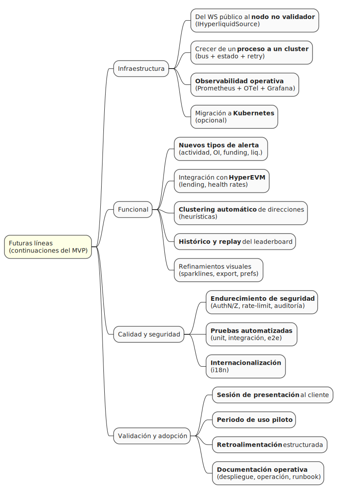
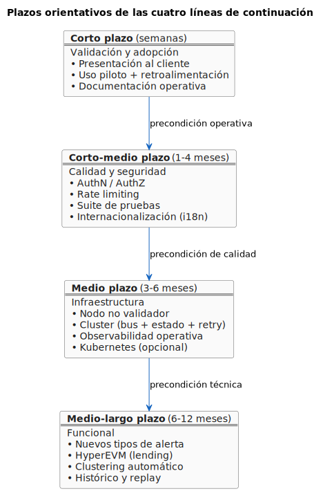

# Recomendaciones y futuras líneas de actuación

El sistema entregado es —por construcción— una primera iteración. El capítulo 1 lo definió así (*MVP que responda a los requisitos capturados y al análisis y diseño realizados*) y la fase de Construcción se cerró en consecuencia. Esta sección plantea, de forma alineada con la [discusión de resultados](discusion.md) y con la propuesta de [escalabilidad futura](../capitulo1/estadoDelArte.md#escalabilidad-futura) ya esbozada en el estado del arte del capítulo 1, las continuaciones viables del proyecto.

## Mapa de continuaciones

Las futuras líneas se organizan en cuatro ejes —Infraestructura, Funcional, Calidad y seguridad, Validación y adopción— cada uno con sus continuaciones concretas. El siguiente mindmap recoge la totalidad de líneas que se desarrollan a continuación:

> Fuente PlantUML: [`/modelosUML/capitulosFinales/futurasLineas.puml`](../../modelosUML/capitulosFinales/futurasLineas.puml). Cada línea declara explícitamente el **punto de extensión** del sistema actual y el **artefacto** que la habilita: no son ideas a abordar desde cero, son continuaciones del diseño ya en repositorio.

---

## Infraestructura

### Del WS público al nodo no validador

**Punto de extensión:** Puerto `IHyperliquidSource` + factory `createHyperliquidSource()`.

El esqueleto `NanorethRpcAdapter` ya existe (`app/src/sources/nanoreth-rpc.adapter.ts`) y respeta la interfaz del puerto. El esfuerzo es la implementación funcional, no la integración: el resto del sistema **no sabrá** que la fuente ha cambiado.

Las cuatro tareas concretas son: (1) desplegar un nodo nanoreth con su sincronización inicial sobre la L1; (2) implementar `subscribeTrades`, `subscribeAllMids` y los `getX` de cuenta sobre JSON-RPC, mapeando respuestas del nodo a los tipos `Operacion` / `Precio` del dominio; (3) conmutar `HYPERLIQUID_SOURCE=nanoreth` en el `.env` sin tocar el núcleo; y (4) opcionalmente refinar el puerto con un plan de contingencia para degradar a `PublicWsAdapter` si el nodo cae.

Los beneficios esperados, alineados con la discusión del [estado del arte](../capitulo1/estadoDelArte.md#escalabilidad-futura): eliminación de las restricciones de *rate limit* de la API pública, acceso al flujo completo de la L1 sin pasar por la API gateway de Hyperliquid, y reducción de latencia para escenarios con monitorización masiva de direcciones.

### Crecer de un proceso a un cluster

**Punto de extensión:** Bus de eventos (`bus.ts`) + estado in-memory (`LeaderboardState`) + cola virtual (`notificaciones`).

La arquitectura actual asume un único proceso. Para escalar horizontalmente, cada uno de estos tres componentes tiene una sustitución natural:

- `TypedBus<DomainEventMap>` (in-process) → **bus distribuido** (Redis Streams, NATS o Postgres `LISTEN/NOTIFY`).
- `LeaderboardState` (RAM) → **sticky sessions por terna** o estado compartido (Redis Cluster, hashmap distribuido).
- `RetryWorker` (singleton por proceso) → **coordinación por lock** (Postgres `advisory lock` o Redis `RedLock`) o partición por `hash(notificacionId)`.

Las decisiones del capítulo 3 lo prevén: el [diseño de la arquitectura](../capitulo3/disenoArquitectura.md#asignación-de-subsistemas-a-módulos) deja explícito que cada subsistema es independiente; ninguno mantiene un estado que el cluster no pueda particionar o compartir.

### Observabilidad operativa

**Punto de extensión:** `shared/logger.ts` (pino) + `shared/health.ts`.

Las cuatro capacidades a añadir son **métricas** (exportador Prometheus con contadores de trades por canal, alertas evaluadas, notificaciones por estado, latencia del bus, latencia HTTP/WS), **trazas** (OpenTelemetry adaptado a Fastify y a las funciones de servicio, exportando a Jaeger / Tempo), **dashboards** (Grafana con paneles sobre las métricas anteriores: salud del WS, *backlog* del retry worker, distribución de tiempo de evaluación) y **alertas operativas** (reglas Prometheus sobre las métricas anteriores, e.g. *backlog > N* durante > 5 min).

### Migración a Kubernetes (opcional)

**Punto de extensión:** `docker-compose.yml` y `app/Dockerfile`.

El Compose actual es deliberadamente simple. Si el sistema pasara a producción con réplicas y *rolling updates*, los Dockerfiles ya tienen la base: la imagen `runtime` es no-root, ligera (Node 20 Alpine) y declara healthcheck. La transición requiere añadir un Helm chart o manifiestos K8s (Deployment, Service, ConfigMap, Secret, HPA), migrar el `LeaderboardState` a estado compartido —pre-requisito ya cubierto por la línea anterior— y un Job de migraciones (`npm run db:migrate`) que preceda al rolling deploy.

---

## Funcional

### Nuevos tipos de alerta

**Punto de extensión:** `modules/evaluacion/evaluator.ts` (función pura) + dominio (`Umbral` y similares).

El bus y la suscripción están ya preparados para nuevos eventos. Para añadir un nuevo tipo de alerta basta con: (1) definir un nuevo tipo en el dominio (`AlertaActividad`, `AlertaInteresAbierto`, …) con su predicado puro; (2) añadir el evento productor en el bus —e.g. `OperacionDeDireccion` para alertas por movimiento de wallet—; (3) suscribir un nuevo handler en `wireEvaluacion` que invoque el predicado.

Casos identificados durante el desarrollo:

- **Por movimiento de una dirección** — avisar cuando una dirección monitorizada compra/vende un token específico. `OperacionRecibida` ya existe en el bus; basta filtrar por dirección + token.
- **Por cambio en el interés abierto** — detectar señales tempranas de movimientos masivos en perpetuos. Nuevo evento `InteresAbiertoActualizado` alimentado desde un endpoint REST de Hyperliquid.
- **Por *funding rate* extremo** — identificar oportunidades de carry o estrés del mercado. Nuevo evento `FundingRateActualizado` con polling periódico.
- **Por cercanía a liquidación** — vigilar la salud de posiciones en lending o perpetuos. Requiere extensión a HyperEVM (ver siguiente sección).

### Integración con HyperEVM

**Punto de extensión:** Nuevos adaptadores en `sources/` que implementen un puerto `IHyperEvmSource` (a definir).

El [estado del arte](../capitulo1/estadoDelArte.md#escalabilidad-futura) ya prevé esta dirección: monitorización de posiciones en protocolos de *lending* desplegados sobre HyperEVM, vigilando *health rates* bajos que indiquen proximidad a liquidación. La estrategia es la misma que con HyperCore: definir un puerto, implementar un adaptador por protocolo o por tipo de consulta, integrar nuevos eventos en el bus.

Los cuatro componentes a añadir: **cliente HyperEVM** (ya existe en el ecosistema, compatible EVM; puede usarse `viem` o `ethers`), **suscripción a logs de eventos** de contratos (`eth_subscribe` sobre el WS de HyperEVM), **decodificación de eventos** mediante ABIs de los protocolos a monitorizar, y **nuevos tipos de dominio** (`PosicionLending`, `HealthRate`) en `domain/` siguiendo el patrón actual.

### Clusters reales de direcciones

El término *clustering* del capítulo 1 quedó implementado en el MVP como agrupación de direcciones bajo una misma entidad-nombre. Una extensión natural sería el clustering **automático** mediante heurísticas: direcciones que financian a otras desde la misma origin (patrón hot/cold), direcciones que operan en los mismos pares con timing correlacionado (indicio de bot u operador único con varias wallets) o direcciones con balances correlacionados a lo largo del tiempo (gestión coordinada).

Esta capacidad encaja como un servicio nuevo (`modules/cluster/`) sin alterar el resto del sistema.

### Histórico y *replay* del leaderboard

`lb_trades` retiene operaciones por un periodo configurable (`LB_TRADES_RETENTION_DAYS`). Sobre esa base se puede construir: **leaderboard histórico** —reconstrucción de la clasificación para una ventana arbitraria del pasado a partir de `lb_trades`—, **comparativa entre periodos** —diferencia de comportamiento de las mismas direcciones entre dos ventanas distintas— e **identificación de nuevos actores** —direcciones que aparecen en el top sin haber estado antes—.

### Refinamiento del leaderboard

Sin cambios estructurales, hay refinamientos visuales y funcionales identificados como deuda agradable: un **histograma de actividad** por dirección (sparkline en cada fila mostrando el patrón de la última hora), **exportación a CSV/JSON** del ranking actual para análisis *offline* y **configuración por usuario** que persista la selección de mercado/token/temporalidad por sesión.

---

## Calidad y seguridad

### Endurecimiento de seguridad

El MVP asume despliegue en una red de confianza (intranet de Infinite Fieldx o tras un proxy con autenticación). Para producción abierta, las cinco capacidades a añadir son: **autenticación** (OAuth2 / OIDC delegado a un IdP corporativo; sesión por cookie HttpOnly), **autorización** (roles operador / lector / administrador modelados como permisos sobre los CdU), **rate limiting** de la API (plugin `@fastify/rate-limit` con buckets por usuario o IP), **auditoría de operaciones sensibles** (bitácora de cambios sobre `entidades`, `direcciones`, `alertas`) y **rotación de `APP_SECRET`** (re-cifrado en lote de `webhook_url_enc` con la nueva clave; mecanismo ya soportado por `pgcrypto`).

### Pruebas automatizadas

El smoke test actual cubre el camino feliz (`tsc --noEmit`, `vite build`, arranque con conexión real al WS). La continuación natural recorre las cuatro capas del sistema:

- **Dominio** (`domain/`) — pruebas unitarias puras sobre `evaluarUmbral`, `evaluarAlertasContraPrecio`, validadores de dirección y token.
- **Servicios** — pruebas con dobles del puerto `IHyperliquidSource` y base de datos en memoria o contenedor efímero (`testcontainers`).
- **Rutas** — pruebas de integración con `fastify.inject(...)` (sin red real) cubriendo casos de éxito y fallo.
- **End-to-end** — Playwright o Cypress sobre flujos críticos del SPA (alta de entidad → leaderboard, alta de alerta → recepción de webhook simulado).

### Internacionalización

La interfaz está actualmente en español. Si Infinite Fieldx desplegara el sistema para equipos no hispanohablantes, sería razonable internacionalizar con `react-i18next` o `formatjs`. Los textos del dominio (estados de alerta, mercados) ya están aislados en constantes (`domain.ts`), lo que facilita la transición.

---

## Validación y adopción

### Validación con el cliente (cierre del ciclo RUP)

El MVP está listo para entrar en la **fase de Transición** del proceso unificado: instalación en el entorno de Infinite Fieldx, ejecución sobre datos reales y retroalimentación operativa. Las actividades previstas son una **sesión de presentación** (recorrido sobre el repositorio + ejecución en vivo siguiendo el [mapa de navegación](mapaNavegacion.md)), un **periodo de uso piloto** (configuración de las primeras entidades reales por el cliente, alertas sobre tokens de interés, observación de la cobertura de ventana en el leaderboard), **retroalimentación estructurada** (listado de incidencias y mejoras priorizadas que constituyen el *backlog* de la segunda iteración) y **ajustes de configuración** (`LEADERBOARD_PREWARM`, `NOTIFICATION_RETRY_*`, `LB_TRADES_RETENTION_DAYS` afinados con métricas reales).

> Esta validación es la **prueba operativa** que valida la hipótesis del capítulo 1 más allá del MVP entregado. Cerrar el ciclo con el cliente convierte el TFG en producto.

### Documentación dirigida a operadores

El [README del repositorio](../../README.md) y el README de `src/` cubren el arranque para desarrolladores. Para operadores se sugiere añadir un **manual de despliegue** (pasos detallados de instalación en VM/host del cliente, copia de seguridad y restauración de la BD), un **manual de operación** (casos de incidencia frecuentes y respuesta: WS de Hyperliquid caído, BD lenta, webhook receptor caído masivamente) y un **runbook** (procedimientos para rotación de `APP_SECRET`, ampliación de `LEADERBOARD_PREWARM`, *vacuum* programado de `lb_trades`).

---

## Plazos y dependencias

Las líneas se priorizan por plazo orientativo y por dependencia entre ejes:

> Fuente PlantUML: [`/modelosUML/capitulosFinales/plazosFuturas.puml`](../../modelosUML/capitulosFinales/plazosFuturas.puml). La validación con el cliente es la primera línea **porque condiciona el resto**: la prioridad relativa de las restantes depende del *feedback* que el piloto entregue.

## Recapitulación

Las líneas anteriores comparten una propiedad: **ninguna requiere reescribir el sistema**. Todas son extensiones sobre puntos del diseño ya pensados para ello (puerto hexagonal, bus tipado, organización por feature, evaluador como función pura). El [capítulo 3](../capitulo3/README.md) anticipó esta extensibilidad como RS-04 y las decisiones arquitectónicas la materializaron; este capítulo lo confirma poniendo nombre a cada extensión.

La continuidad del proyecto es viable. El proceso metodológico que la habilita —RUP aplicado en serio durante el TFG— es, en última instancia, lo que distingue una entrega académica de un producto que el cliente puede llevarse y seguir construyendo sobre él.
