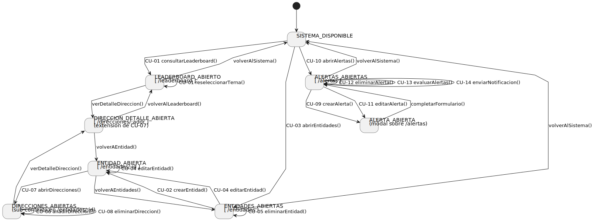
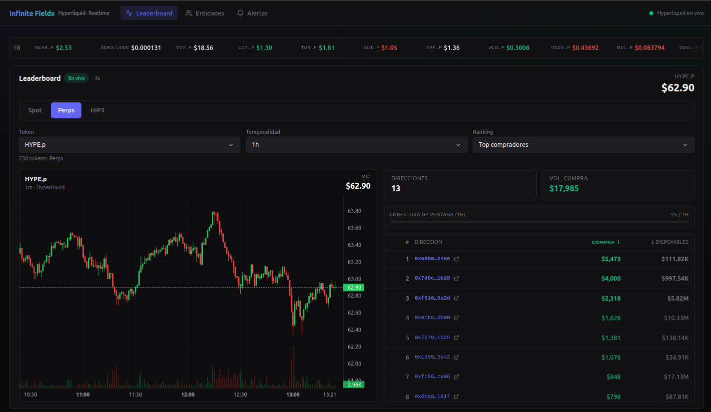
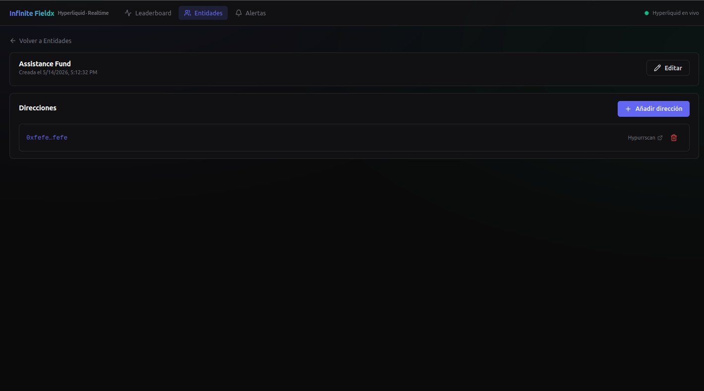
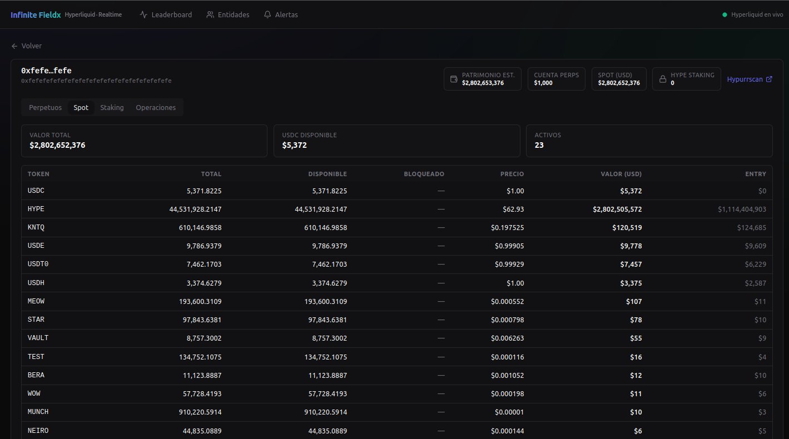
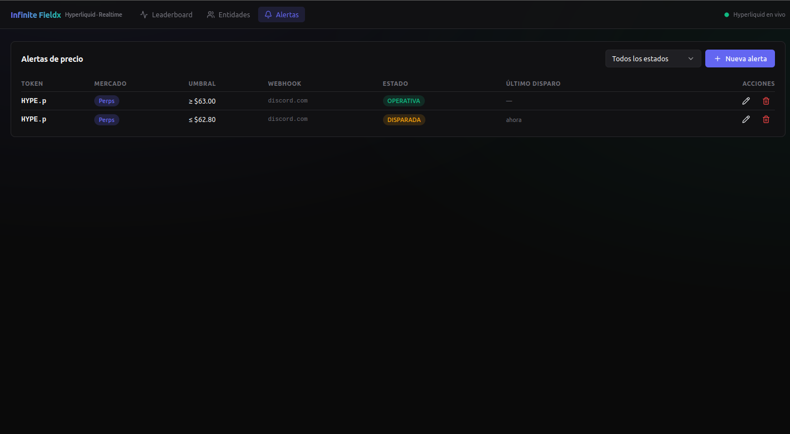

# Mapa de navegación

El SPA construido sobre **React + React Router** materializa, ruta a ruta, los estados y transiciones del [diagrama de contexto](../capitulo2/diagramaDeContexto.md) del capítulo 2. La navegación no es un añadido de la implementación: es **el contrato del actor *Usuario* hecho navegable**, redibujado aquí con los nombres de ruta reales y con las extensiones que la disciplina de implementación ha hecho explícitas.

## Diagrama

<div align=center>



</div>

> Fuente PlantUML: [`/modelosUML/capitulosFinales/navegacion.puml`](../../modelosUML/capitulosFinales/navegacion.puml). Cada nodo es un estado del diagrama de contexto del capítulo 2 anotado con su ruta real del SPA; cada transición lleva el identificador del caso de uso (`CU-XX`) que la realiza. La trazabilidad **estado del cap. 2 → ruta del SPA → caso de uso** queda resuelta visualmente, sin tablas intermedias.

## Principio de correspondencia

Cada **estado** del diagrama de contexto se realiza por una **ruta** del SPA (`web/src/pages/*Page.tsx`). Cada **transición** del diagrama se realiza por una **acción del usuario** sobre un elemento de interfaz —enlace, botón, formulario, modal— que ataca el endpoint correspondiente del backend. El recorrido a continuación se ordena tal como lo encuentra el actor *Usuario* al abrir la aplicación.

## Estados del sistema

Se conservan los mismos identificadores que el capítulo 2 para no introducir terminología nueva. La extensión `DIRECCION_DETALLE_ABIERTA` aparece como sub-estado introducido durante la implementación y documentado en [ajustes de pila](ajustesDePila.md#extensión-funcional-del-cu-07); no es un estado nuevo del dominio, sino una ruta transversal para una variante de CU-07.

<div align=center>

|Estado (cap. 2)|Ruta SPA|Página (`web/src/pages/`)|
|-|-|-|
|`SISTEMA_DISPONIBLE` *(hub)*|`/` (redirige a `/leaderboard`)|—|
|`LEADERBOARD_ABIERTO`|`/leaderboard`|`LeaderboardPage`|
|`ENTIDADES_ABIERTAS`|`/entidades`|`EntidadesPage`|
|`ENTIDAD_ABIERTA`|`/entidades/:id`|`EntidadDetailPage`|
|`DIRECCIONES_ABIERTAS` *(sub-contexto)*|`/entidades/:id`|`EntidadDetailPage` *(sección)*|
|`DIRECCION_DETALLE_ABIERTA` *(extensión CU-07)*|`/direcciones/:addr`|`DireccionDetailPage`|
|`ALERTAS_ABIERTAS`|`/alertas`|`AlertasPage`|
|`ALERTA_ABIERTA`|`/alertas` *(modal)*|`AlertaForm`|

</div>

## Transiciones principales

### Entrada al sistema

`[*] → SISTEMA_DISPONIBLE`. El bootstrap del SPA establece la conexión WebSocket única (`AppDataContext`), precarga el catálogo de tokens y deja el router preparado para despachar. La ruta raíz `/` redirige automáticamente a `/leaderboard`, dejando al usuario en el hub funcional: `SISTEMA_DISPONIBLE → LEADERBOARD_ABIERTO` por **CU-01**.

```56:65:src/web/src/App.tsx
        <Routes>
          <Route path="/" element={<Navigate to="/leaderboard" replace />} />
          <Route path="/leaderboard" element={<LeaderboardPage />} />
          <Route path="/entidades" element={<EntidadesPage />} />
          <Route path="/entidades/:id" element={<EntidadDetailPage />} />
          <Route
            path="/direcciones/:addr"
            element={<DireccionDetailPage />}
          />
          <Route path="/alertas" element={<AlertasPage />} />
          <Route path="*" element={<Navigate to="/leaderboard" replace />} />
        </Routes>
```

La cabecera global, presente en todas las páginas, expone los tres puntos de acceso a las áreas funcionales (`Leaderboard`, `Entidades`, `Alertas`) junto al indicador de salud del backend. Esa cabecera **es** el conmutador entre las tres ramas, y se modela en el diagrama como las transiciones simétricas hacia y desde `SISTEMA_DISPONIBLE`.

### Rama 1 — Leaderboard

Materializa `LEADERBOARD_ABIERTO`. Es el único estado en el que el sistema **empuja** datos hacia el usuario sin que medie una acción explícita: la conexión WebSocket única mantiene la clasificación actualizándose mientras la página esté abierta.

- **Auto-transición CU-01 `reseleccionarTerna()`.** Cambiar mercado, token, temporalidad o lado del ranking dispara una nueva suscripción WebSocket; la página no cambia de ruta, sólo recompone el snapshot. Materializa el flujo alternativo *3a* del [detalle de CU-01](../capitulo2/detalleCdU.md#cu-01--consultar-leaderboard).
- **Salida `verDetalleDireccion()` a `DIRECCION_DETALLE_ABIERTA`.** Hacer click sobre la dirección abreviada de una fila del ranking salta al detalle global de esa dirección (ver más abajo).
- **Salida `volverAlSistema()`.** El click en cualquier ítem de la cabecera devuelve al hub y, desde ahí, a otra rama.

<div align=center>



</div>

### Rama 2 — Entidades → Detalle → Direcciones

Materializa el sub-árbol `ENTIDADES_ABIERTAS → ENTIDAD_ABIERTA → DIRECCIONES_ABIERTAS`. La estructura sigue el patrón **lista → detalle → sub-detalle** que el diagrama de contexto deja explícito:

- `ENTIDADES_ABIERTAS` admite las cuatro operaciones del CRUD de entidades: **CU-02 `crearEntidad()`**, **CU-03 `abrirEntidades()` y `filtrarEntidades()`** (auto-transición al re-consultar con `q=`), **CU-04 `editarEntidad()`** y **CU-05 `eliminarEntidad()`** (auto-transición in situ con confirmación).
- `ENTIDAD_ABIERTA` y `DIRECCIONES_ABIERTAS` **comparten ruta** (`/entidades/:id`): la `EntidadDetailPage` muestra simultáneamente los datos de la entidad y la relación de sus direcciones. Esto refleja el sub-contexto del cap. 2: el segundo estado vive siempre dentro del primero.
- Sobre `DIRECCIONES_ABIERTAS` operan **CU-06 `anadirDireccion()`** y **CU-08 `eliminarDireccion()`** (ambas auto-transiciones), porque ninguna lleva al usuario fuera de la página.

<div align=center>



</div>

### Detalle global de una dirección — extensión de CU-07

`DIRECCION_DETALLE_ABIERTA` (`/direcciones/:addr`) es un estado **transversal**: se alcanza con el mismo CdU (`CU-07`, en su variante *Ver detalle global*) desde dos orígenes distintos:

- Click sobre la dirección abreviada de una fila del **leaderboard** (`LEADERBOARD_ABIERTO`).
- Click sobre la dirección abreviada de una **entidad** (`DIRECCIONES_ABIERTAS`).

La página agrupa cuatro vistas reconciliadas en pestañas, todas alimentadas por el puerto hexagonal `IHyperliquidSource`: **Perpetuos**, **Spot**, **Staking** y **Operaciones**. El retorno se hace contextual: `volverAlLeaderboard()` o `volverAEntidad()` según el origen.

<div align=center>



</div>

> Esta vista materializa, además, **el cliente real** del sistema (Infinite Fieldx) tal como lo planteó el escenario: a partir del leaderboard, un operador puede entrar en cualquier dirección y disponer en una sola pantalla del contexto patrimonial completo, sin abandonar la herramienta.

### Rama 3 — Alertas

Materializa `ALERTAS_ABIERTAS` y, sobre ella, `ALERTA_ABIERTA` realizada como **diálogo modal** (`AlertaForm`) en lugar de ruta propia: el edit-in-place mantiene visible la relación que se está editando.

- **CU-09 `crearAlerta()`** y **CU-11 `editarAlerta()`** abren el modal; al confirmar, se cierra con `completarFormulario()` y la relación se invalida.
- **CU-12 `eliminarAlerta()`** es auto-transición con confirmación.
- **CU-13 `evaluarAlertas()`** y **CU-14 `enviarNotificacion()`** son transiciones **internas** del sistema: el usuario no las dispara; las observa como cambios de la columna *Estado* en la relación (`OPERATIVA → DISPARADA → OPERATIVA`, o `NOTIFICACION_FALLIDA` si los reintentos se agotan). La página se refresca cada 6 s para reflejarlas.

<div align=center>



</div>

## Validación de la cobertura

El diagrama es **exhaustivo** sobre el catálogo del capítulo 2:

- Cada uno de los 14 CdU del catálogo aparece como transición etiquetada.
- Cada uno de los 7 estados originales del cap. 2 aparece como nodo, más la extensión `DIRECCION_DETALLE_ABIERTA`.
- Las rutas no reconocidas redirigen al hub (`<Route path="*" element={<Navigate to="/leaderboard" replace />} />`), garantizando que el actor nunca quede en un estado huérfano.

No hay estados sin entrada ni salida; no hay transiciones sin CdU. La rúbrica de descripción de la solución se verifica visualmente sobre el diagrama, **sin necesidad de una tabla de trazabilidad adicional**.

## Decisiones de presentación reseñables

- **`SISTEMA_DISPONIBLE` aterriza en `LEADERBOARD_ABIERTO`.** Es el área que satisface la propuesta de valor central del cliente (monitorización en tiempo real); el resto del sistema es soporte para esa monitorización.
- **`ENTIDAD_ABIERTA` y `DIRECCIONES_ABIERTAS` comparten ruta.** El sub-contexto está siempre presente cuando hay una entidad abierta; separar rutas obligaría a una navegación redundante.
- **`ALERTA_ABIERTA` como modal, no como ruta.** El edit-in-place mantiene la relación visible debajo, soportando comparación entre alertas existentes y la que se edita.
- **`DIRECCION_DETALLE_ABIERTA` accesible desde dos orígenes.** El detalle global de una dirección es **transversal** a entidades y leaderboard; el actor accede a él desde el contexto donde la haya encontrado.
- **Página única para el leaderboard.** El WS es único por sesión (RS-01); cualquier reapertura reutiliza la conexión gestionada por `AppDataContext`.

## Referencias

- [Diagrama de contexto](../capitulo2/diagramaDeContexto.md) — origen del modelo de estados.
- [Detalle de CdU](../capitulo2/detalleCdU.md) — flujos paso a paso de cada transición etiquetada.
- [Casos de uso implementados](casosDeUsoImplementados.md) — cascada análisis → diseño → interfaz real para CU-01, CU-09, CU-13 y CU-14.
- [Ajustes de pila](ajustesDePila.md#extensión-funcional-del-cu-07) — justificación de la extensión de CU-07.
